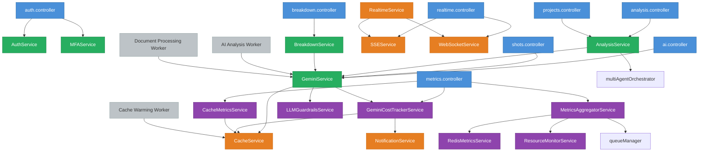

# كتالوج خدمات الباك اند — Backend Services Catalog

**المشروع:** The Copy — منصة تحليل وإنتاج المحتوى الدرامي العربي
**المسار الجذري:** `apps/backend/src/`
**تاريخ آخر تحديث:** 2026-03-30

---

## نظرة عامة

تتكون طبقة الخدمات في باك اند المشروع من ثلاث فئات رئيسية:

1. **خدمات الأعمال (Business Services)** — تنفذ المنطق الوظيفي الأساسي: المصادقة، التحليل، التحويل، وإدارة السيناريو.
2. **خدمات البنية التحتية (Infrastructure Services)** — تدير التخزين المؤقت، الاتصالات الآنية، قوائم الانتظار، والمراقبة.
3. **طبقة العوامل الخلفية (Queue Workers)** — مهام BullMQ التي تعالج العمليات الثقيلة بشكل غير متزامن.

جميع الخدمات تُصدَّر كـ Singleton instance للاستخدام المشترك عبر التطبيق، باستثناء `AnalysisService` و`GeminiService` اللتين يتم إنشاؤهما حسب الحاجة.

---

## فهرس الخدمات

| الخدمة | الملف | الفئة |
|---|---|---|
| [AuthService](#1-authservice) | `services/auth.service.ts` | أعمال |
| [MFAService](#2-mfaservice) | `services/mfa.service.ts` | أعمال |
| [AnalysisService](#3-analysisservice) | `services/analysis.service.ts` | أعمال |
| [BreakdownService](#4-breakdownservice) | `services/breakdown/service.ts` | أعمال |
| [GeminiService](#5-geminiservice) | `services/gemini.service.ts` | أعمال / ذكاء اصطناعي |
| [CacheService](#6-cacheservice) | `services/cache.service.ts` | بنية تحتية |
| [RealtimeService](#7-realtimeservice) | `services/realtime.service.ts` | بنية تحتية |
| [WebSocketService](#8-websocketservice) | `services/websocket.service.ts` | بنية تحتية |
| [SSEService](#9-sseservice) | `services/sse.service.ts` | بنية تحتية |
| [NotificationService](#10-notificationservice) | `services/notification.service.ts` | بنية تحتية |
| [GeminiCostTrackerService](#11-geminicosttrackerservice) | `services/gemini-cost-tracker.service.ts` | مراقبة |
| [LLMGuardrailsService](#12-llmguardrailsservice) | `services/llm-guardrails.service.ts` | أمان |
| [CacheMetricsService](#13-cachemetricsservice) | `services/cache-metrics.service.ts` | مراقبة |
| [ResourceMonitorService](#14-resourcemonitorservice) | `services/resource-monitor.service.ts` | مراقبة |
| [MetricsAggregatorService](#15-metricsaggregatorservice) | `services/metrics-aggregator.service.ts` | مراقبة |
| [RedisMetricsService](#16-redismetricsservice) | `services/redis-metrics.service.ts` | مراقبة |
| [EnhancedRAGService](#17-enhancedragservice) | `services/rag/enhancedRAG.service.ts` | ذكاء اصطناعي |

---

## تفاصيل الخدمات

---

### 1. AuthService

**الملف:** `services/auth.service.ts`
**التصدير:** `export const authService = new AuthService()` (Singleton)

#### الوصف الوظيفي

تدير دورة حياة المصادقة الكاملة: تسجيل المستخدمين، تسجيل الدخول، التحقق من رموز JWT، وتدوير رموز التحديث. تعتمد على bcrypt لتجزئة كلمات المرور وعلى JWT للرموز المؤقتة (15 دقيقة) بالاقتران مع رموز تحديث مشفرة بـ `crypto.randomBytes` وصلاحيتها 7 أيام مخزنة في PostgreSQL.

#### الواجهة العامة

```typescript
// تسجيل مستخدم جديد — يعيد tokens + بيانات المستخدم بدون كلمة المرور
signup(email: string, password: string, firstName?: string, lastName?: string): Promise<AuthTokens>

// تسجيل الدخول
login(email: string, password: string): Promise<AuthTokens>

// جلب بيانات مستخدم بمعرّفه
getUserById(userId: string): Promise<Omit<User, 'passwordHash'> | null>

// التحقق من صحة رمز JWT
verifyToken(token: string): { userId: string }

// تجديد رمز الوصول باستخدام رمز التحديث
refreshAccessToken(refreshToken: string): Promise<{ accessToken: string; refreshToken: string }>

// إلغاء رمز التحديث (تسجيل الخروج)
revokeRefreshToken(token: string): Promise<void>
```

**النوع المرجع:**
```typescript
interface AuthTokens {
  accessToken: string;   // JWT — صلاحية 15 دقيقة
  refreshToken: string;  // hex عشوائي — صلاحية 7 أيام
  user: Omit<User, 'passwordHash'>;
}
```

#### التبعيات

- `@/db` — قاعدة البيانات (جدولا `users` و`refreshTokens`)
- `@/config/env` — لقراءة `JWT_SECRET`
- مكتبات: `bcrypt`، `jsonwebtoken`، `crypto`

#### Controllers التي تستدعيها

- `auth.controller.ts` — جميع عمليات المصادقة
- `websocket.service.ts` — التحقق من رمز JWT عند الاتصال

---

### 2. MFAService

**الملف:** `services/mfa.service.ts`
**التصدير:** `export const mfaService = new MFAService()` (Singleton)

#### الوصف الوظيفي

تتولى إدارة المصادقة الثنائية (TOTP) بالكامل: توليد السر والرمز QR، التحقق من الرمز الزمني عند الإعداد، وإلغاء التفعيل. تستخدم مكتبة `otplib` مع إعداد افتراضي بـ 6 أرقام وصلاحية 30 ثانية مع هامش انحراف ±1 خطوة.

#### الواجهة العامة

```typescript
// تفعيل MFA — يُعيد السر، رمز QR، وعنوان otpauth
enableMFA(userId: string): Promise<MFASetupResult>

// التحقق من الرمز المدخل (وتفعيل MFA عند أول تحقق ناجح)
verifyMFA(userId: string, token: string): Promise<MFAVerifyResult>

// تعطيل MFA
disableMFA(userId: string): Promise<void>

// التحقق من حالة تفعيل MFA للمستخدم
isMFAEnabled(userId: string): Promise<boolean>

// التحقق من الرمز أثناء تسجيل الدخول
validateToken(userId: string, token: string): Promise<boolean>
```

**الأنواع المرجعة:**
```typescript
interface MFASetupResult {
  secret: string;
  qrCodeDataUrl: string;  // Base64 data URL لصورة QR
  otpauthUrl: string;
}

interface MFAVerifyResult {
  success: boolean;
  message: string;
}
```

#### التبعيات

- `@/db` — جدول `users` (حقلا `mfaEnabled` و`mfaSecret`)
- مكتبات: `otplib`، `qrcode`

#### Controllers التي تستدعيها

- `auth.controller.ts` — نقاط نهاية MFA (تفعيل، تحقق، إلغاء)

---

### 3. AnalysisService

**الملف:** `services/analysis.service.ts`
**التصدير:** Class فقط — يتم إنشاء instance عند الحاجة

#### الوصف الوظيفي

تُشغّل خط أنابيب التحليل متعدد الوكلاء (Multi-Agent Pipeline). تأخذ نص سيناريو كاملاً وتوزعه على 7 وكلاء AI متخصصين يعملون بالتوازي عبر `multiAgentOrchestrator`، ثم تحول النتائج إلى هيكل المحطات السبع المتوافق مع الواجهة الأمامية.

#### الواجهة العامة

```typescript
// تشغيل خط التحليل الكامل (7 وكلاء بالتوازي)
runFullPipeline(input: PipelineInput): Promise<PipelineRunResult>
```

**المحطات السبع:**
| المحطة | الوكيل المستخدم |
|---|---|
| 1 | `CHARACTER_DEEP_ANALYZER` — تحليل الشخصيات |
| 2 | `DIALOGUE_ADVANCED_ANALYZER` — تحليل الحوار |
| 3 | `VISUAL_CINEMATIC_ANALYZER` — التحليل البصري |
| 4 | `THEMES_MESSAGES_ANALYZER` — الموضوعات والرسائل |
| 5 | `CULTURAL_HISTORICAL_ANALYZER` — السياق الثقافي |
| 6 | `PRODUCIBILITY_ANALYZER` — قابلية الإنتاج |
| 7 | `TARGET_AUDIENCE_ANALYZER` — الجمهور المستهدف |

#### التبعيات

- `GeminiService` — (محجوز للاستخدام المستقبلي داخل الخدمة)
- `multiAgentOrchestrator` من `services/agents`
- `@/utils/logger`

#### Controllers التي تستدعيها

- `analysis.controller.ts` — نقطة نهاية `/api/analysis/run`
- `projects.controller.ts` — تحليل المشروع الكامل

---

### 4. BreakdownService

**الملف:** `services/breakdown/service.ts`
**التصدير:** `export const breakdownService = new BreakdownService()` (Singleton)

#### الوصف الوظيفي

خدمة التفكيك الإنتاجي للسيناريو (Production Breakdown). تُحلّل نص السيناريو، تستخرج عناصر الإنتاج (مواقع، ممثلين، معدات، مؤثرات)، تُنشئ تقارير تفصيلية وجداول تصوير، وتدعم التصدير بصيغ متعددة. تعتمد على Gemini AI لتحليل كل مشهد وتصنيف عناصره.

#### الواجهة العامة (المستنبطة من controller)

```typescript
// إنشاء مشروع وتحليل النص في خطوة واحدة
createProjectAndParse(userId: string, title: string, scriptContent: string): Promise<...>

// تحليل نص سيناريو لمشروع موجود
parseProject(projectId: string, userId: string): Promise<ParsedScreenplay>

// تحليل AI كامل للمشروع وتخزين النتائج
analyzeProject(projectId: string, userId: string): Promise<BreakdownReport>

// جلب التقرير المحفوظ
getProjectReport(projectId: string, userId: string): Promise<BreakdownReport>

// جلب جدول التصوير
getProjectSchedule(projectId: string, userId: string): Promise<ShootingScheduleDay[]>

// جلب تفاصيل مشهد واحد
getSceneBreakdown(sceneId: string, userId: string): Promise<BreakdownSceneAnalysis>

// إعادة تحليل مشهد محدد
reanalyzeScene(sceneId: string, userId: string): Promise<BreakdownSceneAnalysis>

// تصدير التقرير (PDF / JSON / CSV)
exportReport(reportId: string, userId: string, format: string): Promise<...>

// محادثة AI حول السيناريو
chat(message: string, context?: any): Promise<BreakdownChatResponse>
```

#### التبعيات

- `GeminiService` — تحليل المشاهد وتصنيف العناصر
- `@/db` — جداول: `projects`, `scenes`, `sceneBreakdowns`, `breakdownReports`, `breakdownJobs`, `breakdownExports`, `shootingSchedules`
- `./parser` — تحليل بنية السيناريو
- `./utils` — أدوات بناء التقارير وحساب جداول التصوير

#### Controllers التي تستدعيها

- `breakdown.controller.ts` — جميع نقاط نهاية `/api/breakdown/*`

---

### 5. GeminiService

**الملف:** `services/gemini.service.ts`
**التصدير:** `export const geminiService = new GeminiService()` (Singleton) + Class

#### الوصف الوظيفي

بوابة موحدة لجميع استدعاءات Gemini AI. تُغلّف كل طلب بطبقات متعددة: التخزين المؤقت (stale-while-revalidate)، حماية الإدخال والإخراج (LLM Guardrails)، تتبع التكاليف، قياسات Prometheus، ومهلة زمنية 30 ثانية. النموذج المستخدم هو `gemini-2.0-flash-exp`.

#### الواجهة العامة

```typescript
// تحليل نص بنوع محدد (characters, themes, structure, relationships...)
analyzeText(text: string, analysisType: string): Promise<string>

// توليد محتوى من prompt مباشر (بدون تخزين مؤقت)
generateContent(prompt: string, options?: { temperature?: number; maxTokens?: number }): Promise<string>

// مراجعة السيناريو: استمرارية + حوار + شخصيات
reviewScreenplay(text: string): Promise<string>

// محادثة AI مع سياق اختياري
chatWithAI(message: string, context?: any): Promise<string>

// اقتراح لقطة سينمائية لمشهد
getShotSuggestion(sceneDescription: string, shotType: string): Promise<string>
```

**فئات التخزين المؤقت (`GeminiCacheCategory`):**
`analysis` | `character` | `screenplay` | `chat` | `shot-suggestion`

#### التبعيات

- `CacheService` — التخزين المؤقت للنتائج
- `GeminiCostTrackerService` — تتبع tokens والتكاليف
- `LLMGuardrailsService` — فحص الإدخال والإخراج
- `gemini-cache.strategy` — منطق مفاتيح التخزين والـ TTL
- `@/middleware/metrics.middleware` — قياسات Prometheus
- `@google/generative-ai` — SDK رسمي

#### Controllers التي تستدعيها

- `ai.controller.ts` — المحادثة واقتراح اللقطات
- `shots.controller.ts` — اقتراحات اللقطات
- `analysis.controller.ts` — (عبر AnalysisService)
- `breakdown/service.ts` — تحليل مشاهد السيناريو

---

### 6. CacheService

**الملف:** `services/cache.service.ts`
**التصدير:** `export const cacheService = new CacheService()` (Singleton)

#### الوصف الوظيفي

تنفّذ استراتيجية تخزين مؤقت ثنائية الطبقة:
- **L1 (Memory):** ذاكرة عملية Node.js — `Map` بحد أقصى 100 عنصر مع LRU Eviction
- **L2 (Redis):** تخزين موزع دائم

تدعم Redis Sentinel عالي التوفر، وتتراجع تلقائياً لـ L1 عند انقطاع Redis. الحد الأقصى لحجم القيمة 1MB والـ TTL الافتراضي 30 دقيقة.

#### الواجهة العامة

```typescript
// جلب قيمة (L1 أولاً، ثم L2)
get<T>(key: string): Promise<T | null>

// تخزين قيمة في L1+L2
set<T>(key: string, value: T, ttl?: number): Promise<void>

// حذف قيمة
delete(key: string): Promise<void>

// مسح الكاش (كله أو بنمط prefix)
clear(pattern?: string): Promise<void>

// توليد مفتاح كاش بـ SHA-256 hash
generateKey(prefix: string, data: any): string

// إحصاءات الكاش الحالية
getStats(): { memorySize: number; redisStatus: string; metrics: CacheMetrics; hitRate: number }

// إعادة تعيين المقاييس
resetMetrics(): void

// قطع الاتصال وتنظيف الموارد
disconnect(): Promise<void>
```

#### التبعيات

- `redis` — عميل Redis
- `@/config/env` — إعدادات الاتصال
- `@sentry/node` — مراقبة الأخطاء (اختياري)

#### Controllers التي تستدعيها

لا تُستدعى مباشرة من Controllers — تُستخدم داخلياً من:
- `GeminiService`
- `GeminiCostTrackerService`
- `CacheMetricsService`

---

### 7. RealtimeService

**الملف:** `services/realtime.service.ts`
**التصدير:** `export const realtimeService = new RealtimeService()` (Singleton)

#### الوصف الوظيفي

واجهة موحدة تجمع WebSocket وSSE في خدمة واحدة. تُبث الأحداث عبر القناتين أو إحداهما حسب `BroadcastTarget`. تُعرّف دوال متخصصة لأحداث المهام والتحليل والنظام، مع توجيه ذكي (routing) بناءً على `userId` أو `projectId` أو `queueName`.

#### الواجهة العامة

```typescript
// بث لجميع المتصلين
broadcast<T>(event: RealtimeEvent<T>, options?: BroadcastOptions): void

// إرسال لغرفة محددة
toRoom<T>(room: string, event: RealtimeEvent<T>, options?: BroadcastOptions): void

// إرسال لمستخدم محدد
toUser<T>(userId: string, event: RealtimeEvent<T>, options?: BroadcastOptions): void

// إرسال لمشروع محدد
toProject<T>(projectId: string, event: RealtimeEvent<T>, options?: BroadcastOptions): void

// إرسال لقائمة انتظار محددة
toQueue<T>(queueName: string, event: RealtimeEvent<T>, options?: BroadcastOptions): void

// أحداث المهام
emitJobStarted(payload: Omit<JobStartedPayload, 'timestamp' | 'eventType'>, options?: BroadcastOptions): void
emitJobProgress(payload: Omit<JobProgressPayload, ...>, options?: BroadcastOptions): void
emitJobCompleted(payload: Omit<JobCompletedPayload, ...>, options?: BroadcastOptions): void
emitJobFailed(payload: Omit<JobFailedPayload, ...>, options?: BroadcastOptions): void

// أحداث التحليل
emitAnalysisProgress(payload: Omit<AnalysisProgressPayload, ...>, options?: BroadcastOptions): void
emitStationCompleted(payload: Omit<StationCompletedPayload, ...>, options?: BroadcastOptions): void

// أحداث النظام
emitSystemInfo(message: string, details?: any, options?: BroadcastOptions): void
emitSystemWarning(message: string, details?: any, options?: BroadcastOptions): void
emitSystemError(message: string, details?: any, options?: BroadcastOptions): void

// إحصاءات وصحة الخدمة
getStats(): { websocket: ...; sse: ...; timestamp: string }
getHealth(): { websocket: ...; sse: ...; overall: 'healthy' | 'degraded' | 'down'; timestamp: string }

// بث مباشر لعميل SSE
streamToSSE(clientId: string, data: string, event?: string): boolean

// إدارة اشتراكات SSE في الغرف
subscribeSSEClientToRoom(clientId: string, room: string): void
unsubscribeSSEClientFromRoom(clientId: string, room: string): void

// إيقاف التشغيل
shutdown(): Promise<void>
```

**قيم `BroadcastTarget`:** `ALL` | `WEBSOCKET` | `SSE`

#### التبعيات

- `WebSocketService`
- `SSEService`
- `@/utils/logger`

#### Controllers التي تستدعيها

- `queue.controller.ts` — بث حالة المهام

---

### 8. WebSocketService

**الملف:** `services/websocket.service.ts`
**التصدير:** `export const websocketService = new WebSocketService()` (Singleton)

#### الوصف الوظيفي

تُدير خادم Socket.IO: تهيئة الاتصالات، التحقق من المصادقة (JWT من header أو cookie)، إدارة الغرف، وبث الأحداث. تحدد مهلة زمنية للمصادقة وتطبّق حدًا لعدد الغرف لكل Socket.

> **تحذير أمني:** وضع التطوير يقبل `userId` بدون التحقق من JWT. يجب تأمين هذا في الإنتاج.

#### الواجهة العامة

```typescript
// تهيئة خادم Socket.IO على HTTP Server موجود
initialize(httpServer: HTTPServer): void

// بث لجميع المتصلين
broadcast<T>(event: RealtimeEvent<T>): void

// إرسال لغرفة محددة
toRoom<T>(room: string, event: RealtimeEvent<T>): void

// إرسال لمستخدم محدد
toUser<T>(userId: string, event: RealtimeEvent<T>): void

// إرسال لمشروع محدد
toProject<T>(projectId: string, event: RealtimeEvent<T>): void

// إرسال لقائمة انتظار محددة
toQueue<T>(queueName: string, event: RealtimeEvent<T>): void

// أحداث المهام المتخصصة (تُرسل للغرفة + المستخدم)
emitJobProgress(payload: Omit<JobProgressPayload, ...>): void
emitJobStarted(payload: Omit<JobStartedPayload, ...>): void
emitJobCompleted(payload: Omit<JobCompletedPayload, ...>): void
emitJobFailed(payload: Omit<JobFailedPayload, ...>): void

// إحصاءات الاتصالات
getStats(): { totalConnections: number; authenticatedConnections: number; rooms: string[] }

// جلب instance Socket.IO (للاستخدام المتقدم)
getIO(): SocketIOServer | null

// إيقاف التشغيل وقطع جميع الاتصالات
shutdown(): Promise<void>
```

#### التبعيات

- `AuthService` — التحقق من رمز JWT
- `@/config/websocket.config` — إعدادات Socket.IO
- `socket.io`

#### Controllers التي تستدعيها

- `realtime.controller.ts` — إحصاءات وصحة WebSocket

---

### 9. SSEService

**الملف:** `services/sse.service.ts`
**التصدير:** `export const sseService = new SSEService()` (Singleton)

#### الوصف الوظيفي

تُدير اتصالات Server-Sent Events لبث التحديثات الآنية أحادية الاتجاه. تُرسل ping كل 30 ثانية للحفاظ على الاتصال، وتدعم الغرف واشتراكات متعددة لكل مستخدم. تتبع المتصلين بثلاث خرائط: بالـ ID، بالمستخدم، وبالغرفة.

#### الواجهة العامة

```typescript
// تهيئة اتصال SSE جديد
initializeConnection(clientId: string, response: Response, userId?: string, lastEventId?: string): void

// اشتراك عميل في غرفة
subscribeToRoom(clientId: string, room: string): void

// إلغاء الاشتراك من غرفة
unsubscribeFromRoom(clientId: string, room: string): void

// إرسال حدث لعميل محدد
sendToClient<T>(clientId: string, event: RealtimeEvent<T>, id?: string): boolean

// إرسال لجميع عملاء غرفة
sendToRoom<T>(room: string, event: RealtimeEvent<T>, id?: string): number

// إرسال لجميع عملاء مستخدم
sendToUser<T>(userId: string, event: RealtimeEvent<T>, id?: string): number

// بث لجميع المتصلين
broadcast<T>(event: RealtimeEvent<T>, id?: string): number

// بث بيانات خام (للتدفق المباشر)
streamData(clientId: string, data: string, event?: string): boolean

// إغلاق اتصال عميل محدد
closeClient(clientId: string): void

// إحصاءات الخدمة
getStats(): { totalClients: number; authenticatedClients: number; rooms: ...; users: ... }

// إيقاف الخدمة وإغلاق جميع الاتصالات
shutdown(): void
```

#### التبعيات

- `express` — `Response` object
- `@/utils/logger`

#### Controllers التي تستدعيها

- `realtime.controller.ts` — تهيئة اتصالات SSE لنقاط `/sse`, `/analysis/:id/stream`, `/jobs/:id/stream`

---

### 10. NotificationService

**الملف:** `services/notification.service.ts`
**التصدير:** `export const notificationService = new NotificationService()` (Singleton)

#### الوصف الوظيفي

تُرسل إشعارات عبر قناتين: البريد الإلكتروني (SMTP عبر Nodemailer) وSlack (Webhooks). تُهيّأ تلقائياً من متغيرات البيئة عند الإطلاق، وتتدهور بأمان (graceful degradation) إذا كانت بيانات الاعتماد غير موجودة. توفّر دالة `sendAlert` موحّدة تُرسل لكلتا القناتين حسب مستوى الخطورة.

#### الواجهة العامة

```typescript
// إرسال بريد HTML
sendEmail(to: string | string[], subject: string, htmlBody: string): Promise<boolean>

// إرسال رسالة Slack مع تنسيق اختياري
sendSlack(message: string, options?: { title?: string; color?: string; fields?: any[] }): Promise<boolean>

// إرسال تنبيه لكلا القناتين (Slack دائماً، Email للتحذيرات والحرجة فقط)
sendAlert(level: 'INFO' | 'WARNING' | 'CRITICAL', title: string, message: string, data?: Record<string, any>): Promise<void>
```

**متغيرات البيئة المطلوبة:**
```
SMTP_HOST, SMTP_PORT, SMTP_USER, SMTP_PASS, SMTP_FROM  (للبريد)
SLACK_WEBHOOK_URL                                        (لـ Slack)
ALERT_EMAIL_RECIPIENTS                                   (مستقبلو التنبيهات)
```

#### التبعيات

- `nodemailer` — إرسال البريد
- `axios` — طلبات Slack Webhook

#### Controllers التي تستدعيها

لا تُستدعى مباشرة من Controllers — تُستخدم داخلياً من:
- `GeminiCostTrackerService` — تنبيهات تجاوز الميزانية

---

### 11. GeminiCostTrackerService

**الملف:** `services/gemini-cost-tracker.service.ts`
**التصدير:** `export const geminiCostTracker = new GeminiCostTrackerService()` (Singleton)

#### الوصف الوظيفي

يتتبع استخدام tokens وتكاليف Gemini API بدقة، ويُصدر مقاييس Prometheus. يُخزّن بيانات الاستخدام اليومي والشهري في Redis مع fallback لذاكرة العملية. يُطلق تنبيهات تلقائية عند تجاوز حد 10$/يوم أو 80% من ميزانية 300$/شهر.

**أسعار Gemini 2.0 Flash:** إدخال 0.075$/مليون token، إخراج 0.30$/مليون token.

#### الواجهة العامة

```typescript
// تسجيل استخدام tokens وحساب التكلفة
trackUsage(inputTokens: number, outputTokens: number, analysisType?: string): Promise<TokenUsage>

// جلب ملخص الاستخدام اليومي
getDailyUsage(): Promise<UsagePeriod | null>

// جلب ملخص الاستخدام الشهري
getMonthlyUsage(): Promise<UsagePeriod | null>

// ملخص التكاليف الكامل (يومي + شهري مع نسب التجاوز)
getCostSummary(): Promise<{ daily: {...}; monthly: {...} }>

// إعادة تعيين بيانات الاستخدام (للاختبار)
resetUsage(period?: 'daily' | 'monthly' | 'all'): Promise<void>
```

**مقاييس Prometheus المُصدَّرة:**
- `the_copy_gemini_tokens_total` (counter، labels: `type`)
- `the_copy_gemini_cost_usd_total` (counter، labels: `period`)
- `the_copy_gemini_daily_cost_usd` (gauge)
- `the_copy_gemini_monthly_cost_usd` (gauge)
- `the_copy_gemini_cost_alerts_total` (counter، labels: `type`)

#### التبعيات

- `CacheService` — تخزين بيانات الاستخدام
- `NotificationService` — إرسال تنبيهات التكلفة (dynamic import)
- `prom-client` — مقاييس Prometheus

#### Controllers التي تستدعيها

- `metrics.controller.ts` — عرض ملخص تكاليف Gemini

---

### 12. LLMGuardrailsService

**الملف:** `services/llm-guardrails.service.ts`
**التصدير:** `export const llmGuardrails = new LLMGuardrailsService()` (Singleton)

#### الوصف الوظيفي

حارس أمان للمدخلات والمخرجات في نماذج AI. يكشف عن: حقن الـ Prompt، البيانات الشخصية (PII)، المحتوى الضار، ومؤشرات الهلوسة. يحظر المدخلات ذات المخاطر العالية/الحرجة، ويُعقّم المخرجات بإخفاء PII تلقائياً. يُسجّل الانتهاكات في Sentry ويحتفظ بمقاييس مفصّلة.

#### الواجهة العامة

```typescript
// فحص المدخلات (يحجب عند critical/high)
checkInput(content: string, context?: { userId?: string; requestType?: string }): GuardrailResult

// فحص وتعقيم المخرجات (لا يحجب — يُعقّم فقط)
checkOutput(content: string, context?: { userId?: string; requestType?: string }): GuardrailResult

// فحص شامل للمدخلات والمخرجات معاً
comprehensiveCheck(input: string, output: string, context?: { userId?: string; requestType?: string }): {
  input: GuardrailResult;
  output: GuardrailResult;
  overallRisk: 'low' | 'medium' | 'high' | 'critical';
}

// جلب مقاييس الانتهاكات
getMetrics(): GuardrailMetrics

// إعادة تعيين المقاييس
resetMetrics(): void
```

**أنواع PII المكتشفة:** email, phone, SSN, credit_card, address, name

**مستويات الخطر:** `low` | `medium` | `high` | `critical`

#### التبعيات

- `@sentry/node` — تسجيل الانتهاكات
- `@/utils/logger`

#### Controllers التي تستدعيها

لا تُستدعى مباشرة من Controllers — تُستخدم داخلياً من:
- `GeminiService` — عند كل طلب AI

---

### 13. CacheMetricsService

**الملف:** `services/cache-metrics.service.ts`
**التصدير:** `export const cacheMetricsService = new CacheMetricsService()` (Singleton)

#### الوصف الوظيفي

يلتقط لقطات دورية لأداء التخزين المؤقت (L1+L2+Gemini) ويُنشئ تقارير أداء. يحتفظ بآخر 1000 لقطة، ويُقيّم الصحة العامة، ويُصدر توصيات عملية عند الانحراف عن المعدلات المثلى.

#### الواجهة العامة

```typescript
// التقاط لقطة فورية للمقاييس
takeSnapshot(): Promise<CacheMetricsSnapshot>

// جلب آخر لقطة
getLatestSnapshot(): CacheMetricsSnapshot | null

// جلب لقطات في نطاق زمني
getSnapshotsInRange(startTime: Date, endTime: Date): CacheMetricsSnapshot[]

// تقرير أداء لفترة زمنية
generatePerformanceReport(startTime: Date, endTime: Date): Promise<CachePerformanceReport>

// تتبع زمن استجابة عملية
trackLatency(operation: 'get' | 'set', latency: number): void

// تقييم الحالة الصحية مع توصيات
getHealthStatus(): Promise<{ status: 'healthy' | 'degraded' | 'critical'; issues: string[]; recommendations: string[] }>

// إحصاءات فورية
getRealTimeStats(): { memorySize: number; redisStatus: string; hitRate: number; metrics: ... }

// إعادة تعيين
reset(): void
```

#### التبعيات

- `CacheService` — مصدر المقاييس
- `gemini-cache.strategy` — مقاييس كاش Gemini

#### Controllers التي تستدعيها

- `metrics.controller.ts` — عرض صحة وأداء التخزين المؤقت

---

### 14. ResourceMonitorService

**الملف:** `services/resource-monitor.service.ts`
**التصدير:** `export const resourceMonitor = new ResourceMonitorService()` (Singleton)

#### الوصف الوظيفي

يراقب موارد النظام (CPU، ذاكرة، حلقة الأحداث) بشكل دوري ويُصدر مقاييس Prometheus. يكشف عن الضغط الزائد (backpressure) ويُسجّل الأحداث الحرجة. الحدود الافتراضية: CPU تحذير 70%/حرج 90%، ذاكرة تحذير 80%/حرج 95%، تأخر حلقة الأحداث تحذير 100ms/حرج 500ms.

#### الواجهة العامة

```typescript
// بدء المراقبة الدورية
startMonitoring(intervalMs?: number): void   // افتراضي: 5000ms

// إيقاف المراقبة
stopMonitoring(): void

// جلب حالة الموارد الحالية
getResourceStatus(): Promise<{
  cpu: { usage: number; status: 'ok' | 'warning' | 'critical' };
  memory: { used: number; total: number; percent: number; status: ... };
  eventLoop: { lag: number; status: ... };
  connections: number;
  concurrentRequests: number;
  backpressureEvents: number;
}>

// هل النظام تحت ضغط؟
isUnderPressure(): boolean

// تتبع تجاوز حد المعدل
trackRateLimitHit(endpoint: string, user?: string): void

// تتبع حدث ضغط
trackBackpressure(type: string, details?: Record<string, any>): void

// تتبع الطلبات المتزامنة
incrementConcurrentRequests(): void
decrementConcurrentRequests(): void

// تحديث حجم طابور الطلبات
updateRequestQueueSize(size: number): void
```

**مقاييس Prometheus المُصدَّرة:**
- `the_copy_system_cpu_usage_percent`
- `the_copy_system_memory_usage_bytes` (labels: `type`)
- `the_copy_event_loop_lag_ms`
- `the_copy_active_connections`
- `the_copy_request_queue_size`
- `the_copy_rate_limit_hits_total`
- `the_copy_backpressure_events_total`
- `the_copy_concurrent_requests`

#### التبعيات

- `prom-client`
- `os` — قراءة موارد النظام
- `@/middleware/metrics.middleware`

#### Controllers التي تستدعيها

- `metrics.controller.ts` — حالة الموارد
- `MetricsAggregatorService` — مصدر بيانات الموارد

---

### 15. MetricsAggregatorService

**الملف:** `services/metrics-aggregator.service.ts`
**التصدير:** `export const metricsAggregator = new MetricsAggregatorService()` (Singleton)

#### الوصف الوظيفي

يجمع المقاييس من جميع المصادر (قاعدة البيانات، Redis، قوائم الانتظار، API، الموارد، Gemini) في لقطة واحدة موحدة. يحتفظ بـ 1000 لقطة (~8 ساعات عند أخذ لقطة كل 30 ثانية) ويُنشئ تقارير أداء مع تنبيهات وتوصيات.

#### الواجهة العامة

```typescript
// لقطة موحدة لجميع المقاييس
takeSnapshot(): Promise<MetricsSnapshot>

// آخر لقطة
getLatestSnapshot(): MetricsSnapshot | null

// لقطات في نطاق زمني
getSnapshotsInRange(startTime: Date, endTime: Date): MetricsSnapshot[]

// تقرير أداء مفصّل مع تنبيهات وتوصيات
generatePerformanceReport(startTime: Date, endTime: Date): Promise<PerformanceReport>
```

#### التبعيات

- `RedisMetricsService` — مقاييس Redis
- `ResourceMonitorService` — مقاييس النظام
- `@/queues/queue.config` (`queueManager`) — مقاييس قوائم الانتظار
- `@/middleware/metrics.middleware` (`register`) — سجل Prometheus الرئيسي

#### Controllers التي تستدعيها

- `metrics.controller.ts` — التقارير والإحصاءات الشاملة

---

### 16. RedisMetricsService

**الملف:** `services/redis-metrics.service.ts`
**التصدير:** Class فقط — يتم إنشاؤه بتمرير `RedisClientType`

#### الوصف الوظيفي

يتتبع مقاييس Redis المتخصصة: الإصابات والتفويتات، زمن الاستجابة، استخدام الذاكرة، وعدد المفاتيح بأنماط مختلفة. يستخدم سجل Prometheus منفصل (`redisMetricsRegistry`) لعزل مقاييس Redis.

#### الواجهة العامة

```typescript
// تتبع إصابة/تفويتة الكاش
trackCacheHit(keyPrefix: string): void
trackCacheMiss(keyPrefix: string): void

// تنفيذ عملية مع قياس زمن الاستجابة
trackOperation<T>(operation: string, fn: () => Promise<T>): Promise<T>

// إحصاءات الكاش
getCacheStats(): Promise<{ hits: number; misses: number; hitRatio: number; totalOperations: number }>

// تحديث مقاييس خادم Redis من INFO command
updateServerMetrics(): Promise<void>

// بدء/إيقاف جمع المقاييس الدوري
startMetricsCollection(intervalMs?: number): void   // افتراضي: 30000ms
stopMetricsCollection(): void

// تقرير شامل (كاش + خادم + زمن استجابة)
getMetricsReport(): Promise<{ cache: ...; server: ...; latency: ... }>
```

**دوال مساعدة مُصدَّرة:**
```typescript
trackRedisGet(keyPrefix: string, hit: boolean): void
trackRedisLatency(operation: string, duration: number, success: boolean): void
```

#### التبعيات

- `redis` — `RedisClientType`
- `prom-client`

#### Controllers التي تستدعيها

- `MetricsAggregatorService` — مصدر بيانات Redis

---

### 17. EnhancedRAGService

**الملف:** `services/rag/enhancedRAG.service.ts`
**التصدير:** `export const enhancedRAGService = new EnhancedRAGService()` (Singleton)

#### الوصف الوظيفي

تُطبّق نظام Retrieval-Augmented Generation متقدم للنصوص العربية. تُقسّم المستند دلالياً (Semantic Chunking)، تحسب التشابه الدلالي بين الاستعلام والأجزاء باستخدام التضمينات (Embeddings)، تُرتّب النتائج بنقاط مركّبة (ملاءمة 70% + تماسك 20% + موقع 10%)، وتبني prompt معزّزاً بالسياق المسترجع.

#### الواجهة العامة

```typescript
// تنفيذ RAG كامل على مستند
performRAG(query: string, document: string): Promise<{ chunks: RetrievedChunk[]; metrics: RAGMetrics }>

// استرجاع الأجزاء ذات الصلة
retrieveRelevantChunks(query: string, chunks: SemanticChunk[]): Promise<RetrievedChunk[]>

// ترتيب الأجزاء بالنقاط المركّبة
rankChunksByRelevance(query: string, chunks: RetrievedChunk[]): Promise<RetrievedChunk[]>

// بناء prompt معزّز بالسياق
buildAugmentedPrompt(basePrompt: string, chunks: RetrievedChunk[]): string

// تحديث الإعدادات
setOptions(options: Partial<EnhancedRAGOptions>): void
getOptions(): EnhancedRAGOptions
```

**الإعدادات الافتراضية:**
```typescript
{
  maxChunks: 5,
  minRelevanceScore: 0.65,
  chunkSize: 800,
  coherenceThreshold: 0.6,
  enableReranking: true,
}
```

#### التبعيات

- `SemanticChunker` من `./semanticChunker`
- `embeddingsService` من `./embeddings.service`

#### Controllers التي تستدعيها

- لا تُستدعى مباشرة حالياً — مُعدّة للدمج في خطوط تحليل متقدمة

---

## عوامل قوائم الانتظار (Queue Workers)

تقع في `queues/jobs/` وتستخدم BullMQ.

---

### AI Analysis Worker

**الملف:** `queues/jobs/ai-analysis.job.ts`

يُعالج تحليلات AI الثقيلة بشكل غير متزامن. يدعم 4 أنواع كيانات (scene, character, shot, project) و3 أنواع تحليل (quick, full, detailed). التزامن: 3 مهام متوازية، حد أقصى 5 مهام/ثانية، 3 محاولات مع تراجع أسي.

**الدوال المُصدَّرة:**
```typescript
// إضافة مهمة للقائمة
queueAIAnalysis(data: AIAnalysisJobData): Promise<string>  // يُعيد jobId

// تسجيل العامل في نظام Queue
registerAIAnalysisWorker(): void
```

**نوع البيانات:**
```typescript
interface AIAnalysisJobData {
  type: 'scene' | 'character' | 'shot' | 'project';
  entityId: string;
  userId: string;
  analysisType: 'full' | 'quick' | 'detailed';
  options?: Record<string, unknown>;
}
```

---

### Document Processing Worker

**الملف:** `queues/jobs/document-processing.job.ts`

يُعالج استخراج النصوص من المستندات (PDF, DOCX, TXT) وتحليلها: استخراج المشاهد، الشخصيات، الحوارات، وتوليد ملخص.

**الدوال المُصدَّرة:** `queueDocumentProcessing()` و`registerDocumentProcessingWorker()`

---

### Cache Warming Worker

**الملف:** `queues/jobs/cache-warming.job.ts`

يُسخّن التخزين المؤقت استباقياً للكيانات الأكثر وصولاً. يستخدم `warmGeminiCache` لتنفيذ استعلامات Gemini للكيانات المطلوبة وتخزين نتائجها.

**نوع البيانات:**
```typescript
interface CacheWarmingJobData {
  entities: Array<{ type: 'scene' | 'character' | 'shot' | 'project'; id: string; analysisType: string }>;
  priority?: number;
}
```

---

## مخطط تبعيات الخدمات



---

## طبقة الأدوات المساعدة (utils/)

| الملف | الوصف |
|---|---|
| `utils/logger.ts` | مُسجّل Winston مُهيَّأ بفلترة PII، مستوى `debug` في التطوير و`info` في الإنتاج، مع كتابة ملفات `error.log` و`combined.log` خارج التطوير. |
| `utils/metrics.ts` | (فارغ حالياً — محجوز للمقاييس المشتركة) |
| `utils/validation.schemas.ts` | مخططات Zod لتحقق المدخلات عبر `validation.middleware`. |
| `utils/health-checks.ts` | دوال التحقق من صحة الخدمات لنقطة نهاية `/health`. |
| `utils/redis-health.ts` | التحقق من صحة اتصال Redis تحديداً. |

---

## طبقة التهيئة (config/)

| الملف | المحتوى |
|---|---|
| `config/env.ts` | مخطط Zod لجميع متغيرات البيئة مع قيم افتراضية. يُلزم بـ JWT_SECRET قوي في الإنتاج. |
| `config/agents.ts` | تعريفات وكلاء AI وأنواع المهام (`TaskType`). |
| `config/agentConfigs.ts` | إعدادات كل وكيل (النموذج، درجة الحرارة، الحد الأقصى للتوكنات). |
| `config/agentPrompts.ts` | Prompts الوكلاء المتخصصين. |
| `config/redis.config.ts` | إعدادات اتصال Redis وخيارات Sentinel. |
| `config/websocket.config.ts` | إعدادات Socket.IO (CORS، أحداث، مهل، حدود). |
| `config/sentry.ts` | تهيئة Sentry لتتبع الأخطاء والأداء. |
| `config/tracing.ts` | تهيئة OpenTelemetry للتتبع الموزع. |
| `config/swagger.ts` | تهيئة توثيق Swagger/OpenAPI. |

---

## طبقة قاعدة البيانات (db/)

| الملف | المحتوى |
|---|---|
| `db/schema.ts` | مخططات Drizzle ORM: `users`, `refreshTokens`, `sessions`, `projects`, `scenes`, `sceneBreakdowns`, `breakdownReports`, `shootingSchedules`, وجداول أخرى. |
| `db/zkSchema.ts` | مخططات Zero-Knowledge Authentication. |
| `db/index.ts` | تهيئة وتصدير كائن `db` من Drizzle مع اتصال PostgreSQL. |
| `db/client.ts` | عميل قاعدة البيانات الخام. |

**الجداول الرئيسية:**

| الجدول | الوصف |
|---|---|
| `users` | المستخدمون — يتضمن حقول MFA و Zero-Knowledge |
| `refreshTokens` | رموز تحديث JWT مع صلاحية قابلة للتحقق |
| `sessions` | جلسات Express مخزّنة في قاعدة البيانات |
| `projects` | مشاريع المستخدمين مع محتوى السيناريو |
| `scenes` | مشاهد السيناريو المرتبطة بالمشروع |
| `sceneBreakdowns` | نتائج تفكيك المشاهد الإنتاجي |
| `breakdownReports` | تقارير التفكيك الكاملة |
| `shootingSchedules` | جداول التصوير المُولَّدة |

---

## ملاحظات للمطورين

1. **النمط المعتمد:** جميع الخدمات تُصدَّر كـ Singleton. لا تُنشئ instances جديدة إلا في حالات الاختبار أو عند الحاجة الصريحة.

2. **التسلسل الهرمي للتخزين المؤقت:** `GeminiService` → `CacheService (L1+L2)` → Redis/Memory. جميع استدعاءات Gemini تمر عبر هذا التسلسل.

3. **الأمان:** كل مدخل لـ `GeminiService` يمر عبر `LLMGuardrailsService` قبل الإرسال لـ API، وكل مخرج يُعقَّم قبل الإعادة.

4. **التكاليف:** لا تستدع `GeminiService.analyzeText` أو `reviewScreenplay` مباشرة دون مراعاة أن `GeminiCostTrackerService` يُحاسب كل طلب تلقائياً.

5. **الاتصالات الآنية:** استخدم `RealtimeService` دائماً (لا `WebSocketService` أو `SSEService` مباشرة) لضمان الإرسال عبر كلتا القناتين.

6. **قوائم الانتظار:** للتحليلات الثقيلة استخدم `queueAIAnalysis()` بدلاً من استدعاء `AnalysisService.runFullPipeline()` مباشرة في طلب HTTP.
