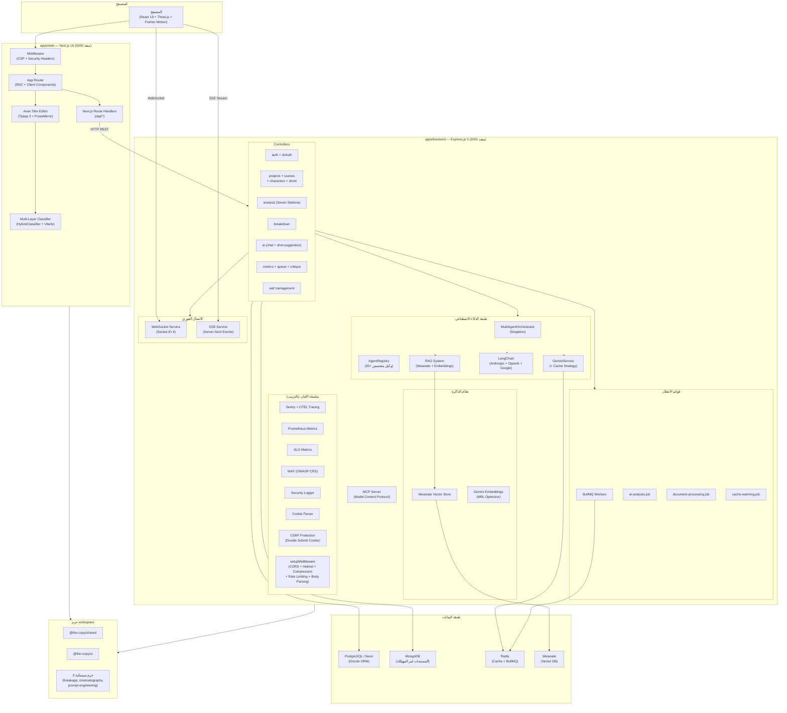
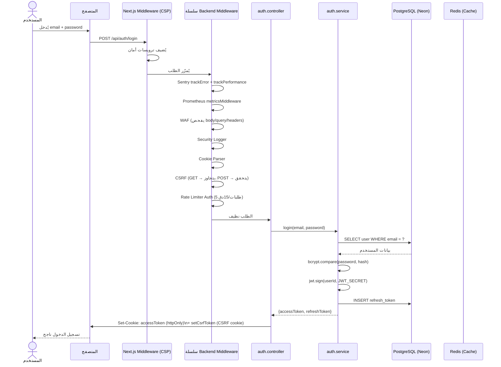
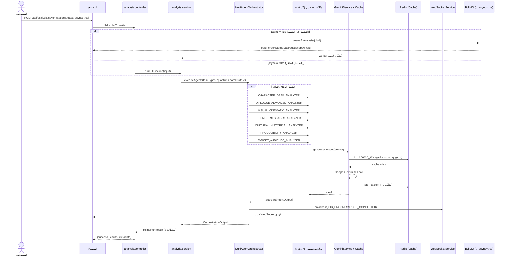
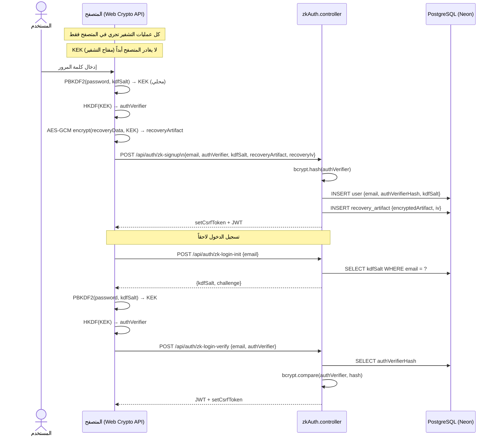
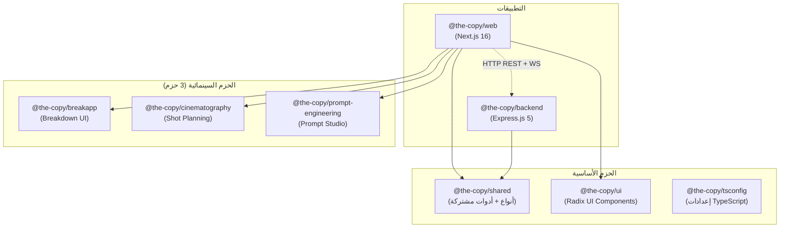

# معمارية منصة "النسخة"

> وثيقة المعمارية الفنية الشاملة للمنصة العربية للإبداع والإنتاج السينمائي
> آخر تحديث: 2026-03-30 | الإصدار: 1.2.0

---

## جدول المحتويات

1. [نظرة عامة](#1-نظرة-عامة)
2. [مخطط النظام العام](#2-مخطط-النظام-العام)
3. [طبقات المنصة الأربع](#3-طبقات-المنصة-الأربع)
4. [تدفقات الطلبات](#4-تدفقات-الطلبات)
5. [العلاقة بين التطبيقات والحزم](#5-العلاقة-بين-التطبيقات-والحزم)
6. [أنماط التصميم المستخدمة](#6-أنماط-التصميم-المستخدمة)
7. [هيكل المجلدات التفصيلي](#7-هيكل-المجلدات-التفصيلي)
8. [جدول القرارات المعمارية](#8-جدول-القرارات-المعمارية)
9. [القيود والمحاذير](#9-القيود-والمحاذير)

---

## 1. نظرة عامة

"النسخة" هي منصة ويب عربية متكاملة للإبداع والإنتاج السينمائي، مبنية بنمط **Monorepo** يجمع بين:

- **تطبيق ويب** (`apps/web`): واجهة مستخدم Next.js 16 تعمل على المنفذ 5000، تقدم أدوات التحرير والتحليل والإنتاج للكتّاب والمخرجين.
- **خادم خلفي** (`apps/backend`): Express.js 5 يعمل على المنفذ 3001، يوفر API محمياً لمعالجة السيناريوهات وتشغيل نماذج الذكاء الاصطناعي وإدارة الحالة الطويلة.
- **7 حزم workspace** تحت `packages/`، منها أربع حزم أساسية (`shared`, `ui`, `tsconfig`, `core-memory`) و3 حزم سينمائية متخصصة.

يُدار بناء المشروع عبر **Turborepo 2.5.0** و**pnpm 10.32.1** مع تسلسل بناء يضمن بناء الحزم المشتركة قبل التطبيقات.

---

## 2. مخطط النظام العام



---

## 3. طبقات المنصة الأربع

### 3.1 طبقة العرض (Presentation Layer)

**التقنيات:** Next.js 16.1.5 · React 19 · TypeScript · Tailwind CSS 4 · Radix UI · Three.js · Framer Motion · Zustand 5

**المسارات الرئيسية (App Router):**

| المسار | الغرض |
|--------|--------|
| `/(auth)/login` | تسجيل الدخول |
| `/(auth)/register` | التسجيل الجديد |
| `/(main)/` | الصفحة الرئيسية (landing) |
| `/(main)/editor` | محرر السيناريو أفان تيتر (Tiptap 3 + ProseMirror) |
| `/(main)/directors-studio` | استوديو المخرجين (مشاريع، مشاهد، شخصيات، لقطات) |
| `/(main)/breakdown` | تحليل وتفكيك السيناريو |
| `/(main)/analysis` | نظام المحطات السبع للتحليل الدرامي |
| `/(main)/brain-storm-ai` | أدوات العصف الذهني بالذكاء الاصطناعي |
| `/(main)/arabic-creative-writing-studio` | ستوديو الكتابة الإبداعية العربية |
| `/(main)/arabic-prompt-engineering-studio` | ستوديو هندسة التوجيهات |
| `/(main)/art-director` | مساعد المخرج الفني |
| `/(main)/cinematography-studio` | ستوديو التصوير السينمائي |
| `/(main)/styleIST` | محلل الأسلوب |
| `/(main)/actorai-arabic` | الممثل الاصطناعي العربي |
| `/(main)/metrics-dashboard` | لوحة مقاييس الأداء |

**Middleware (Next.js):** يُضيف ترويسات أمان (CSP + HSTS + X-Frame-Options + X-XSS-Protection) على جميع المسارات باستثناء الملفات الثابتة. في بيئة الإنتاج فقط يُفعّل CSP الكامل.

**Next.js Route Handlers (`/api/*`):**

تشغّل Next.js مجموعة من Route Handlers على الخادم مباشرة (بدون المرور بـ Express) لمهام مثل: `ai/`, `analysis/`, `breakdown/`, `health/`, `projects/`, `scenes/`, `shots/`, `characters/`, `critique/`, `review-screenplay/`, `budget/`, `editor/`.

---

### 3.2 طبقة الخدمات (Services Layer)

**التقنيات:** Express.js 5.1.0 · Socket.IO 4.8 · BullMQ 5.66 · LangChain · Google Gemini · Anthropic · OpenAI · Mistral · Weaviate

**سلسلة middleware العميقة (بالترتيب في `server.ts`):**

```
Sentry (trackError + trackPerformance)
    ↓
Prometheus (metricsMiddleware)
    ↓
SLO Metrics (sloMetricsMiddleware)
    ↓
WAF (wafMiddleware — OWASP CRS)
    ↓
Security Logger (logAuthAttempts + logRateLimitViolations)
    ↓
Cookie Parser
    ↓
CSRF Protection (Double Submit Cookie + Origin/Referer validation)
    ↓
setupMiddleware()
    ├── CORS (strict origin whitelist)
    ├── Helmet (CSP + HSTS + X-Frame-Options + ...)
    ├── Compression
    ├── Body Parsing (JSON + urlencoded, حد 10MB)
    ├── PII Sanitization (log-sanitization.middleware)
    ├── SLO Metrics
    └── Rate Limiting
         ├── General: 100 طلب / 15 دقيقة
         ├── Auth: 5 طلبات / 15 دقيقة
         └── AI: 20 طلب / ساعة
    ↓
WebSocket Service (Socket.IO على HTTP Server)
    ↓
BullMQ Workers (ai-analysis + document-processing + cache-warming)
    ↓
Bull Board Dashboard (/admin/queues — مع مصادقة)
    ↓
Routes (Health + Auth + ZK-Auth + Analysis + Projects + ...)
    ↓
Error Handlers (Sentry → errorHandler)
```

**Controllers الرئيسية:**

| Controller | نقاط النهاية الرئيسية |
|------------|----------------------|
| `auth.controller` | signup, login, logout, refresh, me |
| `zkAuth.controller` | zk-signup, zk-login-init, zk-login-verify, recovery |
| `projects.controller` | CRUD + analyzeScript |
| `scenes.controller` | CRUD على المشاهد |
| `characters.controller` | CRUD على الشخصيات |
| `shots.controller` | CRUD + generateShotSuggestion |
| `analysis.controller` | runSevenStationsPipeline (sync/async), getStationDetails |
| `breakdown.controller` | bootstrapProject, parseProject, analyzeProject, getReport, getSchedule, getSceneBreakdown, reanalyzeScene, exportReport, chat |
| `ai.controller` | chat, getShotSuggestion |
| `critique.controller` | getAllCritiqueConfigs, getCritiqueConfig, getDimensionDetails, getCritiqueSummary |
| `queue.controller` | getJobStatus, getQueueStats, retryJob, cleanQueue |
| `metrics.controller` | snapshot, latest, range, database, redis, queue, api, resources, gemini, report, cache, APM |
| `health.controller` | getHealth, getLiveness, getReadiness, getStartup, getDetailedHealth |
| `encryptedDocs.controller` | CRUD على المستندات المشفرة (client-side encryption) |
| `workflow.controller` | إدارة سير العمل متعدد الوكلاء |
| `realtime.controller` | إدارة اتصالات SSE و WebSocket |

**طبقة الذكاء الاصطناعي:**

تعتمد المنصة على نمط Multi-Agent Orchestration. `AnalysisService` يستدعي `MultiAgentOrchestrator` (Singleton) الذي يوزّع المهام على وكلاء متخصصين:

| فئة الوكلاء | أمثلة |
|-------------|--------|
| تحليل الشخصيات | `characterDeepAnalyzer`, `characterNetwork`, `characterVoice` |
| تحليل الحوار | `dialogueAdvancedAnalyzer`, `dialogueForensics` |
| تحليل بصري وسينمائي | `visualCinematicAnalyzer` |
| تحليل الأفكار والمضامين | `themesMessagesAnalyzer`, `thematicMining` |
| التحليل الثقافي والتاريخي | `culturalHistoricalAnalyzer` |
| الجدوى الإنتاجية | `producibilityAnalyzer`, `targetAudienceAnalyzer` |
| الإبداع والكتابة | `sceneGenerator`, `adaptiveRewriting`, `worldBuilder` |
| نقاشات متعددة الوكلاء | `debate` system |
| التقييم | `audienceResonance`, `platformAdapter` |

**الخدمات الداعمة:**

- `GeminiService`: يتصل بـ Google Gemini API مع استراتيجية تخزين مؤقت متكيّفة (`gemini-cache.strategy`) ومتتبّع للتكلفة (`gemini-cost-tracker`).
- `CacheService`: تخزين Redis مع TTL متكيّف.
- `WebSocketService`: يدير اتصالات Socket.IO، يربط كل اتصال بمستخدم مصادق عليه عبر JWT.
- `SSEService`: بث أحداث الزمن الفعلي (progress, completion, errors) لعمليات طويلة الأمد.
- `RAG System`: يُضمّن المحتوى باستخدام Gemini Embeddings + MRL Optimizer ويُخزّنه في Weaviate.
- `LLMGuardrails`: يُصفّي المدخلات والمخرجات لنماذج اللغة.
- `MFAService`: دعم المصادقة متعددة العوامل (TOTP).
- `NotificationService`: إرسال إشعارات البريد الإلكتروني (Nodemailer).

---

### 3.3 طبقة البيانات (Data Layer)

**PostgreSQL / Neon (عبر Drizzle ORM):**

جداول المخطط الرئيسية في `schema.ts` و`zkSchema.ts`:

| الجدول | الغرض |
|--------|--------|
| `users` | المستخدمون (+ حقول MFA + حقول ZK-Auth) |
| `sessions` | جلسات Express |
| `refresh_tokens` | JWT Refresh Tokens مع دوران تلقائي |
| `projects` | مشاريع المخرجين |
| `scenes` | مشاهد المشروع |
| `characters` | شخصيات المشروع |
| `breakdown_reports` | تقارير تفكيك السيناريو |
| `scene_breakdowns` | تحليل المشاهد الفردية |
| `scene_header_metadata` | بيانات رأس المشهد (نوع، موقع، وقت) |
| `shooting_schedules` | جداول التصوير |
| `breakdown_exports` | ملفات التصدير (DOCX, PDF, ...) |
| `breakdown_jobs` | حالة مهام التحليل في الخلفية |
| `recovery_artifacts` | أدوات استرداد الحساب (مشفرة) |
| `encrypted_documents` | المستندات المشفرة من جانب العميل (AES-GCM) |

جميع الجداول تحمل مؤشرات مُحسَّنة للاستعلامات الشائعة (مثل `idx_projects_user_created`, `idx_scenes_project_number`).

**MongoDB:** يُستخدم لتخزين المستندات غير المهيكلة والبيانات المرنة التي لا تناسب البنية العلائقية.

**Redis:** يخدم غرضين: طبقة التخزين المؤقت لـ GeminiService، وBackend لـ BullMQ لقوائم انتظار المهام الخلفية.

**Weaviate (Vector DB):** يخزّن التضمينات لنظام RAG، يستخدم `WeaviateMemoryStore` مع `GeminiEmbeddingGenerator` و`MRLOptimizer` لضغط أبعاد الأولويات.

---

### 3.4 طبقة الحزم (Packages Layer)

**الحزم الأساسية:**

| الحزمة | الغرض |
|--------|--------|
| `@the-copy/shared` | أنواع TypeScript المشتركة وأدوات مساعدة |
| `@the-copy/ui` | مكونات Radix UI المُعاد استخدامها |
| `@the-copy/tsconfig` | إعدادات TypeScript المشتركة |

**الحزم السينمائية المتخصصة (3 حزم):**

| الحزمة | الوظيفة |
|--------|---------|
| `@the-copy/breakapp` | واجهة تطبيق Breakdown |
| `@the-copy/cinematography` | أدوات التصوير السينمائي |
| `@the-copy/prompt-engineering` | ستوديو هندسة التوجيهات |

---

## 4. تدفقات الطلبات

### 4.1 تدفق المصادقة العادية (JWT)



---

### 4.2 تدفق تحليل السيناريو بالذكاء الاصطناعي (المحطات السبع)



---

### 4.3 تدفق المصادقة Zero-Knowledge (ZK-Auth)



---

## 5. العلاقة بين التطبيقات والحزم



**ملاحظة:** الحزم السينمائية تُستهلك حصراً من `apps/web`. يستهلك `apps/backend` فقط `@the-copy/shared` للأنواع المشتركة. هذا الفصل يمنع تسرّب منطق الواجهة إلى الخادم.

---

## 6. أنماط التصميم المستخدمة

### 6.1 Singleton Pattern — المحرك الواحد للوكلاء

`MultiAgentOrchestrator` في `apps/backend/src/services/agents/orchestrator.ts` يُطبّق نمط Singleton لضمان حالة واحدة لنظام الوكلاء طوال دورة حياة الخادم:

```typescript
// apps/backend/src/services/agents/orchestrator.ts
export class MultiAgentOrchestrator {
  private static instance: MultiAgentOrchestrator;

  private constructor() {}

  public static getInstance(): MultiAgentOrchestrator {
    if (!MultiAgentOrchestrator.instance) {
      MultiAgentOrchestrator.instance = new MultiAgentOrchestrator();
    }
    return MultiAgentOrchestrator.instance;
  }
}
```

يُطبَّق النمط ذاته في `WebSocketService` و`SSEService`.

---

### 6.2 Middleware Chain Pattern — الدفاع متعدد الطبقات

`server.ts` يُطبّق سلسلة middleware صريحة ومرتّبة. كل طبقة مسؤولة عن جانب واحد فقط من الأمان:

```
WAF → SecurityLogger → CookieParser → CSRF → CORS → Helmet → RateLimiter → Routes
```

هذا يعكس مبدأ **Defense in Depth** الموصى به في OWASP.

---

### 6.3 Hybrid React + Imperative Pattern — محرر السيناريو

محرر أفان تيتر في `apps/web/src/app/(main)/editor/src/App.tsx` يُطبّق نمطاً هجيناً:

- **React** يدير الغلاف الخارجي (Shell) وحالة واجهة المستخدم.
- **`EditorArea`** (فئة إجرائية) تدير محرك Tiptap/ProseMirror مباشرة خارج دورة حياة React.

هذا النمط ضروري لأن ProseMirror يدير حالته الخاصة وتكاملها مع React state يُسبّب مشاكل أداء.

---

### 6.4 Multi-Layer Classification Pipeline — تصنيف النصوص

خط أنابيب تصنيف السيناريو الحالي داخل محرر الويب يتكوّن من سبع مراحل:

```
النص المُلصق
    ↓ 1. التطبيع والتقطيع
    ↓ 2. HybridClassifier (regex + قواعد السياق + نقاط الثقة)
    ↓ 3. PostClassificationReviewer (8 كاشفات جودة)
    ↓ 4. SequenceOptimization (خوارزمية Viterbi)
    ↓ 5. Self-Reflection Pass (مراجعة بالذكاء الاصطناعي)
    ↓ 6. RetroactiveCorrection (إصلاح أسماء الشخصيات)
    ↓ 7. Agent Review (LLM عند نقاط الشك ≥ 74 + ≥ 2 نتائج)
النتيجة النهائية
```

---

### 6.5 Repository + Service Layer Pattern — فصل المسؤوليات

يتبع الباك اند فصلاً واضحاً:

- **Controllers**: تحليل الطلب والرد فقط، لا منطق أعمال.
- **Services**: كل المنطق (مثل `AnalysisService`, `AuthService`, `BreakdownService`).
- **DB Layer**: Drizzle ORM مع schema مُعرَّف مسبقاً في `schema.ts`.

مثال: `breakdown.controller.ts` يستدعي فقط `breakdownService.createProjectAndParse()` ويُعيد الاستجابة، بينما كل منطق تحليل السيناريو يقع داخل `services/breakdown/service.ts`.

---

### 6.6 Workflow Pattern — سير العمل المُعرَّف مسبقاً

`workflow-presets.ts` يُعرّف سيرات عمل جاهزة (`PresetWorkflowName`) يُنفّذها `workflowExecutor`. هذا يسمح بتشكيل تسلسلات وكلاء معقدة بشكل تصريحي دون تعديل كود الـ Orchestrator.

---

### 6.7 Cache-Aside Pattern — استراتيجية التخزين المؤقت

`GeminiService` يُطبّق Cache-Aside مع تكيّف تلقائي لـ TTL:

```
طلب جديد
    ↓
generateGeminiCacheKey(params)
    ↓
Redis GET(key)
    ├── HIT → إعادة القيمة فوراً + trackGeminiCache(hit)
    └── MISS → استدعاء Gemini API → SET Redis (TTL متكيّف) + trackGeminiCache(miss)
```

---

## 7. هيكل المجلدات التفصيلي

### 7.1 المستوى الجذري

```
the-copy/
├── apps/
│   ├── web/                    # Next.js 16 frontend (منفذ 5000)
│   └── backend/                # Express.js 5 backend (منفذ 3001)
├── packages/
│   ├── shared/                 # أنواع + أدوات مشتركة
│   ├── ui/                     # مكونات Radix UI
│   ├── tsconfig/               # إعدادات TypeScript
│   ├── editor/                 # محرك أفان تيتر
│   ├── breakdown/              # محرك تفكيك السيناريو
│   ├── breakapp/               # واجهة Breakdown
│   ├── directors-studio/       # استوديو المخرجين
│   ├── budget/                 # الميزانية الإنتاجية
│   ├── cinematography/         # التصوير السينمائي
│   ├── art-director/           # المخرج الفني
│   ├── creative-writing/       # الكتابة الإبداعية
│   ├── prompt-engineering/     # هندسة التوجيهات
│   ├── brain-storm-ai/         # العصف الذهني
│   ├── styleist/               # محلل الأسلوب
│   ├── actorai/                # الممثل الاصطناعي
│   └── cinefit/                # مطابقة الممثلين
├── docs/                       # التوثيق الفني
│   ├── ARCHITECTURE.md         # هذا الملف
│   └── adr/                    # قرارات المعمارية
├── scripts/                    # سكريبتات الإدارة (PowerShell + Node.js)
├── redis/                      # ملفات Redis المحلية
├── turbo.json                  # إعداد Turborepo
├── pnpm-workspace.yaml         # إعداد pnpm workspace
└── package.json                # pnpm@10.32.1, turbo@2.5.0
```

### 7.2 apps/backend/src/

```
src/
├── server.ts                   # نقطة الدخول + سلسلة Middleware + Routes
├── mcp-server.ts               # خادم MCP (Model Context Protocol) منفصل
├── bootstrap/                  # تهيئة بدء التشغيل (runtime-alias, ...)
├── config/
│   ├── env.ts                  # قراءة وتحقق المتغيرات البيئية (Zod)
│   ├── sentry.ts               # إعداد Sentry
│   ├── tracing.ts              # OpenTelemetry
│   ├── redis.config.ts         # إعداد Redis + التحقق من الإصدار
│   └── websocket.config.ts     # إعداد Socket.IO
├── controllers/                # 14 controller (راجع القسم 3.2)
├── db/
│   ├── schema.ts               # جداول PostgreSQL الرئيسية (Drizzle)
│   ├── zkSchema.ts             # جداول ZK-Auth والمستندات المشفرة
│   ├── client.ts               # اتصال Neon Serverless
│   └── index.ts                # barrel exports
├── memory/
│   ├── vector-store/           # WeaviateMemoryStore
│   ├── embeddings/             # GeminiEmbeddingGenerator + MRLOptimizer
│   ├── indexer/                # فهرسة المستندات
│   └── retrieval/              # استرجاع السياق
├── middleware/
│   ├── index.ts                # setupMiddleware + errorHandler
│   ├── auth.middleware.ts      # JWT verification + user injection
│   ├── waf.middleware.ts       # WAF (OWASP CRS)
│   ├── csrf.middleware.ts      # CSRF Double Submit Cookie
│   ├── metrics.middleware.ts   # Prometheus counters + histograms
│   ├── slo-metrics.middleware.ts # SLO tracking
│   ├── sentry.middleware.ts    # Sentry error + performance
│   ├── security-logger.middleware.ts # تسجيل الأحداث الأمنية
│   ├── log-sanitization.middleware.ts # إخفاء PII من السجلات
│   ├── csp.middleware.ts       # Content Security Policy
│   ├── validation.middleware.ts # Zod validation helpers
│   └── bull-board.middleware.ts # Bull Dashboard UI
├── queues/
│   ├── index.ts                # initializeWorkers + shutdownQueues
│   ├── queue.config.ts         # QueueManager (BullMQ config)
│   └── jobs/
│       ├── ai-analysis.job.ts  # مهمة تحليل الذكاء الاصطناعي
│       ├── document-processing.job.ts # مهمة معالجة المستندات
│       └── cache-warming.job.ts # مهمة تسخين الكاش
├── services/
│   ├── agents/                 # نظام الوكلاء المتخصصين (30+ وكيل)
│   │   ├── orchestrator.ts     # MultiAgentOrchestrator (Singleton)
│   │   ├── registry.ts         # AgentRegistry
│   │   ├── core/               # enums, types, workflow-executor, workflow-presets
│   │   ├── debate/             # نظام النقاشات متعدد الوكلاء
│   │   ├── characterDeepAnalyzer/
│   │   ├── dialogueAdvancedAnalyzer/
│   │   ├── visualCinematicAnalyzer/
│   │   └── [30+ وكيل آخر...]
│   ├── breakdown/              # service.ts + parser.ts + types.ts + utils.ts
│   ├── rag/                    # embeddings + enhancedRAG + semanticChunker
│   ├── analysis.service.ts     # تشغيل pipeline المحطات السبع
│   ├── auth.service.ts         # JWT + bcrypt + refresh token rotation
│   ├── gemini.service.ts       # Google Gemini API + cache strategy
│   ├── cache.service.ts        # Redis cache wrapper
│   ├── gemini-cache.strategy.ts # استراتيجية TTL التكيفي
│   ├── gemini-cost-tracker.service.ts # تتبع تكاليف Gemini
│   ├── llm-guardrails.service.ts # فلترة المدخلات/المخرجات
│   ├── mfa.service.ts          # TOTP (otplib)
│   ├── metrics-aggregator.service.ts # تجميع مقاييس الأداء
│   ├── cache-metrics.service.ts # مقاييس الكاش
│   ├── redis-metrics.service.ts # مقاييس Redis
│   ├── resource-monitor.service.ts # مراقبة موارد النظام
│   ├── websocket.service.ts    # Socket.IO manager
│   ├── sse.service.ts          # Server-Sent Events manager
│   ├── notification.service.ts # Nodemailer
│   └── realtime.service.ts     # خدمة الزمن الفعلي الموحدة
├── types/                      # أنواع TypeScript المشتركة
└── utils/
    └── logger.ts               # Winston + Pino logger
```

### 7.3 apps/web/src/

```
src/
├── middleware.ts               # CSP + Security Headers (Next.js Edge)
├── app/
│   ├── layout.tsx              # Root Layout (RTL + Dark Theme + Providers)
│   ├── page.tsx                # Landing Page
│   ├── providers.tsx           # React providers (TanStack Query, ...)
│   ├── (auth)/
│   │   ├── login/page.tsx
│   │   └── register/page.tsx
│   ├── (main)/
│   │   ├── layout.tsx
│   │   ├── editor/             # محرر أفان تيتر
│   │   │   └── src/
│   │   │       ├── App.tsx     # Root component (Hybrid React + Imperative)
│   │   │       ├── components/
│   │   │       │   ├── app-shell/ # Header, Sidebar, Dock, Footer
│   │   │       │   └── editor/    # EditorArea (Tiptap)
│   │   │       ├── extensions/ # Tiptap extensions + Classification Engine
│   │   │       │   └── paste-classifier.ts # Main classification entry
│   │   │       └── pipeline/   # Import orchestration + Agent command engine
│   │   ├── directors-studio/   # مشاريع + مشاهد + شخصيات + لقطات
│   │   ├── breakdown/          # DDD structure (domain, application, infrastructure, presentation)
│   │   ├── analysis/           # نظام المحطات السبع
│   │   ├── brain-storm-ai/
│   │   ├── arabic-creative-writing-studio/
│   │   ├── arabic-prompt-engineering-studio/
│   │   ├── art-director/
│   │   ├── cinematography-studio/
│   │   ├── styleIST/
│   │   ├── actorai-arabic/
│   │   └── metrics-dashboard/
│   └── api/                    # Next.js Route Handlers
│       ├── ai/, analysis/, breakdown/, projects/, scenes/
│       ├── shots/, characters/, critique/, budget/
│       ├── health/, editor/, gemini/, groq-test/
│       └── review-screenplay/
```

---

## 8. جدول القرارات المعمارية

| القرار | الاختيار | البديل المرفوض | المبرر |
|--------|----------|----------------|--------|
| إطار الباك اند | Express.js 5.1.0 | Fastify / NestJS | النضج، المرونة، الدعم الواسع لـ Socket.IO وBullMQ |
| إطار الفرونت اند | Next.js 16 (App Router) | Remix / Vite SPA | دعم RSC، التحسين التلقائي للصور، الـ Middleware، التكامل مع Vercel |
| ORM | Drizzle ORM | Prisma / TypeORM | أداء أعلى، Type-safety كاملة، مرونة في كتابة SQL الخام |
| قاعدة البيانات الرئيسية | PostgreSQL / Neon (Serverless) | PlanetScale / Supabase | Neon يوفر Serverless connection pooling مع دعم ممتاز لـ Drizzle |
| قوائم الانتظار | BullMQ + Redis | AWS SQS / RabbitMQ | سهولة التكامل مع Redis الموجود، Bull Board للمراقبة، دعم الجدولة |
| Vector DB | Weaviate | Pinecone / Qdrant | دعم GraphQL API، المرونة في schemas، النشر الذاتي |
| مصادقة ZK | PBKDF2 + HKDF + AES-GCM | SRP protocol كامل | تحقيق أهداف ZK بتعقيد أقل مع الحفاظ على الأمان، KEK لا يغادر المتصفح |
| مصادقة عادية | JWT (access + refresh) + httpOnly cookie | Session-only / OAuth فقط | التوازن بين Stateless (access token) وإمكانية الإلغاء (refresh token في DB) |
| CSRF Protection | Double Submit Cookie + Origin validation | csurf (deprecated) | نمط أحدث، يدعم SPA و API clients بشكل أفضل |
| Monorepo | pnpm + Turborepo | Nx / Lerna | سرعة pnpm، تحسين cache في Turborepo، إعداد أبسط من Nx |
| محرر السيناريو | Tiptap 3 + ProseMirror | Quill / Draft.js | دعم RTL، قابلية التوسعة العالية، Pagination A4 عبر `@tiptap-pro/extension-pages` |
| مراقبة الأداء | Prometheus + prom-client | Datadog / New Relic | التحكم الكامل، التكامل مع Grafana، تكلفة صفر |
| تتبع الأخطاء | Sentry (backend + frontend) | Rollbar / Bugsnag | النضج، دعم Source Maps لـ Next.js، واجهة ممتازة |
| تتبع توزيع الطلبات | OpenTelemetry + OTLP | Jaeger مباشرة | المعيارية، التوافق مع منصات متعددة |

---

## 9. القيود والمحاذير

### 9.1 قيود معروفة

**Rate Limiting بالذاكرة المحلية:**
`express-rate-limit` في `middleware/index.ts` يستخدم in-memory store. في بيئة نشر متعددة الخوادم (Horizontal Scaling)، كل خادم يتتبع حدوده بشكل مستقل، مما يُقلّل فاعلية الحد. الحل الموثّق في الكود: استخدام `rate-limit-redis` مع `RedisStore`.

**BullMQ يتطلب Redis 6.2+:**
`queues/index.ts` يتحقق من إصدار Redis عند بدء التشغيل. إذا كان الإصدار غير متوافق، تُعطَّل قوائم الانتظار ويستمر التطبيق بدون المهام الخلفية. هذا يعني أن التحليل غير المتزامن (`async: true`) سيفشل صامتاً.

**Weaviate كخدمة خارجية:**
نظام الذاكرة يتطلب Weaviate متاحاً. في حالة فشل الاتصال عند بدء التشغيل، يُسجَّل خطأ ويستمر التطبيق — لكن ميزات RAG والذاكرة السياقية لن تعمل.

**محرر أفان تيتر على Client فقط:**
النمط الهجين (React + Imperative EditorArea) يعني أن المحرر لا يدعم SSR. صفحة `/editor` تُعرض كـ Client Component كاملة.

**MCP Server منفصل:**
`mcp-server.ts` يعمل كخادم مستقل (خلاف `server.ts`) ويجب تشغيله بشكل منفصل عبر `pnpm dev:mcp`. في البيئة الحالية، الخادم يحتوي على أدوات تجريبية فقط (`add`, `greeting`).

### 9.2 محاذير الأمان

**CSRF يتطلب SameSite Cookies:**
حماية CSRF تعتمد على صحة `Origin` و`Referer` headers. في بيئات proxy أو CDN تُزيل هذه الترويسات، قد تفشل الحماية. يجب التأكد من إعداد الـ proxy بشكل صحيح لتمرير هذه الترويسات.

**Zero-Knowledge Auth:**
المبدأ الأساسي هو أن `KEK` (مفتاح التشفير) لا يغادر المتصفح. إذا أُرسل `authVerifier` بدلاً من `KEK` (وهو الصحيح)، يُحافظ النظام على خاصية ZK. أي تعديل مستقبلي يجب التحقق من عدم إرسال KEK للخادم.

**نماذج اللغة (LLM Guardrails):**
`llm-guardrails.service.ts` يُصفّي المدخلات والمخرجات لكن لا يُعدّ ضماناً كاملاً. المحتوى المُولَّد يجب مراجعته في السياقات الحساسة.

### 9.3 القيود المعمارية

**الاقتران بين Next.js API Routes والباك اند:**
المنصة تستخدم كلاً من Next.js Route Handlers (`/api/*` من الفرونت اند) و Express Routes (`/api/*` من الباك اند). بعض الوظائف مُكررة. يجب الاتفاق على قاعدة واضحة: أي المسارات تمر بـ Express وأيها تُعالج مباشرة في Next.js.

**حزم workspace لا تعرّف Entry Points موحدة:**
بعض الحزم السينمائية قد لا تحتوي على `package.json` بـ `exports` field مُعرَّف بشكل كامل. هذا يؤثر على tree-shaking في Webpack/Turbopack.

**MongoDB غير مُدار بـ Schema:**
على عكس PostgreSQL المُدار بـ Drizzle، MongoDB يُستخدم بدون Schema validation صريح على مستوى التطبيق. يُنصح بإضافة Zod validation عند الكتابة.

---

*هذه الوثيقة تعكس الكود الفعلي في المستودع بتاريخ 2026-03-30. أي تغيير في البنية يجب أن يُحدَّث هنا فوراً.*
