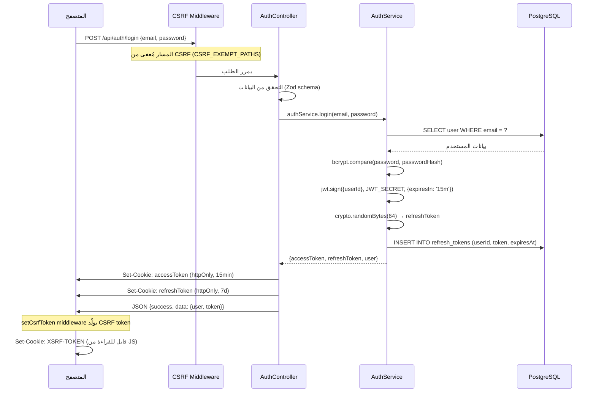
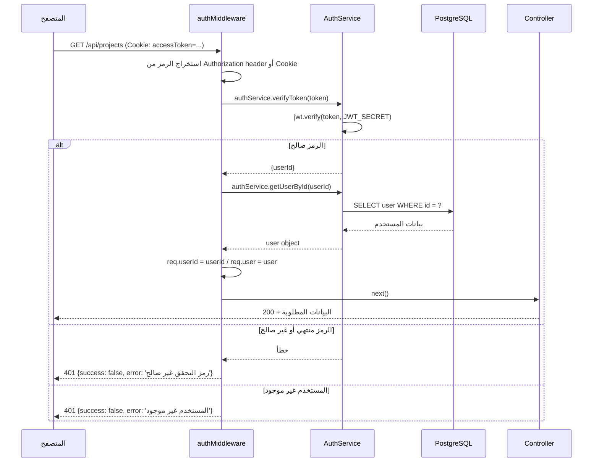
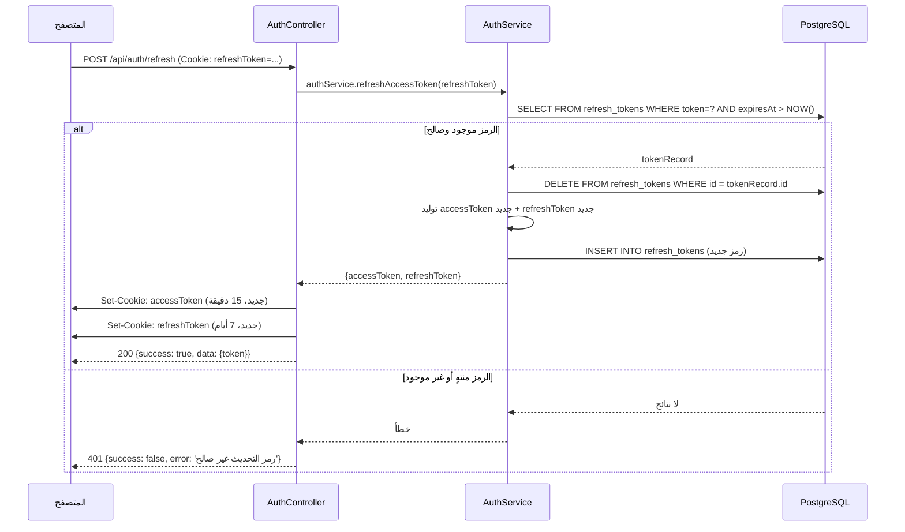
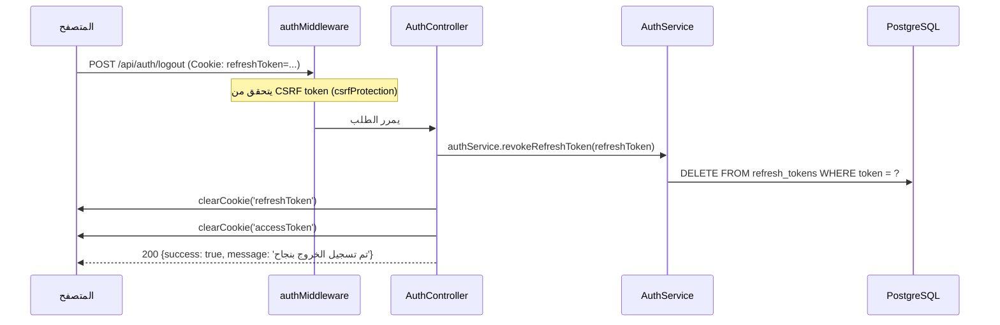
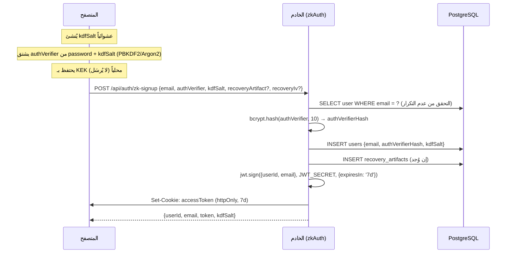
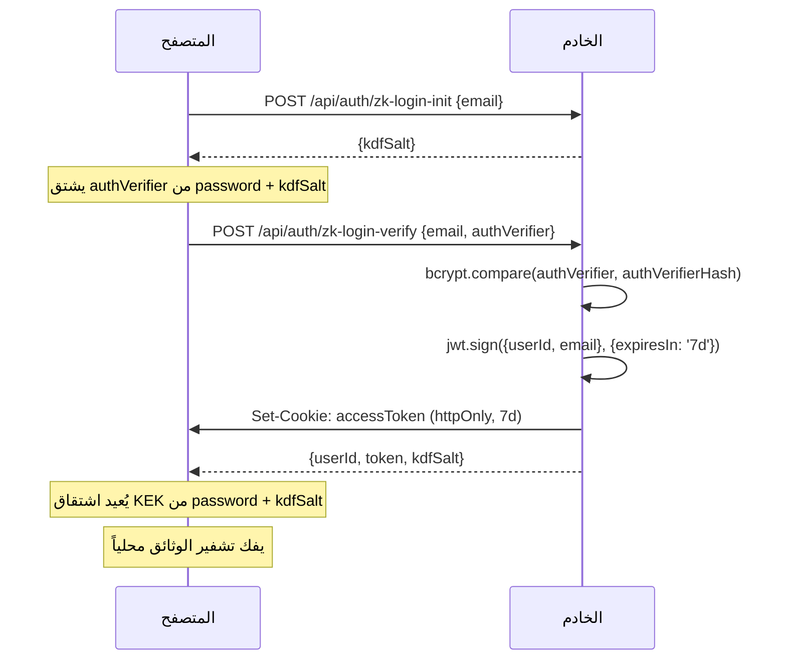

# دليل المصادقة والتفويض — مشروع "النسخة"

**آخر تحديث:** 2026-03-30
**يغطي:** Backend (Express/Node.js) + Frontend (Next.js)

---

## جدول المحتويات

1. [نظرة عامة](#1-نظرة-عامة)
2. [تدفق المصادقة](#2-تدفق-المصادقة)
3. [حماية المسارات في الفرونت اند](#3-حماية-المسارات-في-الفرونت-اند)
4. [حماية المسارات في الباك اند](#4-حماية-المسارات-في-الباك-اند)
5. [الأدوار والصلاحيات](#5-الأدوار-والصلاحيات)
6. [كيفية حماية مسار جديد](#6-كيفية-حماية-مسار-جديد)
7. [إدارة الجلسات والرموز](#7-إدارة-الجلسات-والرموز)
8. [حماية CSRF](#8-حماية-csrf)
9. [نظام المصادقة بدون معرفة (Zero-Knowledge)](#9-نظام-المصادقة-بدون-معرفة-zero-knowledge)
10. [سجل الأمان](#10-سجل-الأمان)
11. [متغيرات البيئة](#11-متغيرات-البيئة)
12. [أخطاء المصادقة الشائعة](#12-أخطاء-المصادقة-الشائعة)
13. [تفاصيل تقنية إضافية](#13-تفاصيل-تقنية-إضافية)
14. [المصطلحات](#14-المصطلحات)

---

## 1. نظرة عامة

يعتمد المشروع على نظامَي مصادقة متوازيين: مصادقة تقليدية قائمة على JWT، ومصادقة بدون معرفة (Zero-Knowledge) للوثائق المشفرة. كلا النظامين يخزنان الرموز في Cookies آمنة بدلاً من `localStorage`.

### جدول خصائص المصادقة

| الخاصية | القيمة / الوصف |
|---|---|
| آلية المصادقة | JWT (JSON Web Tokens) عبر `jsonwebtoken` |
| تجزئة كلمة المرور | bcrypt — `SALT_ROUNDS = 10` |
| مدة رمز الوصول (Access Token) | 15 دقيقة |
| مدة رمز التجديد (Refresh Token) | 7 أيام |
| تخزين الرموز | `httpOnly` Cookie — غير قابلة للوصول من JavaScript |
| `sameSite` للـ Cookies | `strict` — منع إرسالها في طلبات cross-site |
| `secure` للـ Cookies | `true` في الإنتاج (HTTPS فقط) |
| حماية CSRF | نمط Double Submit Cookie مع مقارنة ثابتة الوقت |
| تدوير Refresh Token | نعم — يُحذف القديم عند كل تجديد |
| تخزين Refresh Token | قاعدة البيانات (جدول `refresh_tokens`) |
| Zero-Knowledge Auth | نعم — للوثائق المشفرة (`/api/auth/zk-*`) |
| Firebase | مهيأ (متغيرات البيئة موجودة) — غير مُدمج في تدفق المصادقة الأساسي |
| WAF | نعم — حماية من SQL Injection, XSS, Path Traversal |
| سجل الأمان | Redis (مع fallback في الذاكرة) — 24 ساعة |
| حظر IP تلقائي | نعم — أكثر من 10 انتهاكات خلال ساعة |

---

## 2. تدفق المصادقة

### 2.1 تسجيل الدخول العادي (Login)



### 2.2 التحقق من الرمز في كل طلب محمي



### 2.3 تجديد رمز الوصول (Token Refresh)



### 2.4 تسجيل الخروج (Logout)



---

## 3. حماية المسارات في الفرونت اند

### 3.1 Next.js Middleware (`apps/web/src/middleware.ts`)

الـ middleware في الفرونت اند لا يتحقق من المصادقة مباشرة — وظيفته الأساسية هي إضافة رؤوس الأمان (Security Headers) لكل الصفحات:

```typescript
// apps/web/src/middleware.ts
export function middleware(_request: NextRequest) {
  const response = NextResponse.next();

  // Content Security Policy (CSP) — في الإنتاج فقط
  if (contentSecurityPolicy) {
    response.headers.set("Content-Security-Policy", contentSecurityPolicy);
  }

  // رؤوس أمان إضافية
  response.headers.set("X-Content-Type-Options", "nosniff");
  response.headers.set("X-Frame-Options", "DENY");
  response.headers.set("X-XSS-Protection", "1; mode=block");
  response.headers.set("Referrer-Policy", "strict-origin-when-cross-origin");

  // HSTS — في الإنتاج فقط
  // Strict-Transport-Security: max-age=31536000; includeSubDomains; preload

  return response;
}

// يُطبَّق على كل المسارات ما عدا الملفات الثابتة
export const config = {
  matcher: ["/((?!_next/static|_next/image|favicon.ico|.*\\.(?:svg|png|...)$).*)"],
};
```

**رؤوس CSP المُطبَّقة في الإنتاج:**

| الرأس | القيمة |
|---|---|
| `default-src` | `'self'` |
| `script-src` | `'self'` + Google APIs + Sentry + CDN |
| `style-src` | `'self'` + Google Fonts + CDN |
| `img-src` | `'self'` + data + blob + HTTPS |
| `frame-ancestors` | `'none'` (أو allowedDevOrigin في التطوير) |
| `object-src` | `'none'` |
| `upgrade-insecure-requests` | مُفعَّل |

**ملاحظة:** لا يوجد في `apps/web/src/middleware.ts` فرض مصادقة على `/editor`. الحماية الأساسية تُطبَّق في الخلفية وليس على Route الصفحة نفسها.

### 3.2 حماية المسارات على مستوى التطبيق

تتم حماية المسارات الخاصة عبر التحقق من حالة المصادقة في كل صفحة أو مكون عبر `useAuth` hook الذي يستعلم من `/api/auth/me`. إذا فشل الطلب (401)، يُعاد توجيه المستخدم لصفحة تسجيل الدخول.

**ملاحظة:** الرموز مخزنة في `httpOnly` Cookies ولا يمكن الوصول إليها من JavaScript. الدوال `storeToken`، `getToken`، `removeToken` في `apps/web/src/lib/auth.ts` متقادمة (deprecated) وترجع `null` دائماً.

---

## 4. حماية المسارات في الباك اند

### 4.1 `authMiddleware` — الوسيط الرئيسي

الملف: `apps/backend/src/middleware/auth.middleware.ts`

يعمل الوسيط بالخطوات الآتية:

1. يحاول استخراج الرمز من `Authorization: Bearer <token>` أولاً.
2. إن لم يجده، يبحث في `Cookie: accessToken=<token>`.
3. يمرر الرمز لـ `authService.verifyToken()` الذي يستخدم `jwt.verify()`.
4. يجلب بيانات المستخدم من قاعدة البيانات ويضيفها إلى `req.user` و `req.userId`.

```typescript
// استخدام authMiddleware على مسار محمي
app.get('/api/projects', authMiddleware, projectsController.getProjects.bind(projectsController));

// استخدامه مع CSRF على مسار يُعدِّل بيانات
app.post('/api/projects', authMiddleware, csrfProtection, projectsController.createProject.bind(projectsController));
```

**أولوية استخراج الرمز:**
```
Authorization: Bearer <token>  →  (أولوية قصوى)
Cookie: accessToken=<token>    →  (احتياطي)
```

### 4.2 جدول المسارات وحالة حمايتها

| المسار | الطريقة | authMiddleware | csrfProtection | ملاحظة |
|---|---|---|---|---|
| `/api/auth/signup` | POST | لا | معفى | عام |
| `/api/auth/login` | POST | لا | معفى | عام |
| `/api/auth/logout` | POST | لا | نعم | يحتاج CSRF |
| `/api/auth/refresh` | POST | لا | معفى | معفى — يجدد الجلسة |
| `/api/auth/me` | GET | نعم | لا | يجلب المستخدم الحالي |
| `/api/auth/zk-signup` | POST | لا | معفى | ZK عام |
| `/api/auth/zk-login-init` | POST | لا | معفى | ZK عام |
| `/api/auth/zk-login-verify` | POST | لا | معفى | ZK عام |
| `/api/auth/recovery` | POST | نعم | نعم | ZK محمي |
| `/api/projects` | GET | نعم | لا | قراءة فقط |
| `/api/projects` | POST | نعم | نعم | تعديل |
| `/api/projects/:id` | PUT/DELETE | نعم | نعم | تعديل |
| `/api/analysis/*` | * | نعم | - | محمي |
| `/api/critique/*` | * | نعم | - | محمي |
| `/api/scenes*` | * | نعم | - | محمي |
| `/api/characters*` | * | نعم | - | محمي |
| `/api/shots*` | * | نعم | - | محمي |
| `/api/ai/chat` | POST | نعم | نعم | محمي |
| `/api/docs` | POST/PUT/DELETE | نعم | نعم | وثائق مشفرة |
| `/api/breakdown/*` | * | نعم | - | محمي |
| `/api/queue/*` | * | نعم | - | محمي |
| `/api/memory/*` | * | نعم | - | `app.use('/api/memory', authMiddleware, memoryRoutes)` |
| `/api/metrics/*` | GET | نعم | لا | مراقبة |
| `/api/waf/*` | * | نعم | - | محمي |
| `/admin/queues` | * | نعم | - | Bull Board |
| `/health/*` | GET | لا | معفى | صحة النظام |
| `/metrics` | GET | لا | معفى | Prometheus |

---

## 5. الأدوار والصلاحيات

النظام الحالي لا يمتلك نظام أدوار متعدد المستويات (RBAC) معرَّفاً بشكل صريح. التفويض يعتمد على **ملكية الموارد**:

- كل مورد (مشروع، مشهد، شخصية، لقطة) مرتبط بـ `userId`.
- يتحقق كل controller من أن `req.userId` يطابق `userId` المورد المطلوب.
- **لا يوجد** دور `admin` مُعرَّف في قاعدة البيانات حالياً.

| الدور | الصلاحيات |
|---|---|
| مستخدم مصادق | الوصول إلى أغلب واجهات الخلفية المحمية |
| عام | login, signup, refresh, health |

**حقول المستخدم في `users` table:**

```
id            — معرّف فريد (UUID)
email         — البريد الإلكتروني (فريد)
passwordHash  — تجزئة bcrypt
firstName     — الاسم الأول (اختياري)
lastName      — الاسم الأخير (اختياري)
mfaEnabled    — MFA (مُعدّ هيكلياً، غير مُفعَّل تماماً)
mfaSecret     — سر MFA
authVerifierHash — hash لـ ZK authentication
kdfSalt       — ملح اشتقاق المفتاح لـ ZK
publicKey     — المفتاح العام للمشاركة (ZK)
accountStatus — 'active' | غيرها (يُرفض تسجيل الدخول إن لم يكن active)
lastLogin     — آخر دخول
```

**التحقق من ملكية المورد (مثال من projectsController):**

```typescript
// يجب أن يكون المشروع مملوكاً للمستخدم الحالي
const project = await db.select()
  .from(projects)
  .where(and(
    eq(projects.id, projectId),
    eq(projects.userId, req.userId)  // التحقق من الملكية
  ))
  .limit(1);

if (!project.length) {
  return res.status(404).json({ success: false, error: 'المشروع غير موجود' });
}
```

---

## 6. كيفية حماية مسار جديد

### 6.1 مسار للقراءة فقط (GET)

```typescript
// في apps/backend/src/server.ts
import { authMiddleware } from '@/middleware/auth.middleware';

// كافٍ إضافة authMiddleware فقط لمسارات GET
app.get('/api/my-resource', authMiddleware, myController.getResource.bind(myController));
```

في الـ controller:

```typescript
// req.userId و req.user متاحان بعد authMiddleware
async getResource(req: Request, res: Response): Promise<void> {
  const userId = req.userId; // string — مضمون الوجود
  const user = req.user;     // كائن المستخدم الكامل

  // استعلام مُقيَّد بالمستخدم الحالي
  const data = await db.select()
    .from(myTable)
    .where(eq(myTable.userId, userId));

  res.json({ success: true, data });
}
```

### 6.2 مسار يُعدِّل بيانات (POST / PUT / DELETE)

```typescript
// يجب إضافة csrfProtection لكل مسار يُعدِّل حالة
app.post(
  '/api/my-resource',
  authMiddleware,    // 1. التحقق من المصادقة
  csrfProtection,   // 2. التحقق من CSRF token
  myController.createResource.bind(myController)
);
```

### 6.3 متطلبات العميل (Frontend)

لكل طلب يُعدِّل بيانات، يجب أن يرسل العميل رأس CSRF:

```typescript
// مثال باستخدام axios أو fetch
const csrfToken = document.cookie
  .split('; ')
  .find(row => row.startsWith('XSRF-TOKEN='))
  ?.split('=')[1];

// مع fetch
fetch('/api/my-resource', {
  method: 'POST',
  credentials: 'include',        // إرسال الـ Cookies
  headers: {
    'Content-Type': 'application/json',
    'X-XSRF-TOKEN': csrfToken,   // رأس CSRF المطلوب
  },
  body: JSON.stringify(data),
});
```

### 6.4 إضافة المسار إلى CSRF_EXEMPT_PATHS (حالات نادرة)

إذا كان المسار يجب أن يكون معفياً من CSRF (مثل نقاط النهاية العامة التي تنشئ الجلسة)، أضفه في:

```typescript
// apps/backend/src/middleware/csrf.middleware.ts
const CSRF_EXEMPT_PATHS = [
  '/api/auth/login',
  '/api/auth/signup',
  '/api/auth/refresh',
  '/health',
  // أضف مسارك هنا إذا لزم الأمر
];
```

**تحذير:** لا تُضف مساراً يُعدِّل بيانات مستخدم إلى هذه القائمة إلا بعد تقييم أمني دقيق.

---

## 7. إدارة الجلسات والرموز

### 7.1 بنية رمز JWT

يُوقَّع الرمز باستخدام `JWT_SECRET` المُعرَّف في متغيرات البيئة.

**رمز الوصول (Access Token):**
```json
{
  "userId": "uuid-of-user",
  "iat": 1711756800,
  "exp": 1711757700
}
```

**رمز ZK (Zero-Knowledge JWT):**
```json
{
  "userId": "uuid-of-user",
  "email": "user@example.com",
  "iat": 1711756800,
  "exp": 1712361600
}
```

### 7.2 Cookies المُستخدمة

| Cookie | `httpOnly` | `secure` | `sameSite` | المدة | المحتوى |
|---|---|---|---|---|---|
| `accessToken` | نعم | إنتاج فقط | strict | 15 دقيقة | JWT الوصول |
| `refreshToken` | نعم | إنتاج فقط | strict | 7 أيام | رمز تجديد عشوائي |
| `XSRF-TOKEN` | **لا** | إنتاج فقط | strict | 24 ساعة | رمز CSRF |

**سبب عدم استخدام httpOnly لـ XSRF-TOKEN:** يجب أن يكون JavaScript قادراً على قراءته وإضافته كرأس في كل طلب تعديل.

### 7.3 تخزين Refresh Token في قاعدة البيانات

```sql
-- جدول refresh_tokens
CREATE TABLE refresh_tokens (
  id         VARCHAR PRIMARY KEY DEFAULT gen_random_uuid(),
  user_id    VARCHAR NOT NULL REFERENCES users(id) ON DELETE CASCADE,
  token      TEXT NOT NULL UNIQUE,
  expires_at TIMESTAMP NOT NULL,
  created_at TIMESTAMP DEFAULT NOW()
);

-- فهارس للأداء
CREATE INDEX idx_refresh_tokens_user_id    ON refresh_tokens(user_id);
CREATE INDEX idx_refresh_tokens_token      ON refresh_tokens(token);
CREATE INDEX idx_refresh_tokens_expires_at ON refresh_tokens(expires_at);
```

يُحذف رمز التجديد القديم عند كل استخدام (token rotation)، مما يمنع إعادة استخدامه في حالة تسريبه.

### 7.4 إلغاء الجلسة (Revocation)

- **تسجيل الخروج:** يُحذف `refreshToken` من قاعدة البيانات فوراً.
- **`accessToken`:** لا يمكن إلغاؤه قبل انتهائه (15 دقيقة) — هذا هو المقايضة المعتادة مع JWT.
- **Cascade:** إذا حُذف المستخدم من قاعدة البيانات، تُحذف كل رموز التجديد تلقائياً (`ON DELETE CASCADE`).

---

## 8. حماية CSRF

الملف: `apps/backend/src/middleware/csrf.middleware.ts`

### 8.1 آلية العمل (Double Submit Cookie)

يعتمد النظام على نمط **Double Submit Cookie**:

1. عند أول طلب GET، يُولَّد رمز CSRF عشوائي (32 بايت = 64 حرف hex) ويُخزَّن في `XSRF-TOKEN` cookie.
2. عند كل طلب يُعدِّل بيانات (POST/PUT/PATCH/DELETE)، يجب على العميل إرسال نفس الرمز في الرأس `X-XSRF-TOKEN`.
3. يُقارن الخادم الرمزَين بمقارنة ثابتة الوقت (constant-time) لمنع Timing Attacks.

```typescript
// توليد رمز CSRF
function generateCsrfToken(): string {
  return randomBytes(32).toString('hex'); // 64 حرف hex
}

// مقارنة ثابتة الوقت لمنع Timing Attacks
function constantTimeCompare(a: string, b: string): boolean {
  if (a.length !== b.length) return false;
  let result = 0;
  for (let i = 0; i < a.length; i++) {
    result |= a.charCodeAt(i) ^ b.charCodeAt(i);
  }
  return result === 0;
}
```

### 8.2 المسارات المعفاة من CSRF

```typescript
const CSRF_EXEMPT_PATHS = [
  '/api/auth/login',
  '/api/auth/signup',
  '/api/auth/refresh',
  '/health',
  '/health/live',
  '/health/ready',
  '/health/startup',
  '/metrics',
];
```

هذه المسارات معفاة لأنها إما عامة (public) أو تنشئ الجلسة للمرة الأولى (قبل وجود CSRF token).

### 8.3 طبقة حماية إضافية: التحقق من Origin/Referer

يضيف `server.ts` طبقة حماية ثانية تتحقق من أن رأس `Origin` أو `Referer` في الطلب ينتمي لأحد النطاقات المسموح بها:

```typescript
const allowedOrigins = [
  env.CORS_ORIGIN,
  'http://localhost:5000',
  'http://localhost:3000',
  `http://localhost:${env.PORT}`,
];
```

**رموز الخطأ المحتملة:**

| الكود | المعنى |
|---|---|
| `CSRF_TOKEN_MISSING` | غياب رمز CSRF في الـ Cookie أو الرأس |
| `CSRF_TOKEN_INVALID` | عدم تطابق الرمزَين |
| `CSRF_MISSING_ORIGIN` | غياب Origin وReferer في طلب متصفح |
| `CSRF_ORIGIN_MISMATCH` | Origin لا ينتمي للنطاقات المسموح بها |
| `CSRF_REFERER_MISMATCH` | Referer لا ينتمي للنطاقات المسموح بها |
| `CSRF_INVALID_REFERER` | صيغة Referer URL غير صالحة |

---

## 9. نظام المصادقة بدون معرفة (Zero-Knowledge)

الملف: `apps/backend/src/controllers/zkAuth.controller.ts`

### 9.1 المبادئ الأساسية

| المبدأ | التفصيل |
|---|---|
| فصل المصادقة عن التشفير | `authVerifier` للمصادقة، `KEK` للتشفير |
| `KEK` (مفتاح تشفير المفاتيح) | لا يغادر المتصفح أبداً |
| `kdfSalt` | يُخزَّن على الخادم ويُعاد للعميل عند الحاجة |
| `authVerifier` | يُشتق من كلمة المرور + kdfSalt في المتصفح |

### 9.2 تدفق التسجيل ZK



### 9.3 تدفق تسجيل الدخول ZK (مرحلتان)

**المرحلة 1 — جلب kdfSalt:**

```
POST /api/auth/zk-login-init
Body: { email }
Response: { kdfSalt }
```

**المرحلة 2 — التحقق من authVerifier:**

```
POST /api/auth/zk-login-verify
Body: { email, authVerifier }
Response: { userId, email, token, kdfSalt }
```



**ملاحظة مهمة:** رمز ZK صالح لـ 7 أيام (مقارنة بـ 15 دقيقة للمصادقة العادية) لأن نظام ZK لا يدعم Refresh Token بنفس الآلية.

### 9.4 Recovery Artifact

يُخزَّن مشفراً في جدول `recovery_artifacts` ويُستخدم لاستعادة الوصول في حالة نسيان كلمة المرور دون الكشف عن `KEK` للخادم.

---

## 10. سجل الأمان

الملف: `apps/backend/src/middleware/security-logger.middleware.ts`

### 10.1 أنواع الأحداث الأمنية

```typescript
enum SecurityEventType {
  AUTH_FAILED           // فشل المصادقة
  AUTH_SUCCESS          // نجاح المصادقة
  RATE_LIMIT_EXCEEDED   // تجاوز حد الطلبات
  SUSPICIOUS_INPUT      // مدخلات مشبوهة
  CORS_VIOLATION        // انتهاك CORS
  INVALID_TOKEN         // رمز غير صالح
  SQL_INJECTION_ATTEMPT // محاولة SQL Injection
  XSS_ATTEMPT           // محاولة XSS
  PATH_TRAVERSAL_ATTEMPT // محاولة اجتياز المسار
  UNAUTHORIZED_ACCESS   // وصول غير مصرح
}
```

### 10.2 منطق الحظر التلقائي

- تُتتبَّع عناوين IP في Redis (مع fallback في الذاكرة مدته 24 ساعة).
- إذا تجاوز IP عتبة **10 انتهاكات خلال ساعة واحدة**، يُسجَّل للحظر التلقائي.
- الأحداث الحرجة (`SQL_INJECTION_ATTEMPT`، `XSS_ATTEMPT`، `PATH_TRAVERSAL_ATTEMPT`) تُرسَل فوراً إلى Sentry.

### 10.3 سياسة حماية المعلومات الشخصية في السجلات

- البريد الإلكتروني لا يُسجَّل في أحداث الأمان (PII).
- كلمات المرور والرموز تُنقَّى تلقائياً بواسطة `log-sanitization.middleware.ts`.
- الرموز وكلمات المرور والبيانات الحساسة تُستبدل بـ `[REDACTED]` في جميع السجلات.

---

## 11. متغيرات البيئة

قسم المصادقة من ملف `.env.example`:

```bash
# ─── Authentication ──────────────────────────
# يجب أن يكون 32 حرفاً على الأقل في الإنتاج
# يجب ألا يحتوي على 'dev-secret' أو 'CHANGE-THIS' في الإنتاج
JWT_SECRET=change-me-to-a-secure-random-string-at-least-32-chars

# ─── CORS ────────────────────────────────────
CORS_ORIGIN=http://localhost:5000,http://localhost:9002
FRONTEND_URL=http://localhost:5000
ALLOWED_DEV_ORIGIN=http://localhost:5000

# ─── NEXT_PUBLIC — Firebase Auth (مُعد، غير مُدمج في التدفق الأساسي) ─
NEXT_PUBLIC_FIREBASE_API_KEY=
NEXT_PUBLIC_FIREBASE_AUTH_DOMAIN=
NEXT_PUBLIC_FIREBASE_PROJECT_ID=
NEXT_PUBLIC_FIREBASE_STORAGE_BUCKET=
NEXT_PUBLIC_FIREBASE_MESSAGING_SENDER_ID=
NEXT_PUBLIC_FIREBASE_APP_ID=
NEXT_PUBLIC_FIREBASE_MEASUREMENT_ID=
```

**متطلبات `JWT_SECRET` في الإنتاج:**
- 32 حرفاً على الأقل
- لا يحتوي على النصوص `dev-secret` أو `CHANGE-THIS`
- يُولَّد بأداة آمنة مثل: `openssl rand -hex 32`

---

## 12. أخطاء المصادقة الشائعة

| رمز HTTP | الرسالة | السبب | الحل |
|---|---|---|---|
| 401 | `غير مصرح - يرجى تسجيل الدخول` | غياب الرمز تماماً | أرسل `accessToken` في Cookie أو `Authorization: Bearer` |
| 401 | `رمز التحقق غير صالح` | الرمز تالف أو منتهٍ | استدع `/api/auth/refresh` للحصول على رمز جديد |
| 401 | `المستخدم غير موجود` | الرمز صالح لكن المستخدم حُذف | أعد تسجيل الدخول |
| 401 | `رمز التحديث غير صالح` | الـ refreshToken منتهٍ أو مُلغى | أعد تسجيل الدخول من الصفر |
| 403 | `CSRF token missing` | غياب `XSRF-TOKEN` cookie أو `X-XSRF-TOKEN` header | أضف الرأس للطلبات التي تُعدِّل بيانات |
| 403 | `CSRF token invalid` | عدم تطابق الرمزَين | أعد قراءة `XSRF-TOKEN` من Cookie |
| 403 | `CSRF_ORIGIN_MISMATCH` | Origin غير مسموح به | تحقق من إعداد `CORS_ORIGIN` |
| 400 | `بيانات غير صالحة` | فشل التحقق من الـ Schema (Zod) | تحقق من صيغة البيانات المُرسَلة |
| 400 | `المستخدم موجود بالفعل` | البريد الإلكتروني مسجَّل مسبقاً | استخدم بريداً مختلفاً أو تسجيل الدخول |
| 409 | `البريد الإلكتروني مستخدم بالفعل` | (ZK signup) تكرار البريد | استخدم بريداً مختلفاً |

### متطلبات كلمة المرور

تُطبَّق هذه القواعد بواسطة `signupSchema` في `auth.controller.ts`:

- 12 حرفاً على الأقل
- حرف كبير واحد على الأقل (A-Z)
- حرف صغير واحد على الأقل (a-z)
- رقم واحد على الأقل (0-9)
- رمز خاص واحد على الأقل (مثل `!@#$%`)

---

## 13. تفاصيل تقنية إضافية

### WebSocket

`apps/backend/src/services/websocket.service.ts` يتحقق من التوكن في handshake أو cookie، لكن يحتوي على مسار تطويري معروف:

```
[DEV STUB] WebSocket authentication: bypassing JWT verification
```

هذا قيد أمني معروف ويجب مراجعته قبل الإنتاج.

### الخدمات الخارجية

| المزوّد | الحالة |
|---|---|
| Google OAuth | غير ظاهر في الكود الحالي |
| GitHub OAuth | غير ظاهر في الكود الحالي |
| ZK auth | موجود بمسارات خاصة |
| Firebase | مهيأ في متغيرات البيئة — غير مُدمج في التدفق الأساسي |

---

## 14. المصطلحات

| المصطلح | المعنى في سياق هذا المشروع |
|---|---|
| `accessToken` | JWT قصير العمر (15 دقيقة) يستخدم للوصول إلى المسارات المحمية |
| `refreshToken` | رمز عشوائي (7 أيام) لتجديد الجلسة — مخزَّن في قاعدة البيانات |
| `XSRF-TOKEN` | Cookie مستخدمة للتحقق ضد CSRF — قابلة للقراءة من JavaScript |
| `X-XSRF-TOKEN` | رأس HTTP يُرسله العميل في كل طلب تعديل |
| `KEK` | مفتاح تشفير المفاتيح في نظام ZK — لا يغادر المتصفح |
| `authVerifier` | مشتق من كلمة المرور + kdfSalt — يُستخدم للتحقق في ZK |
| `kdfSalt` | ملح اشتقاق المفتاح — مخزَّن على الخادم لنظام ZK |

---

*هذا الدليل مُولَّد من تحليل الكود المصدري مباشرة. لأي تعديل على سلوك المصادقة، راجع الملفات المُشار إليها في كل قسم.*
