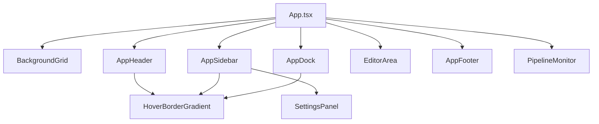

# كتالوج المكونات

هذا الكتالوج يغطي المكونات المخصصة داخل نطاق `apps/web/src/app/(main)/editor` فقط، لأن الطلب موجّه إلى `editor` وما يتصل به من الخلفية. مكونات Radix/Tailwind العامة خارج هذا النطاق غير مفصلة هنا.

## مكونات UI الأساسية

### `BackgroundGrid`

**الملف**: `apps/web/src/app/(main)/editor/src/components/ui/BackgroundGrid.tsx`  
**النوع**: Client Component

**الوصف**: خلفية زخرفية شبكية مع توهجات لونية.

**الخصائص**: لا يملك props.

**مثال استخدام**:

```tsx
<BackgroundGrid />
```

### `HoverBorderGradient`

**الملف**: `apps/web/src/app/(main)/editor/src/components/ui/hover-border-gradient.tsx`  
**النوع**: Client-capable reusable component

| الخاصية | النوع | مطلوب | الافتراضي | الوصف |
|---|---|---|---|---|
| `as` | `React.ElementType` | لا | `button` | العنصر المغلف |
| `children` | `React.ReactNode` | لا | - | المحتوى |
| `containerClassName` | `string` | لا | - | صنف الحاوية الخارجية |
| `className` | `string` | لا | - | صنف طبقة المحتوى |
| `duration` | `number` | لا | `1` | سرعة الحركة |
| `clockwise` | `boolean` | لا | `true` | اتجاه الدوران |

**مثال استخدام**:

```tsx
<HoverBorderGradient as="div" containerClassName="rounded-full">
  <span>النسخة</span>
</HoverBorderGradient>
```

---

## مكونات shell

### `AppHeader`

**الملف**: `apps/web/src/app/(main)/editor/src/components/app-shell/AppHeader.tsx`  
**النوع**: Client Component

| الخاصية | النوع | مطلوب | الوصف |
|---|---|---|---|
| `menuSections` | `readonly AppShellMenuSection[]` | نعم | أقسام القائمة العلوية |
| `activeMenu` | `string \| null` | نعم | القسم المفتوح |
| `onToggleMenu` | `(sectionLabel: string) => void` | نعم | تبديل القائمة |
| `onAction` | `(actionId: string) => void` | نعم | تنفيذ أمر |
| `infoDotColor` | `string` | نعم | لون مؤشر الحالة |
| `brandGradient` | `string` | نعم | تدرج العلامة |
| `onlineDotColor` | `string` | نعم | لون مؤشر الاتصال |

**مثال استخدام**: من `App.tsx` حيث يمرر shell menu actions إلى الرأس.

### `AppSidebar`

**الملف**: `apps/web/src/app/(main)/editor/src/components/app-shell/AppSidebar.tsx`

| الخاصية | النوع | مطلوب | الوصف |
|---|---|---|---|
| `sections` | `readonly AppSidebarSection[]` | نعم | أقسام الشريط |
| `openSectionId` | `string \| null` | نعم | القسم المفتوح |
| `isMobile` | `boolean` | نعم | حالة الجهاز |
| `onToggleSection` | `(sectionId: string) => void` | نعم | تبديل القسم |
| `onItemAction` | `(sectionId: string, itemLabel: string) => void` | نعم | تنفيذ العنصر |
| `settingsPanel` | `React.ReactNode` | نعم | لوحة الإعدادات المركبة |

**ملاحظات**:

- يحتوي بحثاً محلياً على عناصر الأقسام.
- يعامل قسم `settings` بشكل خاص ويحقن داخله `settingsPanel`.

### `AppDock`

**الملف**: `apps/web/src/app/(main)/editor/src/components/app-shell/AppDock.tsx`

| الخاصية | النوع | مطلوب | الوصف |
|---|---|---|---|
| `buttons` | `readonly AppDockButtonItem[]` | نعم | أزرار الـ dock |
| `onAction` | `(actionId: string) => void` | نعم | تنفيذ الأمر |
| `isMobile` | `boolean` | نعم | حالة الجهاز |

### `AppFooter`

**الملف**: `apps/web/src/app/(main)/editor/src/components/app-shell/AppFooter.tsx`

| الخاصية | النوع | مطلوب | الوصف |
|---|---|---|---|
| `stats` | `DocumentStats` | نعم | إحصاءات المستند |
| `currentFormatLabel` | `string` | نعم | اسم التنسيق الحالي |
| `isMobile` | `boolean` | نعم | يتحكم في إظهار بعض المؤشرات |

### `SettingsPanel`

**الملف**: `apps/web/src/app/(main)/editor/src/components/app-shell/SettingsPanel.tsx`

| الخاصية | النوع | مطلوب | الوصف |
|---|---|---|---|
| `typingSystemSettings` | `TypingSystemSettings` | نعم | الإعدادات الحالية |
| `onTypingModeChange` | callback | نعم | تغيير وضع الكتابة |
| `onLiveIdleMinutesChange` | callback | نعم | تغيير مهلة المعالجة |
| `onRunExportClassified` | callback | نعم | تصدير/اعتماد النص |
| `onRunProcessNow` | callback | نعم | تشغيل المعالجة فوراً |
| `lockedEditorFontLabel` | `string` | نعم | الخط الحالي |
| `lockedEditorSizeLabel` | `string` | نعم | الحجم الحالي |
| `supportedLegacyFormatCount` | `number` | نعم | عدد التنسيقات المدعومة |
| `classifierOptionCount` | `number` | نعم | عدد خيارات التصنيف |
| `actionBlockSpacing` | `string` | نعم | تباعد كتل الحدث |
| `hasFileImportBackend` | `boolean` | نعم | حالة تكوين backend المحلي |

### `PipelineMonitor`

**الملف**: `apps/web/src/app/(main)/editor/src/components/app-shell/PipelineMonitor.tsx`

| الخاصية | النوع | مطلوب | الوصف |
|---|---|---|---|
| `visible` | `boolean` | نعم | إظهار اللوحة |
| `onClose` | `() => void` | نعم | إغلاق اللوحة |

**الوصف**: يراقب مراحل pipeline الحية من خلال `pipelineRecorder` ويعرض المراحل، الأزمنة، والتصحيحات.

---

## مكونات الدعم

### `EditorArea`

**الملف**: `apps/web/src/app/(main)/editor/src/components/editor/EditorArea.ts`  
**النوع**: مكون تحكم/Bridge أكثر من كونه واجهة بسيطة

**الوصف**: يغلف مثيل Tiptap ويطبّق الاستيراد، القص واللصق، الإحصاءات، والتكامل مع pipeline.

**ملاحظات**:

- يعتمد على `createScreenplayEditor`
- يربط `importClassifiedText` و`importStructuredBlocks`
- يمرر الأحداث إلى shell عبر props وrefs

---

## شجرة المكونات



## المصطلحات

| المصطلح | المعنى في سياق هذا المشروع |
|---|---|
| shell | الطبقة التي توحد الرأس والجانبية والـ dock والمحرر |
| pipeline monitor | لوحة مراقبة المراحل التحليلية أثناء المعالجة |
