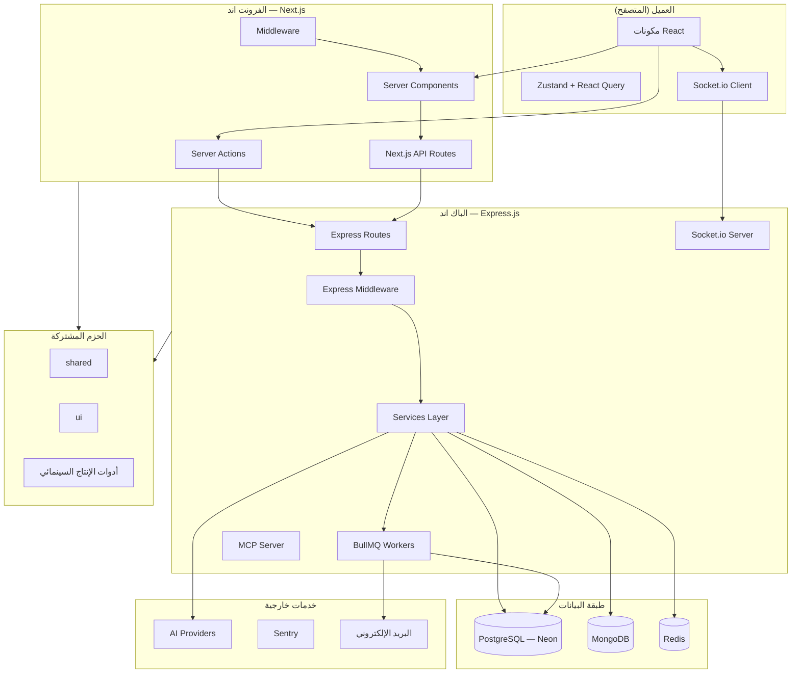
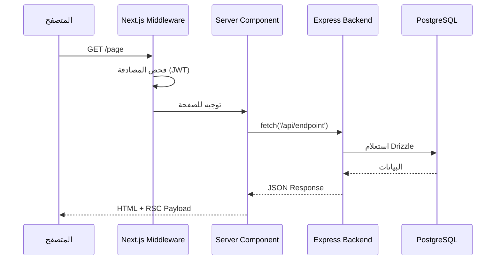
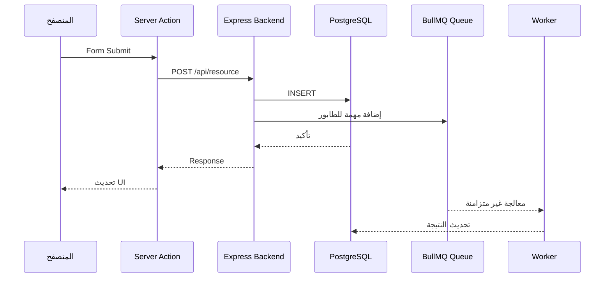
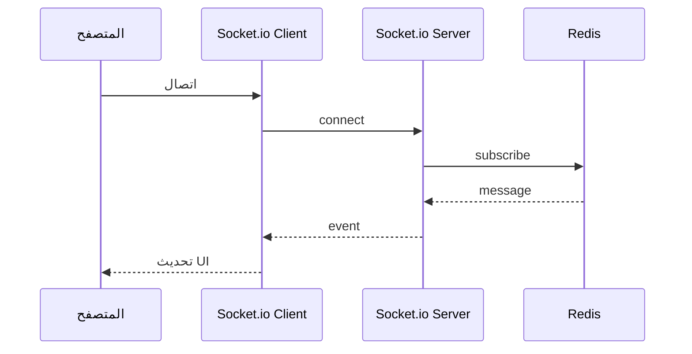
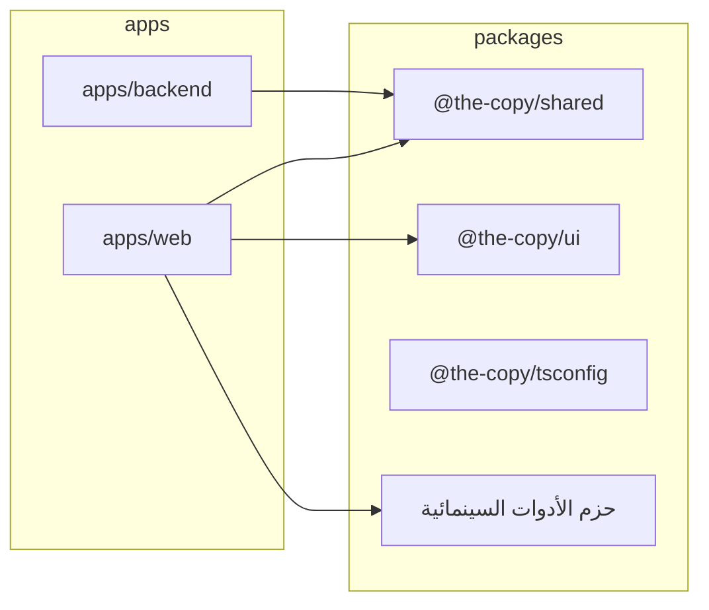
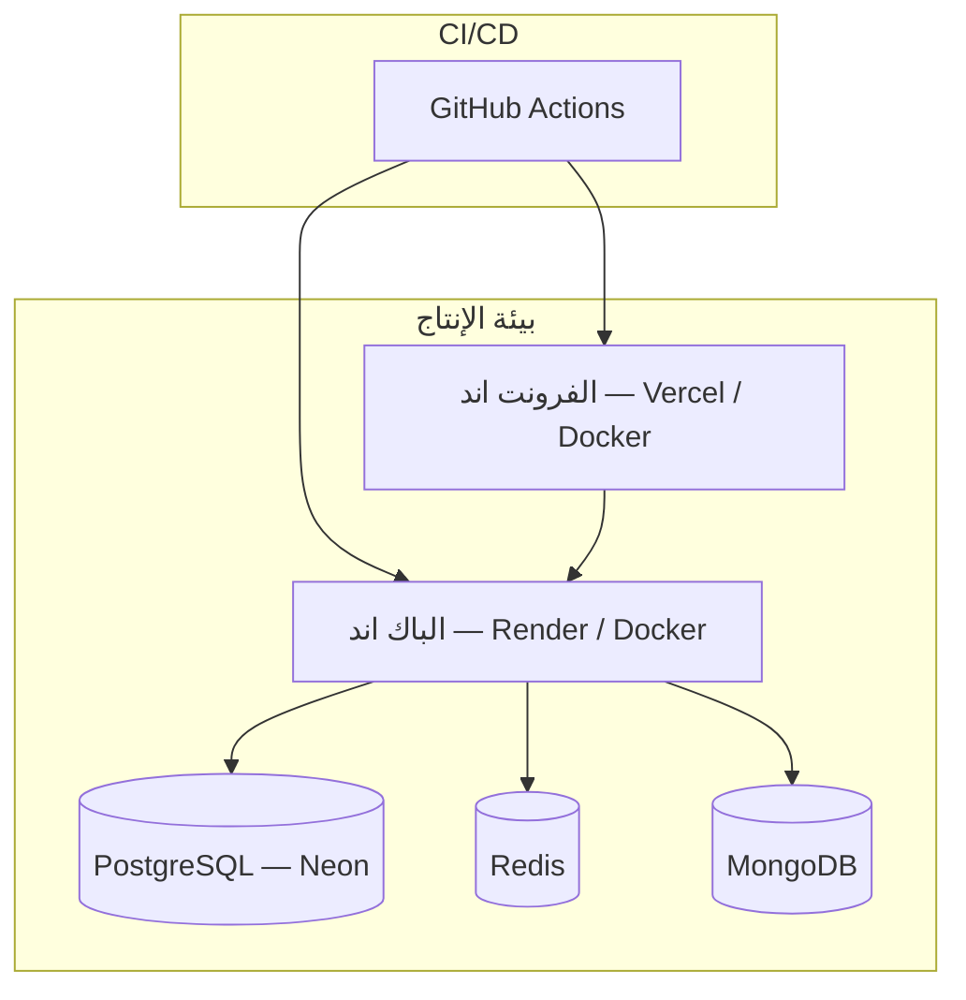

# الأمر التوجيهي: كتابة التوثيق الشامل لمنصة النسخة (Monorepo)

## البيانات الوصفية

| الحقل | القيمة |
|---|---|
| **المعرّف** | `DIRECTIVE-PLATFORM-DOCS-WRITER-v1` |
| **النوع** | أمر توجيهي تنفيذي — كتابة توثيق شامل لمنصة متعددة الطبقات |
| **النطاق** | منصة Monorepo تضم: جذر (Turborepo + pnpm) · فرونت اند (Next.js + React + TypeScript) · باك اند (Express.js + TypeScript) · حزم عمل مشتركة |
| **المُخرَج** | حزمة توثيق متكاملة لكل طبقة (ملفات Markdown + مخططات Mermaid + مراجع API) |
| **مستوى الصرامة** | إنتاجي — التوثيق يُعامَل ككود: لا غموض، لا نقص، لا تخمين |

---

## القسم صفر: بروتوكول التشغيل

### ٠.١ القواعد غير القابلة للتفاوض

1. **الكود هو المصدر الوحيد للحقيقة** — لا تكتب توثيقاً بناءً على افتراضات. اقرأ الكود أولاً، ثم وثّق ما هو موجود فعلاً.
2. **ممنوع التخمين** — إذا لم تستطع تحديد سلوك دالة أو مكوّن أو خدمة، اكتب `⚠️ يحتاج توضيح من الفريق` ولا تخترع وصفاً.
3. **ممنوع اللغة الاحتمالية** — لا تستخدم "غالباً" أو "على الأرجح" أو "يبدو أن" في التوثيق.
4. **الفحص الشامل أولاً** — اقرأ هيكل المشروع بالكامل (الجذر + apps/web + apps/backend + packages/*) قبل كتابة أي سطر توثيق.
5. **التوثيق الميّت أسوأ من عدم التوثيق** — كل جملة يجب أن تعكس الحالة الحالية للكود. لا تنسخ من قوالب عامة.
6. **الأمثلة إلزامية** — كل مفهوم يُشرح يجب أن يتضمن مثالاً عملياً من الكود الفعلي للمشروع.
7. **التوثيق يخدم ثلاثة قُرّاء**: المطوّر الجديد في الفريق، المطوّر الحالي الذي يحتاج مرجعاً سريعاً، فريق العمليات (DevOps) الذي يحتاج تعليمات النشر.
8. **التوثيق مُنفصل لكل طبقة** — لكل طبقة (جذر، فرونت اند، باك اند، حزم) توثيقها الخاص، مع وثيقة جذرية تربطهم.
9. **الحزم المشتركة تُوثّق بشكل مستقل** — كل حزمة في `packages/` لها توثيقها الخاص مع واجهتها العامة (Public API).
10. **لا تخلط بين طبقات التوثيق** — توثيق الباك اند لا يتحدث عن مكونات React، وتوثيق الفرونت اند لا يتحدث عن Express middleware.

### ٠.٢ خريطة الطبقات ومسؤولياتها

```
المنصة (the-copy-monorepo)
├── الجذر (/)
│   ├── المسؤولية: تنسيق البناء، إدارة التبعيات، سكربتات التشغيل، CI/CD
│   ├── الأدوات: pnpm workspaces, Turborepo, Husky
│   └── التوثيق: README.md الجذري + docs/ المشتركة
│
├── الفرونت اند (apps/web)
│   ├── المسؤولية: طبقة العرض، تفاعل المستخدم، Server Components، Server Actions
│   ├── الأدوات: Next.js, React, TypeScript, Tailwind, shadcn/Radix, Zustand, React Query
│   └── التوثيق: apps/web/docs/
│
├── الباك اند (apps/backend)
│   ├── المسؤولية: API المؤمّنة، الحالة الطويلة، الطوابير، العمليات المستقلة
│   ├── الأدوات: Express.js, TypeScript, Drizzle ORM, PostgreSQL (Neon), MongoDB, Redis, BullMQ, Socket.io
│   └── التوثيق: apps/backend/docs/
│
└── الحزم (packages/*)
    ├── المسؤولية: منطق الأدوات وواجهاتها القابلة لإعادة الاستخدام
    └── التوثيق: README.md داخل كل حزمة + packages/PACKAGES-INDEX.md
```

### ٠.٣ ترتيب التنفيذ الإلزامي

```
المرحلة ١  → استكشاف المنصة بالكامل وبناء الخريطة الذهنية الشاملة
المرحلة ٢  → كتابة README.md الجذري (الباب الأمامي للمنصة)
المرحلة ٣  → كتابة دليل المعمارية الشامل (docs/ARCHITECTURE.md)
المرحلة ٤  → كتابة دليل الإعداد والتشغيل (docs/SETUP.md)
المرحلة ٥  → كتابة مرجع API — الباك اند (apps/backend/docs/API.md)
المرحلة ٦  → كتابة مرجع API — الفرونت اند (apps/web/docs/API.md)
المرحلة ٧  → كتابة دليل قاعدة البيانات (docs/DATABASE.md)
المرحلة ٨  → كتابة دليل المصادقة والتفويض (docs/AUTH.md)
المرحلة ٩  → كتابة دليل إدارة الحالة وتدفق البيانات (docs/STATE.md)
المرحلة ١٠ → كتابة دليل الاختبارات (docs/TESTING.md)
المرحلة ١١ → كتابة دليل النشر والبنية التحتية (docs/DEPLOYMENT.md)
المرحلة ١٢ → كتابة دليل المساهمة (docs/CONTRIBUTING.md)
المرحلة ١٣ → كتابة دليل استكشاف الأخطاء (docs/TROUBLESHOOTING.md)
المرحلة ١٤ → كتابة دليل الأمان (docs/SECURITY.md)
المرحلة ١٥ → كتابة سجل القرارات المعمارية (docs/adr/)
المرحلة ١٦ → كتابة توثيق مكونات الفرونت اند (apps/web/docs/COMPONENTS.md)
المرحلة ١٧ → كتابة توثيق خدمات الباك اند (apps/backend/docs/SERVICES.md)
المرحلة ١٨ → كتابة فهرس الحزم (packages/PACKAGES-INDEX.md)
المرحلة ١٩ → كتابة دليل الاتصال الآني والطوابير (docs/REALTIME.md)
المرحلة ٢٠ → المراجعة النهائية والتحقق من الاكتمال
```

### ٠.٤ بروتوكول الاستكشاف (المرحلة ١)

قبل كتابة أي حرف من التوثيق، نفّذ كل خطوة من الخطوات التالية بالترتيب وسجّل النتائج في ذاكرتك العاملة:

#### أ) استكشاف الجذر

```bash
# ١. هيكل مجلدات الجذر (عمق ٢)
find . -maxdepth 2 -type d | grep -v node_modules | grep -v .git | grep -v .next | sort

# ٢. ملفات التهيئة الجذرية
cat package.json
cat pnpm-workspace.yaml
cat turbo.json
cat .dockerignore 2>/dev/null
cat .eslintignore 2>/dev/null
cat .gitignore

# ٣. ملفات البيئة الجذرية
cat .env.example 2>/dev/null || cat .env.template 2>/dev/null

# ٤. سكربتات التشغيل
find scripts/ -type f | sort

# ٥. ملفات CI/CD
find .github/ -type f | sort
find . -maxdepth 1 -name "*.yml" -o -name "*.yaml" | xargs cat 2>/dev/null
```

#### ب) استكشاف الفرونت اند (apps/web)

```bash
# ١. هيكل المجلدات (عمق ٣)
find apps/web -maxdepth 3 -type d | grep -v node_modules | grep -v .next | sort

# ٢. كل الملفات مع أنواعها
find apps/web -type f \( -name "*.ts" -o -name "*.tsx" -o -name "*.js" -o -name "*.jsx" -o -name "*.json" -o -name "*.yaml" -o -name "*.yml" -o -name "*.md" -o -name "*.env*" -o -name "Dockerfile*" -o -name "*.config.*" \) | grep -v node_modules | grep -v .next | sort

# ٣. package.json الفرونت اند
cat apps/web/package.json

# ٤. ملفات التهيئة
cat apps/web/tsconfig.json
cat apps/web/next.config.ts 2>/dev/null || cat apps/web/next.config.* 2>/dev/null
cat apps/web/tailwind.config.* 2>/dev/null
cat apps/web/eslint.config.* 2>/dev/null
cat apps/web/vitest.config.* 2>/dev/null
cat apps/web/playwright.config.* 2>/dev/null
cat apps/web/postcss.config.* 2>/dev/null
cat apps/web/components.json 2>/dev/null

# ٥. ملفات البيئة
cat apps/web/.env.example 2>/dev/null

# ٦. المسارات (Routes) — App Router
find apps/web -path "*/app/*" -name "page.tsx" | grep -v node_modules | sort
find apps/web -path "*/app/*" -name "layout.tsx" | grep -v node_modules | sort
find apps/web -path "*/app/*" -name "route.ts" | grep -v node_modules | sort

# ٧. Server Actions
grep -rn "'use server'" --include="*.ts" --include="*.tsx" apps/web/src/ -l | sort

# ٨. Client Components
grep -rn "'use client'" --include="*.tsx" apps/web/src/ | wc -l

# ٩. Middleware
cat apps/web/src/middleware.ts 2>/dev/null || cat apps/web/middleware.ts 2>/dev/null

# ١٠. حجم الملفات (أكبر ٢٠ ملف)
find apps/web/src -name "*.ts" -o -name "*.tsx" | grep -v node_modules | xargs wc -l 2>/dev/null | sort -rn | head -20

# ١١. الحزم المحلية المستخدمة
grep "@the-copy/" apps/web/package.json

# ١٢. Dockerfile
cat apps/web/Dockerfile 2>/dev/null
cat apps/web/docker-compose.yml 2>/dev/null
```

#### ج) استكشاف الباك اند (apps/backend)

```bash
# ١. هيكل المجلدات (عمق ٣)
find apps/backend -maxdepth 3 -type d | grep -v node_modules | grep -v dist | sort

# ٢. كل الملفات مع أنواعها
find apps/backend -type f \( -name "*.ts" -o -name "*.js" -o -name "*.json" -o -name "*.yaml" -o -name "*.yml" -o -name "*.md" -o -name "*.env*" -o -name "Dockerfile*" -o -name "*.config.*" \) | grep -v node_modules | grep -v dist | sort

# ٣. package.json الباك اند
cat apps/backend/package.json

# ٤. ملفات التهيئة
cat apps/backend/tsconfig.json
cat apps/backend/tsconfig.build.json 2>/dev/null
cat apps/backend/drizzle.config.ts 2>/dev/null
cat apps/backend/eslint.config.* 2>/dev/null
cat apps/backend/vitest.config.* 2>/dev/null

# ٥. ملفات البيئة
cat apps/backend/.env.example 2>/dev/null

# ٦. نقطة الدخول الرئيسية
cat apps/backend/src/server.ts 2>/dev/null || cat apps/backend/src/index.ts 2>/dev/null

# ٧. Express Routes
find apps/backend/src -name "*.routes.ts" -o -name "*.router.ts" -o -name "routes.ts" | sort
grep -rn "router\.\(get\|post\|put\|delete\|patch\)" --include="*.ts" apps/backend/src/ | head -30

# ٨. Express Middleware
find apps/backend/src -path "*middleware*" -name "*.ts" | sort

# ٩. خدمات الباك اند
find apps/backend/src -path "*service*" -name "*.ts" | sort

# ١٠. مخطط قاعدة البيانات
find apps/backend -name "schema.ts" -o -name "schema/*.ts" | grep -v node_modules | sort
cat apps/backend/drizzle.config.ts 2>/dev/null

# ١١. Drizzle migrations
find apps/backend/drizzle -type f | sort 2>/dev/null

# ١٢. Socket.io / WebSocket
grep -rn "socket\.\|io\.\|WebSocket" --include="*.ts" apps/backend/src/ | head -20

# ١٣. BullMQ Queues
grep -rn "Queue\|Worker\|bullmq" --include="*.ts" apps/backend/src/ | head -20

# ١٤. Dockerfile و النشر
cat apps/backend/Dockerfile 2>/dev/null
cat apps/backend/render.yaml 2>/dev/null
cat apps/backend/Procfile 2>/dev/null
```

#### د) استكشاف الحزم (packages/*)

```bash
# ١. قائمة كل الحزم
ls -la packages/

# ٢. لكل حزمة: اسمها ووصفها وتبعياتها
for pkg in packages/*/; do
  echo "=== $pkg ==="
  cat "$pkg/package.json" 2>/dev/null | grep -E "(name|description|main|exports)"
  echo "---"
done

# ٣. الحزمة المشتركة (shared)
cat packages/shared/package.json
find packages/shared/src -name "*.ts" | sort

# ٤. حزمة UI
cat packages/ui/package.json
find packages/ui/src -name "*.tsx" | sort

# ٥. حزمة tsconfig
ls packages/tsconfig/

# ٦. الواجهة العامة لكل حزمة (exports)
for pkg in packages/*/; do
  echo "=== $pkg ==="
  cat "$pkg/package.json" 2>/dev/null | grep -A 20 '"exports"'
  echo "---"
done
```

**بعد تنفيذ كل الأوامر**، ابنِ الخريطة الذهنية التالية قبل المتابعة:

```
الخريطة الذهنية للمنصة:
├── النوع: [SaaS / أداة إبداع / منصة إنتاج سينمائي / ...]
├── هيكل المستودع: Monorepo (pnpm workspaces + Turborepo)
│
├── الفرونت اند (apps/web):
│   ├── الإطار: [Next.js X.X + React X.X]
│   ├── نمط التوجيه: [App Router / Pages Router / مختلط]
│   ├── مكتبة UI: [shadcn / Radix / Tailwind / ...]
│   ├── إدارة الحالة: [Zustand / React Query / Context / ...]
│   ├── جلب البيانات: [Server Components / React Query / fetch / ...]
│   ├── المصادقة: [مخصصة / NextAuth / Clerk / ...]
│   ├── محرر النصوص: [Tiptap / ...]
│   ├── ثلاثي الأبعاد: [Three.js + React Three Fiber / ...]
│   ├── الرسوم المتحركة: [Framer Motion / GSAP / ...]
│   └── المراقبة: [Sentry / OpenTelemetry / ...]
│
├── الباك اند (apps/backend):
│   ├── الإطار: [Express.js X.X]
│   ├── قاعدة البيانات الرئيسية: [PostgreSQL (Neon) + Drizzle ORM]
│   ├── قاعدة بيانات ثانوية: [MongoDB]
│   ├── ذاكرة التخزين المؤقت: [Redis]
│   ├── الطوابير: [BullMQ]
│   ├── الاتصال الآني: [Socket.io]
│   ├── المصادقة: [JWT + bcrypt + express-session]
│   ├── البريد الإلكتروني: [Nodemailer]
│   ├── رفع الملفات: [Multer + Sharp]
│   ├── خدمات AI: [LangChain + Google GenAI + OpenAI + Anthropic + Mistral]
│   ├── MCP Server: [نعم / لا]
│   ├── المقاييس: [Prometheus (prom-client)]
│   ├── المراقبة: [Sentry + Winston + Pino]
│   └── النشر: [Render / Docker]
│
├── الحزم المشتركة (packages/):
│   ├── shared: [أنواع وأدوات مشتركة]
│   ├── ui: [مكونات UI قابلة لإعادة الاستخدام]
│   ├── tsconfig: [إعدادات TypeScript المشتركة]
│   └── [كل حزمة أداة]: [وصف وظيفتها]
│
├── الاختبارات:
│   ├── الفرونت اند: [Vitest + Testing Library + Playwright]
│   ├── الباك اند: [Vitest + Supertest]
│   └── E2E: [Playwright + Cypress]
│
├── CI/CD: [GitHub Actions / ...]
├── النشر:
│   ├── الفرونت اند: [Vercel / Docker / ...]
│   └── الباك اند: [Render / Docker / ...]
│
└── خدمات خارجية: [Neon DB / Redis / Sentry / Firebase / Convex / ...]
```

---

## المرحلة ٢: README.md — الباب الأمامي للمنصة

### الهيكل الإلزامي

```markdown
# [اسم المنصة]

[جملة واحدة تصف ما تفعله المنصة — ليس كيف تعمل، بل ما القيمة التي تقدمها]

---

## لقطة سريعة

| | |
|---|---|
| **النوع** | Monorepo — منصة متعددة التطبيقات |
| **مدير الحزم** | pnpm X.X |
| **منسّق البناء** | Turborepo X.X |
| **التطبيقات** | الفرونت اند (Next.js X.X) · الباك اند (Express.js X.X) |
| **الحزم** | [عدد] حزمة عمل مشتركة |
| **اللغة** | TypeScript X.X |
| **الحالة** | 🟢 إنتاج / 🟡 تطوير / 🔴 نموذج أولي |
| **البيئات** | الإنتاج: [URLs] · المعاينة: [URLs] · المحلية: [URLs] |

---

## البدء السريع

### المتطلبات الأساسية

- Node.js >= [الإصدار من engines في package.json أو .nvmrc]
- pnpm >= [الإصدار من packageManager]
- [أي متطلب آخر: Redis, Docker, ...]

### التثبيت والتشغيل

```bash
git clone [URL]
cd [project-name]
pnpm install

# إعداد متغيرات البيئة
cp .env.example .env
cp apps/web/.env.example apps/web/.env
cp apps/backend/.env.example apps/backend/.env

# [تعليمات ملء المتغيرات الضرورية لكل طبقة]

# تشغيل المنصة كاملة
pnpm dev

# أو تشغيل كل تطبيق على حدة
pnpm dev:web       # الفرونت اند على http://localhost:5000
pnpm dev:backend   # الباك اند على http://localhost:[PORT]
```

---

## بنية المستودع

```
[project-root]/
├── apps/
│   ├── web/                # الفرونت اند — Next.js + React
│   └── backend/            # الباك اند — Express.js
├── packages/
│   ├── shared/             # أنواع وأدوات مشتركة
│   ├── ui/                 # مكونات UI قابلة لإعادة الاستخدام
│   ├── tsconfig/           # إعدادات TypeScript المشتركة
│   ├── [اسم كل حزمة]/     # [وصف مختصر]
│   └── ...
├── scripts/                # سكربتات تشغيل وإدارة
├── docs/                   # التوثيق المشترك
├── turbo.json              # تهيئة Turborepo
├── pnpm-workspace.yaml     # تعريف مساحات العمل
└── package.json            # سكربتات وتبعيات الجذر
```

---

## السكربتات المتاحة

### سكربتات الجذر

| السكربت | الوصف |
|---|---|
| `pnpm dev` | [وصف دقيق — ما التطبيقات التي تشتغل] |
| `pnpm dev:web` | [وصف دقيق] |
| `pnpm dev:backend` | [وصف دقيق] |
| `pnpm build` | [وصف دقيق] |
| `pnpm test` | [وصف دقيق] |
| `pnpm lint` | [وصف دقيق] |
| `pnpm type-check` | [وصف دقيق] |
| `pnpm clean` | [وصف دقيق] |
| `pnpm validate` | [وصف دقيق] |
| [كل سكربت آخر في package.json الجذري] | [وصف دقيق] |

### سكربتات الفرونت اند (apps/web)

| السكربت | الوصف |
|---|---|
| [كل سكربت من apps/web/package.json] | [وصف دقيق] |

### سكربتات الباك اند (apps/backend)

| السكربت | الوصف |
|---|---|
| [كل سكربت من apps/backend/package.json] | [وصف دقيق] |

---

## التوثيق

### توثيق مشترك (docs/)

| الملف | المحتوى |
|---|---|
| [ARCHITECTURE.md](./docs/ARCHITECTURE.md) | المعمارية الشاملة للمنصة وتدفق البيانات بين الطبقات |
| [SETUP.md](./docs/SETUP.md) | دليل الإعداد التفصيلي لكل الطبقات |
| [DATABASE.md](./docs/DATABASE.md) | المخططات والترحيلات (PostgreSQL + MongoDB + Redis) |
| [AUTH.md](./docs/AUTH.md) | المصادقة والتفويض والصلاحيات عبر الطبقات |
| [STATE.md](./docs/STATE.md) | إدارة الحالة وتدفق البيانات (عميل + خادم) |
| [TESTING.md](./docs/TESTING.md) | استراتيجية الاختبار لكل الطبقات |
| [DEPLOYMENT.md](./docs/DEPLOYMENT.md) | النشر والبنية التحتية |
| [CONTRIBUTING.md](./docs/CONTRIBUTING.md) | دليل المساهمة |
| [TROUBLESHOOTING.md](./docs/TROUBLESHOOTING.md) | استكشاف الأخطاء الشائعة |
| [SECURITY.md](./docs/SECURITY.md) | السياسات الأمنية |
| [REALTIME.md](./docs/REALTIME.md) | الاتصال الآني (Socket.io) والطوابير (BullMQ) |

### توثيق الفرونت اند (apps/web/docs/)

| الملف | المحتوى |
|---|---|
| [API.md](./apps/web/docs/API.md) | Server Actions و API Routes في Next.js |
| [COMPONENTS.md](./apps/web/docs/COMPONENTS.md) | كتالوج المكونات |

### توثيق الباك اند (apps/backend/docs/)

| الملف | المحتوى |
|---|---|
| [API.md](./apps/backend/docs/API.md) | مرجع Express API الكامل |
| [SERVICES.md](./apps/backend/docs/SERVICES.md) | كتالوج الخدمات والوحدات |

### توثيق الحزم

| الملف | المحتوى |
|---|---|
| [PACKAGES-INDEX.md](./packages/PACKAGES-INDEX.md) | فهرس كل الحزم مع واجهاتها العامة |

### سجل القرارات المعمارية

| المجلد | المحتوى |
|---|---|
| [docs/adr/](./docs/adr/) | كل القرارات المعمارية موثّقة ومبررة |

---

## الترخيص

[نوع الترخيص]
```

### قواعد كتابة README

1. **لا تذكر تقنية غير موجودة في أي `package.json` في المستودع**.
2. **كل أمر bash يجب أن يعمل فعلاً** — جرّبه ذهنياً خطوة بخطوة.
3. **لا تضع badges لخدمات غير مُهيأة**.
4. **السكربتات من `package.json` فقط** — لا تخترع سكربتات.
5. **وضّح العلاقة بين التطبيقات** — الفرونت اند والباك اند والحزم.

---

## المرحلة ٣: ARCHITECTURE.md — خريطة العقل الهندسي

### الهيكل الإلزامي

```markdown
# المعمارية

## نظرة عامة

[فقرة واحدة: ما نوع المنصة، ما المشكلة التي تحلها، ما الأنماط المعمارية الرئيسية المستخدمة عبر الطبقات]

---

## مخطط النظام العام



---

## طبقات المنصة

### ١. طبقة العرض — الفرونت اند (apps/web)

[وصف دقيق مع أمثلة من الكود الفعلي]

- **الإطار**: Next.js [الإصدار] مع App Router
- **مكتبة UI**: shadcn/ui + Radix Primitives
- **نظام التنسيق**: Tailwind CSS [الإصدار]
- **إدارة النماذج**: react-hook-form + Zod
- **الرسوم المتحركة**: Framer Motion + GSAP
- **ثلاثي الأبعاد**: Three.js + React Three Fiber + Drei
- **محرر النصوص**: Tiptap
- **إدارة الحالة**: Zustand (حالة العميل) + React Query (حالة الخادم)

### ٢. طبقة الخدمات — الباك اند (apps/backend)

[وصف دقيق مع أمثلة من الكود الفعلي]

- **الإطار**: Express.js [الإصدار]
- **المصادقة**: JWT + bcrypt + express-session
- **الأمان**: Helmet + CORS + Rate Limiting
- **الطوابير**: BullMQ + Redis
- **الاتصال الآني**: Socket.io
- **MCP Server**: @modelcontextprotocol/sdk
- **المقاييس**: Prometheus (prom-client)
- **التسجيل**: Winston + Pino

### ٣. طبقة البيانات

[وصف دقيق لكل مخزن بيانات ودوره]

- **PostgreSQL (Neon)**: البيانات العلائقية — [أمثلة: مستخدمون، مشاريع، ...]
- **MongoDB**: البيانات غير المنظمة — [أمثلة: وثائق، تحليلات، ...]
- **Redis**: التخزين المؤقت + الجلسات + الطوابير

### ٤. طبقة الحزم المشتركة (packages/)

[وصف دقيق لكل حزمة ودورها مع أمثلة من الواجهة العامة]

- **shared**: الأنواع والأدوات المشتركة بين الفرونت اند والباك اند
- **ui**: مكونات React القابلة لإعادة الاستخدام
- **tsconfig**: إعدادات TypeScript المشتركة
- **[كل حزمة أداة]**: [وصف وظيفتها ونطاقها]

---

## تدفق الطلب — من المتصفح إلى قاعدة البيانات

### تدفق ١: طلب صفحة (Server Component)



### تدفق ٢: عملية كتابة (Server Action → Backend)



### تدفق ٣: اتصال آني (Socket.io)



[اكتب تدفقات إضافية لكل سيناريو رئيسي في المنصة]

---

## العلاقة بين التطبيقات والحزم



[وضّح لكل حزمة: أي تطبيق يستخدمها وكيف]

---

## أنماط التصميم المُستخدمة

[لكل نمط: اسمه، أين يُستخدم في المنصة (أي طبقة وأي ملف)، مثال من الكود الفعلي]

---

## هيكل المجلدات التفصيلي

### الجذر

```
[project-root]/
├── apps/                       # التطبيقات الرئيسية
├── packages/                   # الحزم المشتركة
├── scripts/                    # سكربتات التشغيل والإدارة
├── docs/                       # التوثيق المشترك
├── .github/                    # CI/CD و GitHub workflows
├── turbo.json                  # تهيئة Turborepo
├── pnpm-workspace.yaml         # تعريف مساحات العمل
└── package.json                # سكربتات وتبعيات الجذر
```

### الفرونت اند (apps/web)

```
apps/web/
├── src/
│   ├── app/                    # [وصف — App Router routes]
│   │   ├── (auth)/             # [وصف]
│   │   ├── (main)/             # [وصف]
│   │   ├── api/                # [وصف]
│   │   ├── layout.tsx          # [وصف]
│   │   └── page.tsx            # [وصف]
│   ├── components/             # [وصف]
│   ├── lib/                    # [وصف]
│   ├── hooks/                  # [وصف]
│   ├── types/                  # [وصف]
│   ├── styles/                 # [وصف]
│   ├── utils/                  # [وصف]
│   └── [كل مجلد آخر]/          # [وصف]
├── public/                     # [وصف]
├── tests/                      # [وصف]
└── [ملفات التهيئة]             # [وصف لكل ملف]
```

### الباك اند (apps/backend)

```
apps/backend/
├── src/
│   ├── routes/                 # [وصف — Express route handlers]
│   ├── services/               # [وصف — طبقة المنطق]
│   ├── middleware/              # [وصف — Express middleware]
│   ├── models/                 # [وصف — نماذج البيانات]
│   ├── config/                 # [وصف — التهيئة]
│   ├── utils/                  # [وصف — أدوات مساعدة]
│   ├── types/                  # [وصف — أنواع TypeScript]
│   ├── server.ts               # [وصف — نقطة الدخول]
│   └── [كل مجلد آخر]/          # [وصف]
├── drizzle/                    # [وصف — الترحيلات]
├── public/                     # [وصف]
└── [ملفات التهيئة]             # [وصف لكل ملف]
```

---

## القرارات المعمارية الرئيسية

| القرار | البدائل المدروسة | المبرر |
|---|---|---|
| Monorepo مع pnpm + Turborepo | Nx, Lerna, مستودعات منفصلة | [استنتج المبرر من الكود] |
| فصل الباك اند عن Next.js | API Routes فقط في Next.js | [استنتج المبرر من الكود] |
| Drizzle ORM | Prisma, TypeORM, Knex | [استنتج المبرر من الكود] |
| PostgreSQL (Neon) + MongoDB | PostgreSQL فقط, MongoDB فقط | [استنتج المبرر من الكود] |
| BullMQ للطوابير | Inngest, Trigger.dev | [استنتج المبرر من الكود] |
| Socket.io | WebSocket خام, Pusher | [استنتج المبرر من الكود] |
| [كل قرار آخر] | ... | ... |

---

## القيود والمحاذير المعروفة

[كل قيد تقني وجدته أثناء الاستكشاف — لكل طبقة]
```

### قواعد كتابة ARCHITECTURE.md

1. **كل مخطط Mermaid يجب أن يعكس الكود الفعلي** — لا تضع صناديق لخدمات غير موجودة.
2. **أمثلة الكود من المنصة نفسها** — ليس من مواقع تعليمية.
3. **القرارات المعمارية تُستنتج من الكود** — لا تخترع مبررات.
4. **وضّح حدود كل طبقة** — ما المسؤول عن ماذا ولماذا.
5. **العلاقة بين الحزم والتطبيقات واضحة** — أي حزمة يستخدمها أي تطبيق.

---

## المرحلة ٤: SETUP.md — من الصفر إلى التشغيل

### الهيكل الإلزامي

```markdown
# دليل الإعداد والتشغيل

## المتطلبات

### إلزامية

| الأداة | الإصدار | كيفية التحقق | كيفية التثبيت |
|---|---|---|---|
| Node.js | >= [الإصدار] | `node -v` | [رابط أو أمر] |
| pnpm | >= [الإصدار] | `pnpm -v` | `npm install -g pnpm@[version]` |
| Redis | >= [الإصدار] | `redis-cli ping` | [أمر أو رابط] |
| [كل متطلب آخر] | ... | ... | ... |

### اختيارية

| الأداة | الغرض | كيفية التثبيت |
|---|---|---|
| Docker | تشغيل الخدمات محلياً | [أمر] |

---

## الإعداد خطوة بخطوة

### الخطوة ١: استنساخ المستودع

```bash
git clone [URL]
cd [project-name]
```

### الخطوة ٢: تثبيت التبعيات (كل المساحات)

```bash
pnpm install
```

> ⚠️ هذا يثبّت التبعيات لكل التطبيقات والحزم دفعة واحدة عبر pnpm workspaces.

### الخطوة ٣: إعداد متغيرات البيئة

#### الجذر

```bash
cp .env.example .env
```

| المتغير | الوصف | كيفية الحصول عليه | مثال |
|---|---|---|---|
| [كل متغير في .env.example الجذري] | ... | ... | ... |

#### الفرونت اند (apps/web)

```bash
cp apps/web/.env.example apps/web/.env
```

| المتغير | الوصف | كيفية الحصول عليه | مثال |
|---|---|---|---|
| [كل متغير في apps/web/.env.example] | ... | ... | ... |

**تنبيه**: المتغيرات التي تبدأ بـ `NEXT_PUBLIC_` مكشوفة للعميل. لا تضع فيها أسراراً.

#### الباك اند (apps/backend)

```bash
cp apps/backend/.env.example apps/backend/.env
```

| المتغير | الوصف | كيفية الحصول عليه | مثال |
|---|---|---|---|
| [كل متغير في apps/backend/.env.example] | ... | ... | ... |

### الخطوة ٤: إعداد قواعد البيانات

#### PostgreSQL (Neon)

```bash
cd apps/backend
pnpm db:push
```

#### MongoDB

[خطوات الاتصال أو الإعداد المحلي]

#### Redis

```bash
# Windows
pnpm start:redis

# macOS/Linux
redis-server
```

### الخطوة ٥: التشغيل

```bash
# المنصة كاملة
pnpm dev

# أو كل تطبيق على حدة
pnpm dev:web        # → http://localhost:5000
pnpm dev:backend    # → http://localhost:[PORT]
```

---

## التحقق من نجاح الإعداد

| الفحص | الطريقة | النتيجة المتوقعة |
|---|---|---|
| الفرونت اند | افتح http://localhost:5000 | [وصف ما يجب أن تراه] |
| الباك اند | افتح http://localhost:[PORT]/health | `{ status: "ok" }` |
| اتصال PostgreSQL | `pnpm --filter @the-copy/backend db:studio` | فتح Drizzle Studio |
| اتصال Redis | `redis-cli ping` | `PONG` |
| اتصال MongoDB | [أمر أو إجراء] | [النتيجة] |

---

## إعداد بيئة التطوير (IDE)

### VS Code

الإضافات الموصى بها (من `.vscode/extensions.json` إذا وُجد):

| الإضافة | الغرض |
|---|---|
| [اسم الإضافة] | [الغرض] |

---

## إعداد Docker (إذا متاح)

```bash
docker compose up -d
```

[شرح كل خدمة في docker-compose.yml]

---

## المشاكل الشائعة أثناء الإعداد

| المشكلة | السبب | الحل |
|---|---|---|
| `ENOENT: pnpm-lock.yaml` | نسخة pnpm غير متوافقة | تأكد من استخدام pnpm [الإصدار] |
| خطأ مع `sharp` أو `winax` | مكتبات native تحتاج بناء | [الحل حسب نظام التشغيل] |
| [كل مشكلة شائعة أخرى] | [السبب] | [الحل] |
```

### قواعد كتابة SETUP.md

1. **كل أمر يجب أن يكون قابلاً للنسخ واللصق مباشرة**.
2. **لا تفترض معرفة مسبقة** — اكتب كأن القارئ يومه الأول.
3. **كل متغير بيئة من كل `.env.example` يجب أن يظهر في الجدول المناسب** — لا تترك أي واحد.
4. **فصل واضح بين إعداد كل طبقة** — الجذر، الفرونت اند، الباك اند.
5. **خطوة التحقق لكل خدمة** — كيف يعرف المطوّر أن كل شيء يعمل.

---

## المرحلة ٥: API.md — الباك اند (apps/backend/docs/API.md)

### بروتوكول الاستكشاف

```bash
# نقطة الدخول
cat apps/backend/src/server.ts

# كل ملفات Routes
find apps/backend/src -name "*.routes.ts" -o -name "*.router.ts" | sort

# HTTP methods
grep -rn "router\.\(get\|post\|put\|delete\|patch\)" --include="*.ts" apps/backend/src/ | sort

# Middleware المُطبّقة
grep -rn "app\.use\|router\.use" --include="*.ts" apps/backend/src/ | sort

# Zod Validation schemas
grep -rn "z\.object\|z\.string\|z\.number" --include="*.ts" apps/backend/src/ | head -30
```

### الهيكل الإلزامي

```markdown
# مرجع API — الباك اند

## نظرة عامة

| الخاصية | القيمة |
|---|---|
| **الإطار** | Express.js [الإصدار] |
| **المسار الأساسي** | `http://localhost:[PORT]` |
| **المصادقة الافتراضية** | [JWT Bearer / Session / ...] |
| **تنسيق الاستجابة** | JSON |
| **حد الطلبات** | [التهيئة من express-rate-limit] |
| **الضغط** | [compression middleware] |
| **الأمان** | [Helmet headers] |

---

## Middleware العامة

| الـ Middleware | الملف | الوظيفة |
|---|---|---|
| [اسم] | `[path]` | [وصف] |

---

## بنية الاستجابة الموحدة

### استجابة ناجحة
```json
{
  // [البنية الفعلية من الكود]
}
```

### استجابة خطأ
```json
{
  // [البنية الفعلية من الكود]
}
```

---

## نقاط الاتصال

### [اسم المجموعة — مثل: المصادقة]

#### `[METHOD] /api/[path]`

| الخاصية | القيمة |
|---|---|
| **الوصف** | [ما تفعله هذه النقطة] |
| **الملف** | `[path/to/route.ts]` |
| **المصادقة** | مطلوبة / غير مطلوبة |
| **الصلاحيات** | [admin / user / public] |
| **Rate Limit** | [مخصص / افتراضي] |

**المدخلات (Request)**

| المكان | الحقل | النوع | مطلوب | الوصف | القيود |
|---|---|---|---|---|---|
| `body` | `[field]` | `string` | نعم | [وصف] | [min/max/pattern] |
| `params` | `[field]` | `string` | نعم | [وصف] | [format] |
| `query` | `[field]` | `string` | لا | [وصف] | [default] |
| `headers` | `Authorization` | `string` | نعم | Bearer token | JWT |

**المخرجات (Response)**

| الحالة | الوصف | مثال |
|---|---|---|
| `200` | نجاح | `{ ... }` |
| `400` | مدخلات غير صالحة | `{ error: { ... } }` |
| `401` | غير مصادق | `{ error: { ... } }` |
| `403` | غير مُفوّض | `{ error: { ... } }` |
| `500` | خطأ داخلي | `{ error: { ... } }` |

**مثال**

```bash
curl -X [METHOD] http://localhost:[PORT]/api/[path] \
  -H "Content-Type: application/json" \
  -H "Authorization: Bearer [token]" \
  -d '{ ... }'
```

[كرّر لكل نقطة اتصال]

---

## Socket.io Events

### الأحداث الصادرة من الخادم (Server → Client)

| الحدث | البيانات | الوصف |
|---|---|---|
| `[event-name]` | `[type]` | [وصف] |

### الأحداث الواردة للخادم (Client → Server)

| الحدث | البيانات | الوصف |
|---|---|---|
| `[event-name]` | `[type]` | [وصف] |

---

## BullMQ Queues

| الطابور | الملف | الوظيفة | الـ Worker |
|---|---|---|---|
| `[queue-name]` | `[path]` | [وصف] | `[worker-path]` |

---

## MCP Server Tools (إذا مُستخدم)

| الأداة | الوصف | المدخلات | المخرجات |
|---|---|---|---|
| `[tool-name]` | [وصف] | `[type]` | `[type]` |
```

### قواعد كتابة API.md — الباك اند

1. **كل route handler يجب أن يظهر** — لا تترك أي واحد.
2. **أنواع البيانات من الكود الفعلي** — Zod schemas أو TypeScript types.
3. **Middleware المُطبّقة لكل route** — وضّح أي middleware تعمل على أي مسار.
4. **Socket.io events و BullMQ queues** — لا تنسَ الأجزاء غير HTTP.
5. **أمثلة curl قابلة للتنفيذ**.

---

## المرحلة ٦: API.md — الفرونت اند (apps/web/docs/API.md)

### بروتوكول الاستكشاف

```bash
# Next.js API Routes
find apps/web -path "*/api/*" -name "route.ts" | grep -v node_modules | sort

# Server Actions
grep -rn "'use server'" --include="*.ts" --include="*.tsx" apps/web/src/ -l | sort

# HTTP methods في Next.js API Routes
grep -rn "export async function \(GET\|POST\|PUT\|DELETE\|PATCH\)" --include="*.ts" apps/web/src/ | sort
```

### الهيكل الإلزامي

```markdown
# مرجع API — الفرونت اند (Next.js)

## نظرة عامة

| الخاصية | القيمة |
|---|---|
| **الإطار** | Next.js [الإصدار] — App Router |
| **المسار الأساسي** | `/api` |
| **الاستخدام** | [BFF / proxy إلى الباك اند / منطق خاص بالعميل] |

---

## Next.js API Routes

### `[METHOD] /api/[path]`

| الخاصية | القيمة |
|---|---|
| **الوصف** | [ما تفعله] |
| **الملف** | `[path/to/route.ts]` |
| **علاقتها بالباك اند** | [تستدعي endpoint X في الباك اند / مستقلة] |

[نفس هيكل جداول المدخلات والمخرجات من المرحلة ٥]

---

## Server Actions

### `[اسم الدالة]`

| الخاصية | القيمة |
|---|---|
| **الملف** | `[path/to/file.ts]` |
| **الوصف** | [ما تفعله] |
| **المدخلات** | `[TypeScript type]` |
| **المخرجات** | `[TypeScript type]` |
| **تستدعي الباك اند** | نعم / لا — [أي endpoint] |
| **المصادقة** | مطلوبة / غير مطلوبة |

```typescript
// مثال الاستخدام من الكود الفعلي
```
```

### قواعد كتابة API.md — الفرونت اند

1. **وضّح العلاقة مع الباك اند** — هل الـ route يستدعي الباك اند أم يعمل مستقلاً.
2. **Server Actions تُوثّق كاملة** — كل action مع مدخلاتها ومخرجاتها.
3. **لا تكرّر توثيق الباك اند** — إذا الـ route مجرد proxy، أشِر لتوثيق الباك اند.

---

## المرحلة ٧: DATABASE.md — خريطة البيانات

### الهيكل الإلزامي

```markdown
# دليل قاعدة البيانات

## نظرة عامة

| الخاصية | القيمة |
|---|---|
| **قاعدة البيانات الرئيسية** | PostgreSQL (Neon) |
| **ORM** | Drizzle ORM |
| **قاعدة بيانات ثانوية** | MongoDB |
| **ذاكرة التخزين المؤقت** | Redis |

---

## PostgreSQL — المخطط العلائقي

### مخطط ERD

```mermaid
erDiagram
    [مخطط Mermaid ERD يوضح الجداول والعلاقات الفعلية من ملفات schema]
```

### الجداول

#### جدول: [اسم الجدول]

**ملف المخطط**: `[apps/backend/src/.../schema.ts]`

| العمود | النوع | القيود | الوصف |
|---|---|---|---|
| `id` | `uuid` | PK, auto | المعرّف |
| [كل عمود] | ... | ... | ... |

**الفهارس**: [قائمة]
**العلاقات**: [قائمة]

[كرّر لكل جدول]

---

## MongoDB — المجموعات

### مجموعة: [اسم المجموعة]

**الملف**: `[path/to/model.ts]`
**الغرض**: [وصف]

```typescript
// [بنية المستند من الكود الفعلي]
```

[كرّر لكل مجموعة]

---

## Redis — أنماط الاستخدام

| النمط | المفتاح | النوع | TTL | الغرض |
|---|---|---|---|---|
| التخزين المؤقت | `cache:[key]` | String/Hash | [مدة] | [وصف] |
| الجلسات | `session:[id]` | String | [مدة] | [وصف] |
| الطوابير | `bull:[queue]` | List | - | BullMQ |

---

## الترحيلات (Migrations) — Drizzle

```bash
# إنشاء ترحيل جديد
cd apps/backend && pnpm db:generate

# تطبيق الترحيلات
cd apps/backend && pnpm db:push

# فتح Drizzle Studio
cd apps/backend && pnpm db:studio
```

---

## بذر البيانات (Seeding)

```bash
[الأمر الدقيق إذا موجود]
```

---

## أنماط الوصول للبيانات

### من الباك اند (Express)

```typescript
// [كود فعلي من المشروع]
```

### من الفرونت اند (Server Components / Server Actions)

```typescript
// [كود فعلي — هل الفرونت اند يصل للـ DB مباشرة أم عبر الباك اند]
```

---

## النسخ الاحتياطي والاسترداد

[الآلية المُستخدمة في Neon أو ⚠️ غير مُهيأ]
```

### قواعد كتابة DATABASE.md

1. **كل جدول وكل مجموعة يجب أن تظهر** — لا تترك أي واحد.
2. **المخطط من ملفات schema الفعلية** — لا تخمّن الأعمدة.
3. **مخطط ERD يعكس العلاقات الفعلية** — من foreign keys في الكود.
4. **أنماط Redis من الكود الفعلي** — ابحث عن كل `redis.set` و `redis.get`.

---

## المرحلة ٨: AUTH.md — المصادقة والتفويض

### الهيكل الإلزامي

```markdown
# المصادقة والتفويض

## نظرة عامة

| الخاصية | القيمة |
|---|---|
| **آلية المصادقة** | [JWT + bcrypt / ...] |
| **تخزين الجلسات** | [express-session + connect-pg-simple / Redis / ...] |
| **طرق تسجيل الدخول** | [بريد + كلمة مرور / OAuth / OTP / ...] |
| **مدة الجلسة** | [المدة] |
| **طبقة المصادقة الرئيسية** | [الباك اند / الفرونت اند / مشتركة] |

---

## تدفق المصادقة

```mermaid
sequenceDiagram
    participant B as المتصفح
    participant FE as Next.js
    participant BE as Express Backend
    participant DB as قاعدة البيانات

    [تدفق كامل من تسجيل الدخول إلى الوصول المحمي]
```

---

## حماية المسارات

### في الفرونت اند (Next.js Middleware)

| النمط | مستوى الحماية | الملف |
|---|---|---|
| [كل مسار محمي] | [مصادق / admin / public] | `middleware.ts` |

```typescript
// [كود الـ middleware الفعلي]
```

### في الباك اند (Express Middleware)

| النمط | مستوى الحماية | الملف |
|---|---|---|
| [كل مسار محمي] | [مصادق / admin / public] | `[middleware file]` |

```typescript
// [كود الـ auth middleware الفعلي]
```

---

## الأدوار والصلاحيات

| الدور | الصلاحيات |
|---|---|
| [كل دور] | [قائمة الصلاحيات] |

---

## كيفية حماية مسار جديد

### في الباك اند (Express Route)

```typescript
// [كود فعلي]
```

### في الفرونت اند (Server Component)

```typescript
// [كود فعلي]
```

### في الفرونت اند (Server Action)

```typescript
// [كود فعلي]
```

---

## إدارة الجلسات

[كيف تعمل الجلسات بين الفرونت اند والباك اند]
[هل JWT يُخزّن في Cookie أم Header؟]
[كيف تُجدّد؟ كيف تنتهي؟]

---

## الخدمات الخارجية (OAuth Providers)

| المزوّد | معرّف التهيئة | كيفية الإعداد |
|---|---|---|
| [Google / GitHub / ...] | `[env var name]` | [خطوات] |
```

### قواعد كتابة AUTH.md

1. **كل آلية مصادقة من الكود الفعلي** — لا تفترض OAuth إذا لم يكن موجوداً.
2. **وضّح الحدود بين الفرونت اند والباك اند** — من يتحقق من ماذا.
3. **أمثلة حماية المسارات عملية** — كود حقيقي من المشروع.

---

## المرحلة ٩: STATE.md — إدارة الحالة وتدفق البيانات

### الهيكل الإلزامي

```markdown
# إدارة الحالة وتدفق البيانات

## الاستراتيجية العامة

[فقرة تشرح فلسفة إدارة الحالة — كيف تتوزع بين العميل والخادم وبين الفرونت اند والباك اند]

---

## أنواع الحالة في المنصة

| النوع | الأداة | الطبقة | أمثلة |
|---|---|---|---|
| حالة الخادم (Server State) | React Query / Server Components | الفرونت اند | [أمثلة] |
| حالة العميل (Client State) | Zustand | الفرونت اند | [أمثلة] |
| حالة النماذج (Form State) | react-hook-form | الفرونت اند | [أمثلة] |
| حالة URL (URL State) | searchParams | الفرونت اند | [أمثلة] |
| حالة آنية (Realtime State) | Socket.io | الفرونت اند + الباك اند | [أمثلة] |
| حالة الطوابير (Queue State) | BullMQ | الباك اند | [أمثلة] |

---

## مخازن الحالة (Zustand Stores)

### [اسم المخزن]

**الملف**: `[path/to/store.ts]`
**الغرض**: [وصف]

```typescript
// [الواجهة / النوع من الكود الفعلي]
```

**كيفية الاستخدام**:

```typescript
// [مثال من الكود الفعلي]
```

[كرّر لكل store]

---

## تدفق البيانات

```mermaid
flowchart LR
    [مخطط يوضح كيف تتدفق البيانات من المصدر إلى العرض عبر الطبقات]
```

---

## أنماط التخزين المؤقت

| البيانات | الاستراتيجية | المدة | إعادة التحقق |
|---|---|---|---|
| [مثال: قائمة المشاريع] | `revalidate` / `cache` | [مدة] | [الآلية] |
```

### قواعد كتابة STATE.md

1. **كل store و hook مُستخدم يجب أن يظهر** — من الكود الفعلي.
2. **وضّح الحدود بين أنواع الحالة** — متى نستخدم Zustand ومتى React Query ومتى Server Component.
3. **أمثلة من الكود الفعلي** — ليس من وثائق المكتبات.

---

## المرحلة ١٠: TESTING.md — استراتيجية الاختبارات

### الهيكل الإلزامي

```markdown
# دليل الاختبارات

## نظرة عامة

| الخاصية | الفرونت اند | الباك اند |
|---|---|---|
| **إطار اختبار الوحدة** | Vitest | Vitest |
| **إطار اختبار E2E** | Playwright + Cypress | Supertest |
| **مكتبة المحاكاة** | Testing Library | Supertest |
| **التغطية الحالية** | [النسبة] | [النسبة] |

---

## تشغيل الاختبارات

### من الجذر (Turborepo)

```bash
pnpm test              # كل الاختبارات عبر كل التطبيقات
pnpm lint              # فحص الكود
pnpm type-check        # فحص الأنواع
pnpm validate          # كل الفحوصات معاً
```

### الفرونت اند (apps/web)

```bash
pnpm --filter @the-copy/web test              # اختبارات الوحدة
pnpm --filter @the-copy/web test:coverage     # مع التغطية
pnpm --filter @the-copy/web test:watch        # وضع المراقبة
pnpm --filter @the-copy/web e2e               # Playwright E2E
pnpm --filter @the-copy/web e2e:ui            # Playwright UI mode
```

### الباك اند (apps/backend)

```bash
pnpm --filter @the-copy/backend test           # اختبارات الوحدة
pnpm --filter @the-copy/backend test:coverage  # مع التغطية
```

---

## هيكل ملفات الاختبارات

```
[الهيكل الفعلي — أين توضع الاختبارات وكيف تُسمّى]
```

---

## اصطلاحات كتابة الاختبارات

### تسمية الملفات

[النمط المُستخدم: `*.test.ts` / `*.spec.ts`]

### تسمية الاختبارات

```typescript
describe('[اسم الوحدة]', () => {
  it('should [السلوك المتوقع] when [الشرط]', () => {
    // [النمط المُستخدم في المشروع]
  });
});
```

---

## المحاكاة (Mocking)

### كيفية محاكاة قاعدة البيانات

```typescript
// [أمثلة من المشروع الفعلي]
```

### كيفية محاكاة API خارجي

```typescript
// [أمثلة من المشروع الفعلي]
```

### كيفية محاكاة المصادقة

```typescript
// [أمثلة من المشروع الفعلي]
```

---

## اختبارات E2E

### إعداد Playwright

```bash
pnpm --filter @the-copy/web e2e
```

### كتابة اختبار E2E جديد

```typescript
// [مثال من المشروع أو نمط يتبع اصطلاحات المشروع]
```

---

## التغطية

```bash
# الفرونت اند
pnpm --filter @the-copy/web test:coverage

# الباك اند
pnpm --filter @the-copy/backend test:coverage
```
```

### قواعد كتابة TESTING.md

1. **فصل واضح بين اختبارات الفرونت اند والباك اند**.
2. **الأوامر من `package.json` فقط** — لا تخترع أوامر.
3. **أنماط المحاكاة من الكود الفعلي** — ابحث عن `vi.mock` و `jest.mock`.
4. **إعدادات الاختبار من ملفات التهيئة الفعلية** — `vitest.config.ts` و `playwright.config.ts`.

---

## المرحلة ١١: DEPLOYMENT.md — النشر والبنية التحتية

### الهيكل الإلزامي

```markdown
# دليل النشر والبنية التحتية

## نظرة عامة

| التطبيق | منصة النشر | عنوان الإنتاج | عنوان المعاينة |
|---|---|---|---|
| الفرونت اند (apps/web) | [Vercel / Docker / ...] | [URL] | [URL] |
| الباك اند (apps/backend) | [Render / Docker / ...] | [URL] | [URL] |
| قاعدة البيانات | [Neon] | [URL] | [URL] |
| Redis | [Upstash / self-hosted / ...] | [URL] | [URL] |
| MongoDB | [Atlas / self-hosted / ...] | [URL] | [URL] |

---

## معمارية النشر



---

## نشر الفرونت اند

### الآلية

[Vercel auto-deploy من الـ branch الرئيسي / Docker / ...]

### متغيرات البيئة في الإنتاج

| المتغير | الوصف | أين يُضبط |
|---|---|---|
| [كل متغير] | ... | [Vercel Dashboard / Docker env / ...] |

### خطوات النشر اليدوي (إذا لزم)

```bash
[الأوامر الدقيقة]
```

---

## نشر الباك اند

### الآلية

[Render auto-deploy / Docker / ...]

### ملف الإعداد

```yaml
# [محتوى render.yaml أو docker-compose.yml أو Dockerfile]
```

### متغيرات البيئة في الإنتاج

| المتغير | الوصف | أين يُضبط |
|---|---|---|
| [كل متغير] | ... | [Render Dashboard / Docker env / ...] |

### خطوات النشر اليدوي (إذا لزم)

```bash
[الأوامر الدقيقة]
```

---

## CI/CD Pipeline

### GitHub Actions (إذا مُستخدم)

| الـ Workflow | الملف | يعمل عند | ما يفعله |
|---|---|---|---|
| [اسم] | `.github/workflows/[file]` | [trigger] | [وصف] |

---

## Docker

### الفرونت اند

```dockerfile
# [محتوى Dockerfile إذا وُجد]
```

### الباك اند

```dockerfile
# [محتوى Dockerfile إذا وُجد]
```

### Docker Compose (التطوير المحلي)

```yaml
# [محتوى docker-compose.yml إذا وُجد]
```

---

## قائمة فحص قبل النشر

- [ ] كل الاختبارات تمر (`pnpm validate`)
- [ ] متغيرات البيئة مضبوطة في الإنتاج
- [ ] قاعدة البيانات مُرحّلة (`db:push` أو `db:migrate`)
- [ ] لا توجد أسرار في الكود
- [ ] [كل فحص آخر خاص بالمشروع]
```

### قواعد كتابة DEPLOYMENT.md

1. **كل منصة نشر من الكود الفعلي** — `render.yaml`, `vercel.json`, `Dockerfile`, `.github/workflows/`.
2. **متغيرات البيئة الإنتاجية واضحة** — أين تُضبط وكيف.
3. **لا تخترع CI/CD pipelines** — وثّق ما هو موجود فقط.

---

## المرحلة ١٢: CONTRIBUTING.md — دليل المساهمة

### الهيكل الإلزامي

```markdown
# دليل المساهمة

## البدء السريع للمساهم

```bash
git clone [URL]
cd [project-name]
pnpm install
git checkout -b feature/[feature-name]
```

---

## بنية الفروع

| الفرع | الغرض | يُدمج في |
|---|---|---|
| `main` | الإنتاج | - |
| `develop` | التطوير | `main` |
| `feature/*` | ميزات جديدة | `develop` |
| `fix/*` | إصلاحات | `develop` |
| [كل نمط آخر مُستخدم] | ... | ... |

---

## اصطلاحات الكود

### TypeScript

[الاصطلاحات من ESLint config و Prettier config]

### تسمية الملفات

| الطبقة | النمط | مثال |
|---|---|---|
| الفرونت اند — المكونات | [PascalCase / kebab-case / ...] | [مثال فعلي] |
| الفرونت اند — Hooks | [camelCase مع use-] | [مثال فعلي] |
| الباك اند — Routes | [kebab-case.routes.ts / ...] | [مثال فعلي] |
| الباك اند — Services | [kebab-case.service.ts / ...] | [مثال فعلي] |
| الحزم | [kebab-case / ...] | [مثال فعلي] |

### تسمية الـ Commits

[النمط المُستخدم: Conventional Commits / free-form / ...]

```
[type]([scope]): [description]
```

---

## إضافة ميزة جديدة

### خطوة بخطوة

١. أنشئ فرعاً
٢. نفّذ التغييرات
٣. اكتب الاختبارات
٤. تحقق: `pnpm validate`
٥. أنشئ Pull Request

### أين تضع الكود

| إذا كان الكود | ضعه في |
|---|---|
| مكوّن React | `apps/web/src/components/` |
| Server Action | `apps/web/src/app/[feature]/actions.ts` |
| Express Route جديد | `apps/backend/src/routes/` |
| Express Service جديد | `apps/backend/src/services/` |
| منطق مشترك | `packages/shared/src/` |
| مكوّن UI قابل لإعادة الاستخدام | `packages/ui/src/` |

---

## إنشاء حزمة جديدة

```bash
mkdir packages/[package-name]
cd packages/[package-name]
# [الخطوات الدقيقة]
```

---

## فحص الكود قبل الـ PR

```bash
pnpm validate   # lint + type-check + test
```
```

### قواعد كتابة CONTRIBUTING.md

1. **الاصطلاحات من الكود الفعلي** — ESLint, Prettier, اسطلاحات التسمية الموجودة.
2. **"أين أضع الكود" واضح لكل طبقة** — لا تترك المطوّر الجديد يخمّن.
3. **الأوامر من `package.json`** — لا تخترع سكربتات.

---

## المرحلة ١٣: TROUBLESHOOTING.md — استكشاف الأخطاء

### الهيكل الإلزامي

```markdown
# دليل استكشاف الأخطاء

## مشاكل الإعداد

| المشكلة | السبب المحتمل | الحل |
|---|---|---|
| `pnpm install` يفشل | نسخة pnpm غير متوافقة | `npm install -g pnpm@[version]` |
| `ECONNREFUSED` عند تشغيل الباك اند | Redis غير شغّال | `redis-server` أو `pnpm start:redis` |
| `MODULE_NOT_FOUND` في الحزم المحلية | لم يتم بناء الحزم | `pnpm build --filter [package]` |
| [كل مشكلة شائعة أخرى] | ... | ... |

---

## مشاكل التطوير

### الفرونت اند

| المشكلة | السبب المحتمل | الحل |
|---|---|---|
| الصفحة لا تتحدث مع الباك اند | `NEXT_PUBLIC_API_URL` غير مضبوط | تحقق من `.env` |
| Hydration mismatch | مكوّن عميل يستخدم بيانات ديناميكية | [الحل الدقيق] |
| [كل مشكلة شائعة] | ... | ... |

### الباك اند

| المشكلة | السبب المحتمل | الحل |
|---|---|---|
| `ERROR: relation "X" does not exist` | الترحيلات لم تُطبّق | `cd apps/backend && pnpm db:push` |
| `JWT malformed` | Token منتهي أو غير صالح | [الحل] |
| [كل مشكلة شائعة] | ... | ... |

### الحزم المشتركة

| المشكلة | السبب المحتمل | الحل |
|---|---|---|
| تغييرات الحزمة لا تظهر | الحزمة لم تُبنَ | `pnpm --filter [package] build` |
| أخطاء TypeScript عند الاستيراد | `exports` في package.json غير صحيح | [الحل] |

---

## مشاكل النشر

| المشكلة | السبب المحتمل | الحل |
|---|---|---|
| Build يفشل على Vercel | متغيرات بيئة ناقصة | تحقق من Vercel Dashboard |
| الباك اند يسقط بعد النشر | `PORT` غير مضبوط | أضف `PORT` لمتغيرات البيئة |
| [كل مشكلة شائعة] | ... | ... |

---

## أوامر إعادة التعيين

```bash
# حذف كل node_modules وإعادة التثبيت
pnpm clean && pnpm install

# إعادة بناء كل الحزم
pnpm build

# إعادة تعيين قاعدة البيانات
cd apps/backend && pnpm db:push --force

# حذف ذاكرة التخزين المؤقت لـ Turborepo
pnpm exec turbo daemon clean
```

---

## السجلات والتشخيص

### أين تجد السجلات

| الطبقة | المكان |
|---|---|
| الفرونت اند (تطوير) | وحدة المتصفح + طرفية Next.js |
| الباك اند (تطوير) | طرفية Express (Winston/Pino) |
| الباك اند (إنتاج) | [Sentry / Render logs / ...] |

### كيفية تمكين السجلات التفصيلية

```bash
# [الأوامر الدقيقة إذا وُجدت]
```
```

### قواعد كتابة TROUBLESHOOTING.md

1. **كل مشكلة من الخبرة الفعلية** — اقرأ GitHub Issues و error handlers في الكود.
2. **الحل قابل للتنفيذ مباشرة** — أمر واحد يحل المشكلة.
3. **فصل واضح بين مشاكل كل طبقة**.

---

## المرحلة ١٤: SECURITY.md — السياسات الأمنية

### الهيكل الإلزامي

```markdown
# دليل الأمان

## نظرة عامة

[فقرة: ما مستوى الأمان المُطبّق في المنصة وما الأنماط المُتّبعة]

---

## المصادقة والتفويض

[ملخص يُشير إلى AUTH.md مع إضافة الجوانب الأمنية]

- **تخزين كلمات المرور**: [bcrypt / argon2 — عدد الجولات]
- **JWT**: [خوارزمية التوقيع / مدة الصلاحية / مكان التخزين]
- **CSRF**: [الآلية المُستخدمة]
- **XSS**: [الآلية المُستخدمة — CSP headers / sanitization]
- **Rate Limiting**: [التهيئة الفعلية]

---

## حماية الرؤوس (Headers)

| الرأس | القيمة | الملف |
|---|---|---|
| [كل رأس من Helmet config] | ... | `[path]` |

---

## التحقق من المدخلات

| الطبقة | الآلية | مثال |
|---|---|---|
| الفرونت اند | Zod + react-hook-form | [مثال من الكود] |
| الباك اند | Zod / express-validator | [مثال من الكود] |

---

## إدارة الأسرار

| السر | أين يُخزّن | كيف يُصل إليه |
|---|---|---|
| مفاتيح API | `.env` (تطوير) / [Platform secrets] (إنتاج) | `process.env.[VAR]` |
| [كل سر آخر] | ... | ... |

**قواعد:**
- لا تُضف أسراراً في الكود أبداً
- لا تُرفع ملفات `.env` إلى Git
- [كل قاعدة أخرى مُطبّقة]

---

## CORS

```typescript
// [التهيئة الفعلية من الكود]
```

---

## حماية رفع الملفات

| الخاصية | القيمة |
|---|---|
| **الحد الأقصى للحجم** | [من multer config] |
| **الأنواع المسموحة** | [من الكود الفعلي] |
| **التخزين** | [local / S3 / ...] |
| **المعالجة** | [Sharp — تغيير الحجم / ضغط / ...] |

---

## الإبلاغ عن ثغرات أمنية

[الإجراء المُتّبع للإبلاغ عن ثغرات]
```

### قواعد كتابة SECURITY.md

1. **كل إعداد أمني من الكود الفعلي** — Helmet config, CORS config, rate-limit config.
2. **لا تذكر حمايات غير مُطبّقة** — وثّق ما هو موجود فقط.
3. **أضف `⚠️ غير مُهيأ` للنقاط الأمنية الناقصة** — لا تتجاهلها.

---

## المرحلة ١٥: ADR — سجل القرارات المعمارية (docs/adr/)

### الهيكل الإلزامي

كل قرار معماري في ملف مستقل:

```
docs/adr/
├── 0001-monorepo-with-pnpm-turborepo.md
├── 0002-separate-backend-from-nextjs.md
├── 0003-drizzle-orm-over-prisma.md
├── 0004-postgresql-plus-mongodb.md
├── 0005-bullmq-for-queues.md
├── 0006-socket-io-for-realtime.md
└── [NNNN-decision-title.md]
```

### قالب ADR الواحد

```markdown
# ADR-[NNNN]: [عنوان القرار]

## الحالة

[مقبول / مرفوض / مُعلّق / مُستبدَل بـ ADR-XXXX]

## السياق

[ما المشكلة أو الحاجة التي أدت لهذا القرار]

## القرار

[ما القرار الذي اتُّخذ]

## البدائل المدروسة

| البديل | المزايا | العيوب |
|---|---|---|
| [بديل ١] | ... | ... |
| [بديل ٢] | ... | ... |

## النتائج

### إيجابية
- [نتيجة]

### سلبية
- [نتيجة]

## الملفات المتأثرة

- `[path/to/file]`
```

### قواعد كتابة ADR

1. **القرارات تُستنتج من الكود** — لا تخترع قرارات لم تُتّخذ.
2. **البدائل واقعية** — بدائل حقيقية كانت مطروحة في وقت القرار.
3. **كل قرار معماري رئيسي يحتاج ADR** — اختيار الإطار، ORM، قاعدة البيانات، هيكل الـ Monorepo، إلخ.

---

## المرحلة ١٦: COMPONENTS.md — كتالوج مكونات الفرونت اند (apps/web/docs/COMPONENTS.md)

### بروتوكول الاستكشاف

```bash
# كل ملفات المكونات
find apps/web/src/components -name "*.tsx" | sort

# shadcn/ui المُثبّتة
ls apps/web/src/components/ui/ 2>/dev/null

# المكونات المخصصة (غير ui/)
find apps/web/src/components -name "*.tsx" -not -path "*/ui/*" | sort

# استخدام المكونات
for comp in $(find apps/web/src/components -maxdepth 1 -name "*.tsx" -exec basename {} .tsx \;); do
  count=$(grep -r "$comp" apps/web/src --include="*.tsx" | wc -l)
  echo "$comp: $count استخدام"
done
```

### الهيكل الإلزامي

```markdown
# كتالوج المكونات

## نظرة عامة

| الخاصية | القيمة |
|---|---|
| **عدد المكونات** | [العدد] |
| **مكونات shadcn/ui** | [العدد] |
| **مكونات مخصصة** | [العدد] |
| **نظام التنسيق** | Tailwind CSS |
| **مكتبة الأيقونات** | [Lucide / ...] |

---

## مكونات shadcn/ui المُثبّتة

| المكوّن | الملف | توثيق shadcn |
|---|---|---|
| `Button` | `components/ui/button.tsx` | [رابط] |
| [كل مكوّن ui/] | ... | ... |

---

## المكونات المخصصة

### [اسم المكوّن]

**الملف**: `[path/to/component.tsx]`
**النوع**: [Server Component / Client Component]
**الغرض**: [وصف]
**يُستخدم في**: [قائمة الصفحات / المكونات التي تستخدمه]

**الـ Props**:

| الخاصية | النوع | مطلوب | القيمة الافتراضية | الوصف |
|---|---|---|---|---|
| `[prop]` | `[type]` | نعم/لا | `[default]` | [وصف] |

**مثال الاستخدام**:

```tsx
// [كود من الاستخدام الفعلي في المشروع]
```

[كرّر لكل مكوّن مخصص]

---

## Hooks المخصصة

### `[اسم الـ Hook]`

**الملف**: `[path/to/hook.ts]`
**الغرض**: [وصف]
**المدخلات**: `[type]`
**المخرجات**: `[type]`

```typescript
// [مثال الاستخدام من الكود الفعلي]
```

[كرّر لكل hook]

---

## أنماط المكونات المُستخدمة

| النمط | المثال | أين يُستخدم |
|---|---|---|
| Compound Components | [مثال] | [أين] |
| Render Props | [مثال] | [أين] |
| Higher-Order Components | [مثال] | [أين] |
| [كل نمط مُستخدم فعلاً] | ... | ... |
```

### قواعد كتابة COMPONENTS.md

1. **كل مكوّن يجب أن يظهر** — shadcn/ui والمخصصة.
2. **الـ Props من TypeScript types الفعلية** — لا تخمّن.
3. **أمثلة الاستخدام من الكود الفعلي** — ليس من وثائق المكتبة.
4. **وضّح Server vs Client Component** لكل مكوّن.

---

## المرحلة ١٧: SERVICES.md — كتالوج خدمات الباك اند (apps/backend/docs/SERVICES.md)

### بروتوكول الاستكشاف

```bash
# كل ملفات الخدمات
find apps/backend/src -path "*service*" -name "*.ts" | sort

# كل ملفات الـ Controllers / Handlers
find apps/backend/src -path "*controller*" -o -path "*handler*" | sort

# الـ Workers
find apps/backend/src -path "*worker*" -name "*.ts" | sort

# الأدوات المساعدة
find apps/backend/src -path "*util*" -name "*.ts" | sort

# ملفات التهيئة
find apps/backend/src -path "*config*" -name "*.ts" | sort
```

### الهيكل الإلزامي

```markdown
# كتالوج خدمات الباك اند

## نظرة عامة

| الخاصية | القيمة |
|---|---|
| **عدد الخدمات** | [العدد] |
| **عدد الـ Workers** | [العدد] |
| **النمط المعماري** | [Service Layer / Repository Pattern / ...] |

---

## الخدمات

### [اسم الخدمة]

**الملف**: `[path/to/service.ts]`
**المسؤولية**: [وصف]
**تعتمد على**: [قائمة الخدمات / المكتبات التي تستخدمها]
**تُستخدم بواسطة**: [قائمة الـ routes / controllers التي تستدعيها]

#### الدوال العامة

| الدالة | المدخلات | المخرجات | الوصف |
|---|---|---|---|
| `[functionName]` | `[type]` | `[type]` | [وصف] |

```typescript
// [مثال استخدام من الكود الفعلي]
```

[كرّر لكل خدمة]

---

## Workers (BullMQ)

### [اسم الـ Worker]

**الملف**: `[path/to/worker.ts]`
**الطابور**: `[queue-name]`
**المسؤولية**: [وصف]
**جدولة**: [cron / on-demand / ...]

```typescript
// [بنية الـ job data من الكود الفعلي]
```

[كرّر لكل worker]

---

## Middleware المخصصة

### [اسم الـ Middleware]

**الملف**: `[path/to/middleware.ts]`
**تُطبّق على**: [كل المسارات / مسارات محددة]
**الوظيفة**: [وصف]

```typescript
// [الكود الفعلي أو التوقيع]
```

[كرّر لكل middleware مخصصة]

---

## ملفات التهيئة

| الملف | المسؤولية |
|---|---|
| `[config/database.ts]` | اتصال قاعدة البيانات |
| `[config/redis.ts]` | اتصال Redis |
| `[config/[file].ts]` | [وصف] |

---

## مخطط التبعيات بين الخدمات

```mermaid
graph TD
    [مخطط يوضح أي خدمة تستدعي أي خدمة]
```
```

### قواعد كتابة SERVICES.md

1. **كل خدمة وكل worker يجب أن يظهر** — لا تترك أي واحد.
2. **الدوال العامة فقط** — لا تُوثّق الدوال الداخلية إلا إذا كانت معقدة.
3. **التبعيات بين الخدمات واضحة** — أي خدمة تستدعي أي خدمة.

---

## المرحلة ١٨: PACKAGES-INDEX.md — فهرس الحزم (packages/PACKAGES-INDEX.md)

### بروتوكول الاستكشاف

```bash
# كل الحزم
ls -la packages/

# لكل حزمة: اسمها، وصفها، تصديراتها
for pkg in packages/*/; do
  echo "=== $pkg ==="
  cat "$pkg/package.json" 2>/dev/null | grep -E '"(name|description|version|main|exports)"'
  echo "--- ملفات المصدر ---"
  find "$pkg/src" -name "*.ts" -o -name "*.tsx" 2>/dev/null | sort
  echo "==="
done
```

### الهيكل الإلزامي

```markdown
# فهرس الحزم المشتركة

## نظرة عامة

| الخاصية | القيمة |
|---|---|
| **إجمالي الحزم** | [العدد] |
| **مدير المساحات** | pnpm workspaces |
| **تعريف المساحات** | `pnpm-workspace.yaml` |

---

## ملخص الحزم

| الحزمة | الإصدار | الوصف | يستخدمها |
|---|---|---|---|
| `@the-copy/shared` | [version] | [وصف] | web, backend |
| `@the-copy/ui` | [version] | [وصف] | web |
| `@the-copy/tsconfig` | [version] | [وصف] | web, backend |
| `@the-copy/[name]` | [version] | [وصف] | [أي تطبيق] |

---

## تفاصيل كل حزمة

### `@the-copy/[package-name]`

**المسار**: `packages/[name]/`
**الإصدار**: `[version]`
**الوصف**: [وصف]

#### الواجهة العامة (Public API)

```typescript
// ما يُصدّر من الحزمة — من exports في package.json أو index.ts
export { [exported items] } from './[source]';
```

#### التبعيات

| التبعية | النوع | الغرض |
|---|---|---|
| [dependency] | production / dev | [وصف] |

#### الاستخدام

```typescript
import { [item] } from '@the-copy/[package-name]';

// [مثال استخدام فعلي]
```

[كرّر لكل حزمة]

---

## مخطط العلاقات بين الحزم

```mermaid
graph LR
    [مخطط يوضح أي حزمة تعتمد على أي حزمة وأي تطبيق يستخدمها]
```

---

## إضافة حزمة جديدة

```bash
mkdir packages/[new-package]
cd packages/[new-package]

# إنشاء package.json
cat > package.json << EOF
{
  "name": "@the-copy/[new-package]",
  "version": "0.0.1",
  "private": true,
  "main": "./src/index.ts",
  "types": "./src/index.ts",
  "scripts": {
    "build": "[build command]",
    "lint": "[lint command]"
  }
}
EOF

# إضافة كتبعية في التطبيق المُستهدف
cd ../../apps/[app]
pnpm add @the-copy/[new-package] --workspace
```
```

### قواعد كتابة PACKAGES-INDEX.md

1. **كل حزمة يجب أن تظهر** — لا تترك أي واحدة.
2. **الواجهة العامة من `exports` و `index.ts` الفعلي** — لا تخمّن.
3. **وضّح أي تطبيق يستخدم أي حزمة** — من `package.json` dependencies.

---

## المرحلة ١٩: REALTIME.md — الاتصال الآني والطوابير (docs/REALTIME.md)

### بروتوكول الاستكشاف

```bash
# Socket.io Server setup
grep -rn "Server\|createServer\|socket\.io" --include="*.ts" apps/backend/src/ | head -20

# Socket.io events
grep -rn "socket\.on\|socket\.emit\|io\.emit\|io\.to\|io\.in" --include="*.ts" apps/backend/src/ | sort

# Socket.io Client
grep -rn "useSocket\|socket\.io-client\|io(" --include="*.ts" --include="*.tsx" apps/web/src/ | sort

# BullMQ Queues
grep -rn "new Queue\|new Worker\|addJob\|process" --include="*.ts" apps/backend/src/ | sort

# Redis Pub/Sub
grep -rn "subscribe\|publish\|psubscribe" --include="*.ts" apps/backend/src/ | sort
```

### الهيكل الإلزامي

```markdown
# الاتصال الآني والطوابير

## نظرة عامة

| الخاصية | القيمة |
|---|---|
| **الاتصال الآني** | Socket.io [الإصدار] |
| **الطوابير** | BullMQ [الإصدار] |
| **وسيط الرسائل** | Redis |

---

## Socket.io

### إعداد الخادم

**الملف**: `[path/to/socket-setup.ts]`

```typescript
// [كود الإعداد الفعلي]
```

### المساحات (Namespaces)

| المساحة | الغرض | المصادقة |
|---|---|---|
| `/` | الافتراضية | [نعم/لا] |
| `/[namespace]` | [وصف] | [نعم/لا] |

### الغرف (Rooms)

| الغرفة | نمط الاسم | الغرض |
|---|---|---|
| `[room-pattern]` | `project:[id]` | [وصف] |

### الأحداث

#### من الخادم إلى العميل (Server → Client)

| الحدث | البيانات | المساحة | الغرفة | الوصف |
|---|---|---|---|---|
| `[event]` | `[TypeScript type]` | `/` | `[room]` | [وصف] |

#### من العميل إلى الخادم (Client → Server)

| الحدث | البيانات | المساحة | الوصف | الاستجابة |
|---|---|---|---|---|
| `[event]` | `[TypeScript type]` | `/` | [وصف] | [ack / event] |

### إعداد العميل (الفرونت اند)

**الملف**: `[path/to/socket-client.ts]`

```typescript
// [كود الإعداد الفعلي — hook أو provider]
```

### مثال تدفق كامل

```mermaid
sequenceDiagram
    participant U1 as المستخدم ١
    participant FE1 as متصفح ١
    participant WS as Socket.io Server
    participant R as Redis
    participant FE2 as متصفح ٢
    participant U2 as المستخدم ٢

    [تدفق رسالة آنية كامل من الكود الفعلي]
```

---

## BullMQ — الطوابير

### قائمة الطوابير

| الطابور | الملف | الوظيفة | عدد المحاولات | التأخير |
|---|---|---|---|---|
| `[queue-name]` | `[path]` | [وصف] | [attempts] | [backoff] |

### تفاصيل كل طابور

#### طابور: [اسم الطابور]

**ملف الطابور**: `[path/to/queue.ts]`
**ملف الـ Worker**: `[path/to/worker.ts]`
**المهمة**: [وصف]

**بنية الـ Job Data**:

```typescript
// [TypeScript type من الكود الفعلي]
```

**إعدادات المحاولات**:

| الخاصية | القيمة |
|---|---|
| **عدد المحاولات** | [من الكود] |
| **التأخير** | [من الكود] |
| **نوع الـ backoff** | [exponential / fixed / ...] |

[كرّر لكل طابور]

---

## لوحة مراقبة الطوابير (إذا مُهيأة)

```bash
# [أمر تشغيل Bull Board أو أي لوحة أخرى]
```

---

## Redis Pub/Sub (إذا مُستخدم بشكل مستقل عن Socket.io)

| القناة | الناشر | المشترك | البيانات |
|---|---|---|---|
| `[channel]` | `[service]` | `[service]` | `[type]` |
```

### قواعد كتابة REALTIME.md

1. **كل حدث Socket.io يجب أن يظهر** — ابحث عن كل `emit` و `on` في الكود.
2. **كل طابور BullMQ يجب أن يظهر** — مع إعدادات المحاولات والتأخير.
3. **تدفقات كاملة من الكود الفعلي** — ليس مخططات نظرية.
4. **وضّح العلاقة بين Socket.io و Redis** — هل يُستخدم Redis adapter؟

---

## المرحلة ٢٠: المراجعة النهائية والتحقق من الاكتمال

### ٢٠.١ قائمة التحقق الإلزامية

بعد الانتهاء من كتابة كل ملفات التوثيق، نفّذ كل فحص من الفحوصات التالية بالترتيب. لا تُعلن الانتهاء حتى تمر كل الفحوصات.

#### أ) فحص الاكتمال — هل كل الملفات مكتوبة؟

| # | الملف | المسار | مكتوب؟ |
|---|---|---|---|
| ١ | README.md | `/README.md` | ☐ |
| ٢ | ARCHITECTURE.md | `/docs/ARCHITECTURE.md` | ☐ |
| ٣ | SETUP.md | `/docs/SETUP.md` | ☐ |
| ٤ | API.md (الباك اند) | `/apps/backend/docs/API.md` | ☐ |
| ٥ | API.md (الفرونت اند) | `/apps/web/docs/API.md` | ☐ |
| ٦ | DATABASE.md | `/docs/DATABASE.md` | ☐ |
| ٧ | AUTH.md | `/docs/AUTH.md` | ☐ |
| ٨ | STATE.md | `/docs/STATE.md` | ☐ |
| ٩ | TESTING.md | `/docs/TESTING.md` | ☐ |
| ١٠ | DEPLOYMENT.md | `/docs/DEPLOYMENT.md` | ☐ |
| ١١ | CONTRIBUTING.md | `/docs/CONTRIBUTING.md` | ☐ |
| ١٢ | TROUBLESHOOTING.md | `/docs/TROUBLESHOOTING.md` | ☐ |
| ١٣ | SECURITY.md | `/docs/SECURITY.md` | ☐ |
| ١٤ | ADR/ | `/docs/adr/*.md` | ☐ |
| ١٥ | COMPONENTS.md | `/apps/web/docs/COMPONENTS.md` | ☐ |
| ١٦ | SERVICES.md | `/apps/backend/docs/SERVICES.md` | ☐ |
| ١٧ | PACKAGES-INDEX.md | `/packages/PACKAGES-INDEX.md` | ☐ |
| ١٨ | REALTIME.md | `/docs/REALTIME.md` | ☐ |

#### ب) فحص الجودة — لكل ملف

| الفحص | الوصف |
|---|---|
| ☐ **لا يوجد `[placeholder]` متروك** | ابحث عن `[` في كل ملف — كل placeholder يجب أن يُملأ بقيمة فعلية أو يُحذف مع تعليق `⚠️` |
| ☐ **لا يوجد `TODO` أو `FIXME` بدون تفسير** | كل `TODO` يجب أن يوضّح ما يحتاج إنجازه ومن المسؤول |
| ☐ **كل أمر bash قابل للتنفيذ** | جرّبه ذهنياً: هل المسار صحيح؟ هل الأداة مُثبّتة؟ |
| ☐ **كل رابط داخلي يعمل** | تحقق أن كل `[text](./path)` يشير لملف موجود فعلاً |
| ☐ **كل مخطط Mermaid سليم** | تحقق من صحة بنية Mermaid (لا أقواس مفتوحة، لا أسماء مكررة) |
| ☐ **لا يوجد تكرار بين الملفات** | إذا المعلومة موجودة في ملف، أشِر إليها — لا تكررها |
| ☐ **لا يوجد تناقض بين الملفات** | إذا ذكرت إصداراً في README، تأكد أنه نفسه في ARCHITECTURE |

#### ج) فحص الصحة — مطابقة الكود

| الفحص | الطريقة |
|---|---|
| ☐ **كل تقنية مذكورة موجودة في `package.json`** | `grep "[tech-name]" package.json apps/*/package.json` |
| ☐ **كل سكربت مذكور موجود في `package.json`** | تحقق أن كل أمر `pnpm [script]` موجود فعلاً |
| ☐ **كل ملف مُشار إليه موجود** | تحقق أن كل مسار `path/to/file.ts` ملف حقيقي |
| ☐ **كل route موثّقة موجودة في الكود** | قارن جدول API مع ملفات الـ routes الفعلية |
| ☐ **كل جدول DB موثّق موجود في schema** | قارن جداول DATABASE.md مع ملفات schema |
| ☐ **كل مكوّن موثّق موجود** | قارن COMPONENTS.md مع ملفات المكونات الفعلية |
| ☐ **كل خدمة موثّقة موجودة** | قارن SERVICES.md مع ملفات الخدمات الفعلية |
| ☐ **كل حزمة موثّقة موجودة** | قارن PACKAGES-INDEX.md مع `ls packages/` |

#### د) فحص القُرّاء — هل التوثيق يخدم الجمهور المستهدف؟

| القارئ | الفحص |
|---|---|
| ☐ **المطوّر الجديد** | هل يستطيع إعداد البيئة وتشغيل المنصة من الصفر بقراءة SETUP.md فقط؟ |
| ☐ **المطوّر الجديد** | هل يستطيع فهم هيكل المنصة بقراءة ARCHITECTURE.md فقط؟ |
| ☐ **المطوّر الحالي** | هل يستطيع إيجاد أي route أو مكوّن أو خدمة في أقل من ٣٠ ثانية؟ |
| ☐ **المطوّر الحالي** | هل يستطيع إضافة ميزة جديدة بقراءة CONTRIBUTING.md فقط؟ |
| ☐ **فريق العمليات** | هل يستطيع نشر المنصة بقراءة DEPLOYMENT.md فقط؟ |
| ☐ **فريق العمليات** | هل يستطيع حل مشكلة شائعة بقراءة TROUBLESHOOTING.md فقط؟ |

---

### ٢٠.٢ تنسيق التقرير النهائي

بعد إتمام كل الفحوصات، اكتب التقرير التالي:

```markdown
# تقرير اكتمال التوثيق

## الملخص

| المقياس | القيمة |
|---|---|
| **إجمالي الملفات** | [العدد] |
| **إجمالي الكلمات** | [تقريبي] |
| **مخططات Mermaid** | [العدد] |
| **أمثلة كود** | [العدد] |
| **ADRs** | [العدد] |

## الملفات المكتوبة

| # | الملف | الحالة | ملاحظات |
|---|---|---|---|
| ١ | README.md | ✅ مكتمل | — |
| ... | ... | ... | ... |

## نقاط تحتاج توضيح من الفريق

| # | النقطة | الملف | السبب |
|---|---|---|---|
| ١ | [النقطة] | [الملف] | [لماذا تحتاج توضيح] |

## نقاط أمنية تحتاج انتباه

| # | النقطة | الخطورة |
|---|---|---|
| ١ | [النقطة] | [عالية / متوسطة / منخفضة] |

## توصيات

[قائمة بالتحسينات المقترحة للمنصة التي اكتشفتها أثناء التوثيق]
```

---

### ٢٠.٣ القواعد النهائية

1. **لا تُعلن الانتهاء حتى تمر كل فحوصات القسم ٢٠.١** — كل فحص مطلوب.
2. **كل `⚠️ يحتاج توضيح من الفريق`** يجب أن يظهر في التقرير النهائي.
3. **كل نقطة أمنية ناقصة** يجب أن تظهر في التقرير النهائي.
4. **التوثيق مُنجز عندما يستطيع مطوّر جديد تماماً أن يُعدّ البيئة ويفهم المعمارية ويُضيف ميزة بقراءة التوثيق فقط** — بدون أي مساعدة شفهية.

---

> **نهاية الأمر التوجيهي** — `DIRECTIVE-PLATFORM-DOCS-WRITER-v1`
