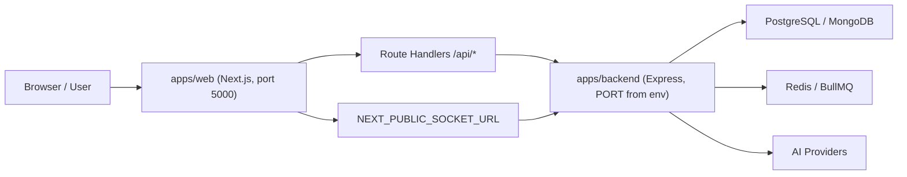

# وضع الفرونت اند والباك إند

> آخر تحديث تشغيلي: 2026-04-02

هذه الوثيقة تلخص العقد الرسمي بين `apps/web` و`apps/backend` كما يجب أن يعمل داخل المنصة، وتفصل بين ما هو مسار تشغيلي معتمد وما هو legacy أو compatibility shim.

## الملخص التنفيذي

- `apps/web` هو طبقة العرض والتجميع وواجهة المستخدم.
- `apps/backend` هو الجهة الخلفية الرسمية الوحيدة لمنطق الأعمال، الذكاء الاصطناعي، التخزين، المصادقة، الطوابير، والاتصال الآني.
- أي HTTP صادر من المتصفح يجب أن يمر عبر `/api/*` في الويب أو عبر روابط مهيأة رسميًا مثل `NEXT_PUBLIC_SOCKET_URL` للاتصال الآني.
- لا يُعد تنفيذ منطق AI أو persistence داخل Route Handler في الويب مسارًا رسميًا للتطبيقات المستهدفة.

## الرسم المعماري المختصر

## مسؤولية الفرونت اند

الفرونت اند في `apps/web` مسؤول عن:

- عرض الصفحات والتجارب التفاعلية.
- تجميع الحزم المشتركة من `packages/*`.
- تقديم Route Handlers تعمل كـ proxy أو thin adapter حين يلزم.
- حفظ واسترجاع `app-state` عبر المسار الرسمي الموحد، لا عبر تخزين محلي قديم.

الفرونت اند ليس هو المسار الرسمي لـ:

- استدعاء مزودات الذكاء الاصطناعي مباشرة كمسار تشغيل أساسي.
- تنفيذ persistence إنتاجي مستقل عن `apps/backend`.
- خلق مسارات موازية للباك إند لنفس المسؤولية.

## مسؤولية الباك إند

الباك إند في `apps/backend` مسؤول عن:

- منطق الأعمال الرسمي للتطبيقات المستهدفة.
- استدعاءات مزودات AI.
- المصادقة والتفويض و`CSRF` و`CORS`.
- التخزين الرسمي في قواعد البيانات والملفات عند وجود fallback مقصود.
- الـ queues والـ workers والـ WebSocket.
- `health` و`readiness` الصادقين.

## العقد الرسمي بين الطبقتين

### 1. التوجيه

- المتصفح يتحدث إلى `apps/web`.
- `apps/web/src/app/api/*` يمرر إلى `apps/backend` أو يعيد استجابة محلية خفيفة عند الحاجة.
- `apps/backend` هو الجهة الوحيدة التي تملك business logic الإنتاجي للتطبيقات المستهدفة.

### 2. المنافذ

- الويب يعمل على `5000` وفق `apps/web/package.json`.
- الخلفية لا يجب توثيقها كرقم ثابت. المنفذ الرسمي يحدده `PORT` في البيئة، والقيمة الافتراضية في الكود هي `3001`.
- أي اختلاف محلي مثل `3003` يعتبر override بيئيًا، لا حقيقة معمارية ثابتة.

### 3. البيئة

- HTTP backend base URL يمر عبر `BACKEND_URL` أو `NEXT_PUBLIC_BACKEND_URL`.
- WebSocket base URL يمر عبر `NEXT_PUBLIC_SOCKET_URL`.
- مفاتيح الذكاء الاصطناعي مثل `GOOGLE_GENAI_API_KEY` تبقى server-side في الخلفية.

## عائلات المسارات الرسمية

| النطاق | من الويب | إلى الخلفية |
|---|---|---|
| App State | `/api/app-state/[app]` | `/api/app-state/:app` |
| Brainstorm | `/api/brainstorm` | `/api/brainstorm` |
| StyleIST | `/api/styleist/*` و`/api/gemini` كـ compatibility shim | `/api/styleist/execute` |
| CineAI | `/api/cineai/*` | `/api/cineai/*` |
| Breakdown | `/api/breakdown/*` | `/api/breakdown/*` |
| Directors Studio | `/api/projects*`, `/api/scenes*`, `/api/characters*`, `/api/shots*`, `/api/ai/*` | نظائرها في `apps/backend` |
| BREAKAPP | `/api/breakapp/*` + `NEXT_PUBLIC_SOCKET_URL` | REST + Socket backend |
| Analysis / Development | Route handlers في الويب ثم backend analysis/app-state | التحليل والحفظ الرسمي |

## مسارات لم تعد تُعامل كمسار تشغيلي رسمي

- `POST /api/editor` داخل الويب لم يعد مسارًا رسميًا.
- التخزين المحلي القديم لحالة التطبيقات ليس هو المسار المعتمد.
- أي Route Handler في الويب ينفذ AI business logic كمسار نهائي يعتبر legacy أو shim ويجب تقييمه صراحة قبل اعتماده.

## Runtime خاص بالمحرر

الـ runtime الرسمي للمحرر مضمّن داخل `apps/backend` ويُركَّب عبر:

- `apps/backend/src/editor/runtime.ts`
- `apps/backend/editor-runtime/routes/index.mjs`

يوجد ملف محلي قديم في:

- `apps/web/src/app/(main)/editor/server/file-import-server.mjs`

لكنه لم يعد جزءًا من مسار الإنتاج الرسمي، ويُعامل كأداة محلية أو artifact تاريخي فقط.

## مراجع مرتبطة

- [README.md](../README.md)
- [docs/API.md](API.md)
- [apps/web/docs/API.md](../apps/web/docs/API.md)
