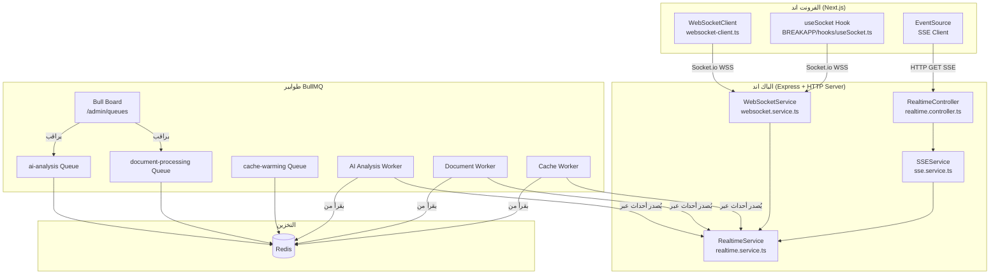
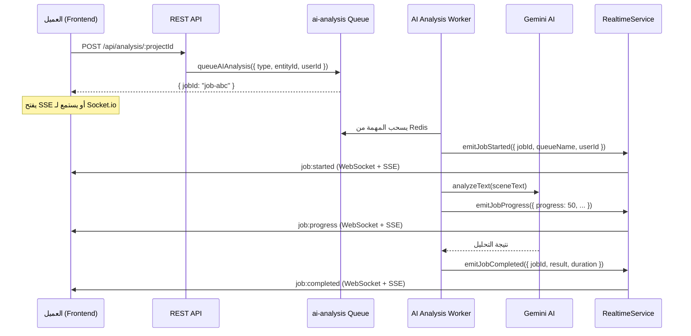
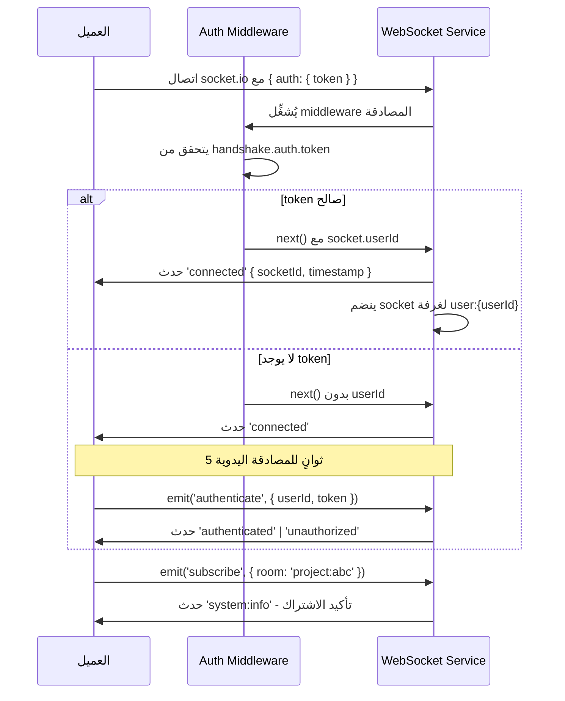
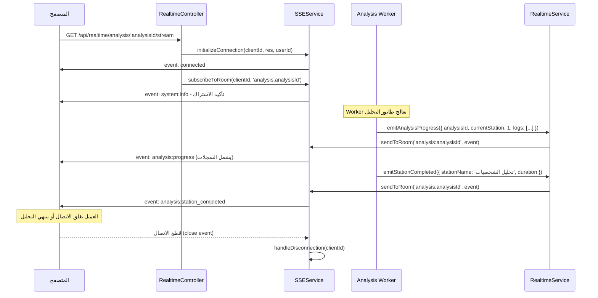

# دليل الاتصال الآني والطوابير

> آخر تحديث: 2026-03-30
> يغطي هذا الدليل: Socket.io · SSE · BullMQ · Bull Board

---

## جدول المحتويات

1. [نظرة عامة](#1-نظرة-عامة)
2. [معمارية الاتصال الآني](#2-معمارية-الاتصال-الآني)
3. [Socket.io](#3-socketio)
   - [إعداد الخادم](#31-إعداد-الخادم)
   - [أحداث الخادم إلى العميل](#32-أحداث-الخادم-إلى-العميل-server--client)
   - [أحداث العميل إلى الخادم](#33-أحداث-العميل-إلى-الخادم-client--server)
   - [Rooms و Namespaces](#34-rooms-و-namespaces)
   - [المصادقة](#35-المصادقة)
   - [إعداد العميل](#36-إعداد-العميل-frontend)
4. [SSE — Server-Sent Events](#4-sse--server-sent-events)
   - [الغرض ومتى يُستخدم](#41-الغرض-ومتى-يُستخدم)
   - [Endpoints](#42-endpoints)
   - [أنواع الأحداث](#43-أنواع-الأحداث)
5. [BullMQ — طوابير المهام](#5-bullmq--طوابير-المهام)
   - [الطوابير المُعرَّفة](#51-الطوابير-المُعرَّفة)
   - [طابور تحليل الذكاء الاصطناعي](#52-طابور-تحليل-الذكاء-الاصطناعي-ai-analysis)
   - [طابور معالجة المستندات](#53-طابور-معالجة-المستندات-document-processing)
   - [طابور تدفئة الكاش](#54-طابور-تدفئة-الكاش-cache-warming)
   - [الإعدادات الافتراضية المشتركة](#55-الإعدادات-الافتراضية-المشتركة)
   - [Bull Board — لوحة المراقبة](#56-bull-board--لوحة-المراقبة)
   - [إضافة طابور جديد](#57-إضافة-طابور-جديد)
   - [مراقبة الطوابير عبر Prometheus](#58-مراقبة-الطوابير-عبر-prometheus)
6. [تدفقات الاتصال الرئيسية](#6-تدفقات-الاتصال-الرئيسية)
   - [تدفق مهمة تحليل الذكاء الاصطناعي](#61-تدفق-مهمة-تحليل-الذكاء-الاصطناعي)
   - [تدفق مصادقة Socket.io](#62-تدفق-مصادقة-socketio)
   - [تدفق SSE لبث سجلات التحليل](#63-تدفق-sse-لبث-سجلات-التحليل)
7. [الخدمة الموحدة RealtimeService](#7-الخدمة-الموحدة-realtimeservice)
8. [متى يستخدم أي مسار؟](#8-متى-يستخدم-أي-مسار)
9. [إشعارات أمنية](#9-إشعارات-أمنية)

---

## 1. نظرة عامة

يعتمد النظام على ثلاثة بروتوكولات متكاملة للاتصال الآني:

| البروتوكول | الغرض الأساسي | الاتجاه | الاستخدام في المشروع |
|---|---|---|---|
| **Socket.io** | اتصال ثنائي الاتجاه مستمر | ثنائي | تحديثات المهام، إدارة الغرف، الأحداث الفورية |
| **SSE** | بث مستمر من الخادم | أحادي (خادم → عميل) | بث سجلات التحليل، تقدم المهام الطويلة |
| **BullMQ** | طوابير المهام الخلفية | خلفية (Redis) | التحليل بالذكاء الاصطناعي، معالجة المستندات، تدفئة الكاش |

الخلفية تملك طبقتي بث فعليتين:

- `Socket.IO` في `apps/backend/src/services/websocket.service.ts`
- `SSE` في `apps/backend/src/services/sse.service.ts`

ويوجد موحّد أعلى منهما:

- `apps/backend/src/services/realtime.service.ts`

يوفر `RealtimeService` واجهة موحدة تُرسل الأحداث عبر Socket.io وSSE في آنٍ واحد، مما يضمن وصول التحديثات لجميع العملاء بغض النظر عن البروتوكول المستخدم.

---

## 2. معمارية الاتصال الآني



---

## 3. Socket.io

### 3.1 إعداد الخادم

الملف: `apps/backend/src/config/websocket.config.ts`
الخدمة: `apps/backend/src/services/websocket.service.ts`

يُهيَّأ خادم Socket.io على نفس خادم HTTP عبر `websocketService.initialize(httpServer)` في `server.ts`.

**الإعدادات الرئيسية:**

| الإعداد | القيمة | الوصف |
|---|---|---|
| `pingTimeout` | 60,000 ms | انتهاء مهلة الـ ping |
| `pingInterval` | 25,000 ms | الفاصل بين كل ping |
| `connectTimeout` | 45,000 ms | مهلة الاتصال الأولي |
| `transports` | `['websocket', 'polling']` | بروتوكولات النقل المسموح بها |
| `maxHttpBufferSize` | 1 MB | الحد الأقصى لحجم الرسائل |
| `perMessageDeflate` | `true` | ضغط الرسائل |
| `serveClient` | `false` | لا يُقدَّم ملف العميل من الخادم |
| `CORS origin` | `env.CORS_ORIGIN` | مصدر CORS المسموح به |

**فارق بيئة الإنتاج:**
- في الإنتاج، يُفضَّل `transports: ['websocket']` فقط لتحسين الأداء.
- في التطوير، يُفعَّل `connectionStateRecovery` لمدة دقيقتين عند الانقطاع.

**حد المصادقة:** يمتلك كل socket مهلة 5 ثوانٍ (`AUTHENTICATION: 5000`) ليُكمل المصادقة قبل قطع الاتصال.

**حد الغرف:** لا يُسمح لكل socket بالانضمام لأكثر من 10 غرف (`MAX_ROOMS_PER_SOCKET: 10`).

---

### 3.2 أحداث الخادم إلى العميل (Server → Client)

هذه الأحداث يُرسلها الخادم، ويستمع إليها العميل عبر `socket.on(eventName, callback)`.

**أحداث الاتصال:**

| اسم الحدث | الثابت (`RealtimeEventType`) | البيانات المُرسَلة | الوصف |
|---|---|---|---|
| `connected` | `CONNECTED` | `{ socketId, message, timestamp }` | تأكيد الاتصال الأولي |
| `authenticated` | `AUTHENTICATED` | `{ message, userId, timestamp }` | نجاح المصادقة |
| `unauthorized` | `UNAUTHORIZED` | `{ message }` | رفض المصادقة أو انتهاء المهلة |
| `disconnected` | `DISCONNECTED` | `{ message, timestamp }` | إشعار قطع الاتصال |

**أحداث المهام (Jobs):**

| اسم الحدث | الثابت | البيانات الرئيسية | الوصف |
|---|---|---|---|
| `job:started` | `JOB_STARTED` | `{ jobId, queueName, jobName, data, userId, timestamp }` | بدء تنفيذ المهمة |
| `job:progress` | `JOB_PROGRESS` | `{ jobId, queueName, progress (0-100), status, message, currentStep, totalSteps, completedSteps }` | تحديث تقدم المهمة |
| `job:completed` | `JOB_COMPLETED` | `{ jobId, queueName, result, duration, timestamp }` | اكتمال المهمة |
| `job:failed` | `JOB_FAILED` | `{ jobId, queueName, error, stackTrace, attemptsMade, attemptsMax }` | فشل المهمة |
| `job:retry` | `JOB_RETRY` | `{ jobId, queueName, ... }` | إعادة محاولة المهمة |

**أحداث التحليل (Analysis):**

| اسم الحدث | الثابت | البيانات الرئيسية | الوصف |
|---|---|---|---|
| `analysis:started` | `ANALYSIS_STARTED` | `{ projectId, analysisId, timestamp }` | بدء جلسة التحليل |
| `analysis:progress` | `ANALYSIS_PROGRESS` | `{ projectId, analysisId, currentStation (1-7), totalStations, stationName, progress, logs[] }` | تقدم محطة التحليل |
| `analysis:station_completed` | `ANALYSIS_STATION_COMPLETED` | `{ projectId, analysisId, stationNumber, stationName, result, duration }` | اكتمال محطة واحدة |
| `analysis:completed` | `ANALYSIS_COMPLETED` | `{ projectId, analysisId, ... }` | اكتمال التحليل الكامل |
| `analysis:failed` | `ANALYSIS_FAILED` | `{ projectId, analysisId, error }` | فشل التحليل |

**أحداث النظام:**

| اسم الحدث | الثابت | البيانات الرئيسية | الوصف |
|---|---|---|---|
| `system:info` | `SYSTEM_INFO` | `{ level: 'info', message, details }` | رسالة معلوماتية |
| `system:warning` | `SYSTEM_WARNING` | `{ level: 'warning', message, details }` | تحذير من النظام |
| `system:error` | `SYSTEM_ERROR` | `{ level: 'error', message, details }` | خطأ في النظام |

---

### 3.3 أحداث العميل إلى الخادم (Client → Server)

هذه الأحداث يُرسلها العميل، ويستمع إليها الخادم عبر `socket.on(eventName, handler)`.

| اسم الحدث | البيانات المُرسَلة | الوصف | متطلبات |
|---|---|---|---|
| `authenticate` | `{ token?: string, userId?: string }` | طلب المصادقة بعد الاتصال | يجب الإرسال خلال 5 ثوانٍ |
| `subscribe` | `{ room: string }` | الاشتراك في غرفة | يتطلب مصادقة مسبقة |
| `unsubscribe` | `{ room: string }` | إلغاء الاشتراك من غرفة | — |

---

### 3.4 Rooms و Namespaces

**أنواع الغرف (WebSocketRoom):**

| نوع الغرفة | صيغة الاسم | مثال | الاستخدام |
|---|---|---|---|
| `USER` | `user:{userId}` | `user:abc123` | أحداث مخصصة للمستخدم |
| `PROJECT` | `project:{projectId}` | `project:proj456` | تحديثات المشروع لأعضائه |
| `QUEUE` | `queue:{queueName}` | `queue:ai-analysis` | مراقبة طابور محدد |
| `GLOBAL` | `global` | `global` | البث العام لجميع المتصلين |

**دالة مساعدة لإنشاء اسم الغرفة:**
```typescript
import { createRoomName, WebSocketRoom } from '@/types/realtime.types';

const room = createRoomName(WebSocketRoom.USER, userId);      // "user:abc123"
const room = createRoomName(WebSocketRoom.PROJECT, projectId); // "project:proj456"
```

**Namespaces المُعرَّفة (في الإعدادات، غير مُفعَّلة حالياً):**

| Namespace | المسار | الغرض المقصود |
|---|---|---|
| Root | `/` | الاتصال العام (مُفعَّل) |
| Jobs | `/jobs` | تتبع المهام (تكوين فقط) |
| Analysis | `/analysis` | تحليل المحتوى (تكوين فقط) |
| Admin | `/admin` | إدارة النظام (تكوين فقط) |

> ملاحظة: حالياً يستخدم النظام namespace الجذر `/` فقط. Namespaces الأخرى موجودة في الإعدادات كتهيئة مستقبلية ولم تُفعَّل بعد.

---

### 3.5 المصادقة

**آلية المصادقة في Middleware:**

يمر كل اتصال جديد عبر middleware مصادقة يمر بخطوتين:

```
1. handshake.auth.token    ← JWT من بيانات المصافحة
2. Cookie: accessToken     ← JWT من ملفات تعريف الارتباط
```

إذا نجحت المصادقة، يُضاف المستخدم تلقائياً إلى غرفته الخاصة `user:{userId}`.

إذا فشلت المصادقة عند الاتصال الأولي، يمكن للعميل المحاولة مرة أخرى خلال 5 ثوانٍ عبر حدث `authenticate`.

**الحماية:**
- handshake token أو `accessToken` cookie
- يوجد مسار تطويري bypass للتوثيق يجب عدم اعتماده إنتاجياً

**تحذير أمني مهم:** راجع [قسم الإشعارات الأمنية](#9-إشعارات-أمنية).

---

### 3.6 إعداد العميل (Frontend)

**الملف الأول:** `apps/web/src/lib/services/websocket-client.ts`
**الملف الثاني:** `apps/web/src/app/(main)/BREAKAPP/hooks/useSocket.ts`

**الاتصال الأساسي عبر `websocketClient`:**

```typescript
import { websocketClient } from '@/lib/services/websocket-client';

// يتصل تلقائياً عند تحميل الصفحة (client-side فقط)
// العنوان: process.env.NEXT_PUBLIC_BACKEND_URL || 'http://localhost:3001'

// الاستماع لتقدم المهمة
const unsubscribe = websocketClient.onJobProgress((data) => {
  console.log(`تقدم: ${data.progress}%`);
});

// الاستماع لاكتمال المهمة
websocketClient.onJobCompleted((data) => {
  console.log('اكتملت المهمة:', data);
});

// إلغاء الاشتراك عند تنظيف المكوّن
unsubscribe();
```

**استخدام `useSocket` React Hook:**

```typescript
import { useSocket } from '@/app/(main)/BREAKAPP/hooks/useSocket';

function MyComponent() {
  const { connected, emit, on, off, error } = useSocket({
    url: process.env.NEXT_PUBLIC_SOCKET_URL || 'http://localhost:3001',
    autoConnect: true,
    auth: true, // يُرسل JWT token تلقائياً
  });

  useEffect(() => {
    const handler = (data: unknown) => console.log('تقدم المهمة:', data);
    on('job:progress', handler);
    return () => off('job:progress', handler);
  }, [on, off]);

  const authenticate = () => {
    emit('authenticate', { userId: 'user-123' });
  };

  const joinRoom = () => {
    emit('subscribe', { room: 'project:proj456' });
  };

  return <div>{connected ? 'متصل' : 'غير متصل'}</div>;
}
```

**مثال اتصال مباشر (بدون React):**

```javascript
import { io } from 'socket.io-client';

const socket = io('http://localhost:3001', {
  transports: ['websocket', 'polling'],
  withCredentials: true,
  auth: { token: 'your-jwt-token' },
});

// الاستماع لتأكيد الاتصال
socket.on('connected', (data) => {
  // المصادقة عبر حدث authenticate (بديل لـ auth في الـ handshake)
  socket.emit('authenticate', { userId: 'user-123' });
});

// بعد المصادقة: الاشتراك في الغرف
socket.on('authenticated', () => {
  socket.emit('subscribe', { room: 'project:proj456' });
  socket.emit('subscribe', { room: 'queue:ai-analysis' });
});

// استقبال التحديثات
socket.on('job:progress', (data) => updateProgressBar(data.progress));
socket.on('job:completed', (data) => showSuccess(data.result));
socket.on('system:error', (data) => showError(data.message));
```

---

## 4. SSE — Server-Sent Events

### 4.1 الغرض ومتى يُستخدم

SSE مناسب للحالات التالية:

- **بث سجلات التحليل** في الوقت الفعلي بينما يعمل الذكاء الاصطناعي.
- **متابعة تقدم مهمة محددة** دون الحاجة لاتصال Socket.io كامل.
- **العملاء الذين لا يحتاجون إرسال بيانات للخادم** — SSE أبسط وأقل استهلاكاً من Socket.io في هذه الحالة.
- **بيئات تمنع WebSocket** — SSE يعمل فوق HTTP/1.1 العادي.
- **تدفق أحادي الاتجاه بسيط ومراقبة.**

الخدمة: `apps/backend/src/services/sse.service.ts`
المتحكم: `apps/backend/src/controllers/realtime.controller.ts`

**خصائص تقنية:**
- ترويسات: `Content-Type: text/event-stream`, `Cache-Control: no-cache`, `X-Accel-Buffering: no`
- Keep-alive: ping تلقائي كل 30 ثانية بتعليق `: keep-alive`
- دعم `Last-Event-ID` للاستئناف بعد الانقطاع
- يحتفظ بالعملاء في `Map`
- يدعم الاشتراك في غرف ومن ثم إرسال أحداث إلى مستخدم أو غرفة أو بث عام

---

### 4.2 Endpoints

| الطريقة | المسار | الوصف | المصادقة |
|---|---|---|---|
| `GET` | `/api/realtime/events` | الاتصال العام بـ SSE | اختياري (userId من `req.user`) |
| `GET` | `/api/realtime/analysis/:analysisId/stream` | بث سجلات تحليل محدد | اختياري |
| `GET` | `/api/realtime/jobs/:jobId/stream` | بث تقدم مهمة محددة | اختياري |
| `GET` | `/api/realtime/stats` | إحصائيات خدمات الاتصال | مطلوبة |
| `GET` | `/api/realtime/health` | فحص صحة خدمات الاتصال | لا |
| `POST` | `/api/realtime/test` | إرسال حدث تجريبي | اختياري |

**الاتصال بـ SSE من المتصفح:**

```javascript
// الاتصال العام
const eventSource = new EventSource('http://localhost:3001/api/realtime/events', {
  withCredentials: true,
});

// بث سجلات تحليل محدد
const analysisStream = new EventSource(
  'http://localhost:3001/api/realtime/analysis/analysis-456/stream',
  { withCredentials: true }
);

// بث تقدم مهمة محددة
const jobStream = new EventSource(
  'http://localhost:3001/api/realtime/jobs/job-123/stream',
  { withCredentials: true }
);

// معالجة الأخطاء وإعادة الاتصال
eventSource.onerror = () => {
  // المتصفح يُعيد الاتصال تلقائياً
};
```

---

### 4.3 أنواع الأحداث

يستخدم SSE نفس أنواع أحداث `RealtimeEventType` المُعرَّفة في `apps/backend/src/types/realtime.types.ts`.

**الاستماع للأحداث عبر SSE:**

```javascript
// حدث الاتصال الأولي
eventSource.addEventListener('connected', (event) => {
  const data = JSON.parse(event.data);
  // { timestamp, eventType: 'connected', message: 'SSE connection established' }
});

// تقدم التحليل (يحتوي على سجلات)
eventSource.addEventListener('analysis:progress', (event) => {
  const data = JSON.parse(event.data);
  // { projectId, analysisId, currentStation, totalStations, stationName, progress, logs[] }
  data.logs?.forEach(log => appendToConsole(log));
});

// تقدم المهمة
eventSource.addEventListener('job:progress', (event) => {
  const data = JSON.parse(event.data);
  // { jobId, queueName, progress, status, message }
  updateProgressBar(data.progress);
});

// اكتمال محطة تحليل
eventSource.addEventListener('analysis:station_completed', (event) => {
  const data = JSON.parse(event.data);
  markStationComplete(data.stationName);
});
```

**صيغة رسالة SSE الخام (للمرجع):**

```
id: evt-1234
event: job:progress
data: {"jobId":"abc","progress":50,"status":"active","timestamp":"2026-03-30T10:00:00.000Z"}

```

---

## 5. BullMQ — طوابير المهام

### 5.1 الطوابير المُعرَّفة

الملف: `apps/backend/src/queues/queue.config.ts`

```typescript
export enum QueueName {
  AI_ANALYSIS       = 'ai-analysis',
  DOCUMENT_PROCESSING = 'document-processing',
  NOTIFICATIONS     = 'notifications',   // مُعرَّف، العامل غير مُسجَّل بعد
  EXPORT            = 'export',           // مُعرَّف، العامل غير مُسجَّل بعد
  CACHE_WARMING     = 'cache-warming',
}
```

> الطوابير `notifications` و `export` مُعرَّفة في `QueueName` لكنها لا تملك عمالاً مُسجَّلين حالياً في `initializeWorkers()`.

---

### 5.2 طابور تحليل الذكاء الاصطناعي (`ai-analysis`)

**الملف:** `apps/backend/src/queues/jobs/ai-analysis.job.ts`

**الوظيفة:** معالجة طلبات تحليل الذكاء الاصطناعي طويلة الأمد للمشاهد والشخصيات واللقطات والمشاريع.

**بنية بيانات المهمة:**

```typescript
interface AIAnalysisJobData {
  type:         'scene' | 'character' | 'shot' | 'project';
  entityId:     string;
  userId:       string;
  analysisType: 'full' | 'quick' | 'detailed';
  options?:     Record<string, unknown>; // يشمل: { text: string }
}
```

**إضافة مهمة للطابور:**

```typescript
import { queueAIAnalysis } from '@/queues';

const jobId = await queueAIAnalysis({
  type: 'scene',
  entityId: 'scene-abc123',
  userId: 'user-xyz',
  analysisType: 'full',
  options: { text: 'نص المشهد هنا...' },
});
```

**خيارات العامل:**

| الخيار | القيمة | الوصف |
|---|---|---|
| `concurrency` | 3 | معالجة 3 تحليلات بشكل متزامن |
| `limiter.max` | 5 | حد أقصى 5 مهام في الثانية |
| `limiter.duration` | 1,000 ms | نافذة حساب الحد |
| `priority` — quick | 1 (أعلى) | مهام التحليل السريع تُعالج أولاً |
| `priority` — others | 2 | مهام التحليل الكاملة والمفصل |
| `attempts` | 3 | عدد محاولات إعادة التنفيذ |
| `backoff.type` | exponential | تأخير أسي بين المحاولات |
| `backoff.delay` | 2,000 ms | التأخير الأساسي |

**خطوات التقدم:**
- `10%` — بدء المعالجة
- `100%` — اكتمال التحليل

---

### 5.3 طابور معالجة المستندات (`document-processing`)

**الملف:** `apps/backend/src/queues/jobs/document-processing.job.ts`

**الوظيفة:** استخراج النصوص والمحتوى من ملفات PDF وDOCX وTXT، مع دعم اختياري لاستخراج المشاهد والشخصيات والحوارات وتوليد الملخصات.

**بنية بيانات المهمة:**

```typescript
interface DocumentProcessingJobData {
  documentId: string;
  filePath:   string;
  fileType:   'pdf' | 'docx' | 'txt';
  userId:     string;
  projectId?: string;
  options?: {
    extractScenes?:     boolean;
    extractCharacters?: boolean;
    extractDialogue?:   boolean;
    generateSummary?:   boolean;
  };
}
```

**إضافة مهمة للطابور:**

```typescript
import { queueDocumentProcessing } from '@/queues';

const jobId = await queueDocumentProcessing({
  documentId: 'doc-123',
  filePath:   '/uploads/script.pdf',
  fileType:   'pdf',
  userId:     'user-xyz',
  projectId:  'proj-456',
  options: {
    extractScenes:     true,
    extractCharacters: true,
    generateSummary:   true,
  },
});
```

**خيارات العامل:**

| الخيار | القيمة | الوصف |
|---|---|---|
| `concurrency` | 2 | معالجة مستندين بشكل متزامن |
| `limiter.max` | 3 | حد أقصى 3 مهام في الثانية |
| `priority` | 1 (ثابت) | أولوية قصوى |
| `attempts` | 3 | عدد المحاولات |
| `backoff.type` | exponential | تأخير أسي |
| `backoff.delay` | 3,000 ms | التأخير الأساسي (أطول من التحليل) |

**خطوات التقدم:**
- `10%` — بدء المعالجة
- `30%` — استخراج النص
- `40%` — حساب الكلمات
- `60%` — استخراج المشاهد (إن طُلب)
- `70%` — استخراج الشخصيات (إن طُلب)
- `80%` — استخراج الحوارات (إن طُلب)
- `90%` — توليد الملخص (إن طُلب)
- `100%` — اكتمال المعالجة

---

### 5.4 طابور تدفئة الكاش (`cache-warming`)

**الملف:** `apps/backend/src/queues/jobs/cache-warming.job.ts`

**الوظيفة:** تسخين كاش Gemini AI بشكل استباقي للكيانات متكررة الاستخدام، مما يقلل زمن الاستجابة ويخفض تكلفة استدعاءات API.

**بنية بيانات المهمة:**

```typescript
interface CacheWarmingJobData {
  entities: Array<{
    type:         'scene' | 'character' | 'shot' | 'project';
    id:           string;
    analysisType: string;
  }>;
  priority?: number; // القيمة الافتراضية: 5
}
```

**إضافة مهمة للطابور:**

```typescript
import { queueCacheWarming } from '@/queues';

const jobId = await queueCacheWarming({
  entities: [
    { type: 'scene', id: 'scene-1', analysisType: 'full' },
    { type: 'character', id: 'char-2', analysisType: 'detailed' },
  ],
  priority: 3,
});
```

**خيارات العامل:**

| الخيار | القيمة | الوصف |
|---|---|---|
| `concurrency` | 1 | معالجة مهمة واحدة في كل وقت |
| `limiter.max` | 1 | حد أقصى مهمة واحدة كل 5 ثوانٍ |
| `limiter.duration` | 5,000 ms | تجنب تجاوز حدود Gemini API |
| `attempts` | 2 | إعادة محاولة واحدة فقط |
| `backoff.type` | exponential | تأخير أسي |
| `backoff.delay` | 5,000 ms | تأخير أطول احتراماً لحدود API |

---

### 5.5 الإعدادات الافتراضية المشتركة

هذه الإعدادات تنطبق على **جميع الطوابير** ما لم تُستبدل في كل طابور:

```typescript
// الاحتفاظ بالمهام المكتملة
removeOnComplete: {
  age:   24 * 3600, // 24 ساعة
  count: 1000,      // آخر 1000 مهمة مكتملة
}

// الاحتفاظ بالمهام الفاشلة
removeOnFail: {
  age:   7 * 24 * 3600, // 7 أيام
  count: 5000,
}

// عدد المحاولات الافتراضية
attempts: 3

// نوع التراجع الافتراضي
backoff: { type: 'exponential', delay: 2000 }

// حد معدل المعالجة
concurrency: 5 (الافتراضي العام)
limiter: { max: 10, duration: 1000 }
```

**اتصال Redis:**
- يدعم `REDIS_URL` (يشمل كل إعدادات الاتصال في URL واحد).
- أو `REDIS_HOST` + `REDIS_PORT` + `REDIS_PASSWORD` منفصلة.
- القيم الافتراضية: `localhost:6379`.

**توافق Redis:** يتحقق النظام من إصدار Redis عند البدء. إذا لم يكن الإصدار متوافقاً مع BullMQ، يستمر التطبيق بدون طوابير (التحقق من `isQueueSystemEnabled()` قبل إضافة مهام جديدة).

---

### 5.6 Bull Board — لوحة المراقبة

**الملف:** `apps/backend/src/middleware/bull-board.middleware.ts`

**رابط الدخول:** `http://localhost:3001/admin/queues`
**الحزمة:** `@bull-board/api` + `@bull-board/express`

**الطوابير المرصودة في اللوحة:**

| الطابور | موجود في Bull Board |
|---|---|
| `ai-analysis` | نعم |
| `document-processing` | نعم |
| `cache-warming` | لا (غير مُضاف في `setupBullBoard`) |
| `notifications` | لا |
| `export` | لا |

**المصادقة:** تتطلب اللوحة مصادقة عبر `authMiddleware` + تحديد معدل الوصول:
- 100 طلب كحد أقصى لكل IP كل 15 دقيقة.
- يُعيد خطأ `429` عند تجاوز الحد.

**الوصول لإحصائيات الطوابير عبر API:**

| الطريقة | المسار | الوصف |
|---|---|---|
| `GET` | `/api/queue/stats` | إحصائيات جميع الطوابير |
| `GET` | `/api/queue/:queueName/stats` | إحصائيات طابور محدد |
| `GET` | `/api/queue/jobs/:jobId` | حالة مهمة بعينها |
| `POST` | `/api/queue/jobs/:jobId/retry` | إعادة محاولة مهمة فاشلة |
| `POST` | `/api/queue/:queueName/clean` | تنظيف المهام القديمة |

---

### 5.7 إضافة طابور جديد

اتبع الخطوات التالية لإضافة طابور جديد:

**الخطوة 1:** أضف الاسم في `QueueName` (ملف `queue.config.ts`):

```typescript
export enum QueueName {
  // ... الطوابير الموجودة ...
  MY_NEW_QUEUE = 'my-new-queue',
}
```

**الخطوة 2:** أنشئ ملف المهمة في `apps/backend/src/queues/jobs/my-new.job.ts`:

```typescript
import { Job } from 'bullmq';
import { queueManager, QueueName } from '@/queues/queue.config';
import { logger } from '@/utils/logger';

export interface MyNewJobData {
  entityId: string;
  userId:   string;
  // ... حقول أخرى
}

async function processMyNewJob(job: Job<MyNewJobData>): Promise<void> {
  await job.updateProgress(10);
  // ... منطق المعالجة
  await job.updateProgress(100);
}

export async function queueMyNewJob(data: MyNewJobData): Promise<string> {
  const queue = queueManager.getQueue(QueueName.MY_NEW_QUEUE);
  const job = await queue.add('my-new-job', data, {
    attempts: 3,
    backoff: { type: 'exponential', delay: 2000 },
  });
  return job.id!;
}

export function registerMyNewWorker(): void {
  queueManager.registerWorker(QueueName.MY_NEW_QUEUE, processMyNewJob, {
    concurrency: 2,
  });
  logger.info('تم تسجيل العامل الجديد');
}
```

**الخطوة 3:** سجّل العامل في `apps/backend/src/queues/index.ts`:

```typescript
import { registerMyNewWorker } from './jobs/my-new.job';

export async function initializeWorkers(): Promise<void> {
  // ...
  registerMyNewWorker(); // أضف هذا السطر
}
```

**الخطوة 4 (اختياري):** أضف الطابور للوحة Bull Board في `bull-board.middleware.ts`:

```typescript
const queues = [
  QueueName.AI_ANALYSIS,
  QueueName.DOCUMENT_PROCESSING,
  QueueName.MY_NEW_QUEUE, // أضف هنا
];
```

---

### 5.8 مراقبة الطوابير عبر Prometheus

**ملف الـ Metrics:** `apps/backend/src/middleware/metrics.middleware.ts`
**Endpoint:** `GET /metrics` (Prometheus format)
**Endpoint البديل:** `GET /api/metrics/queue` (JSON format، يتطلب مصادقة)

يستخدم النظام مكتبة `prom-client` مع بادئة `the_copy_` لجميع المقاييس.

تشمل المقاييس المتاحة للطوابير عبر endpoint `/api/metrics/queue`:
- عدد المهام في الانتظار / النشطة / المكتملة / الفاشلة / المؤجلة لكل طابور.
- وقت المعالجة الإجمالي.

---

## 6. تدفقات الاتصال الرئيسية

### 6.1 تدفق مهمة تحليل الذكاء الاصطناعي



---

### 6.2 تدفق مصادقة Socket.io



---

### 6.3 تدفق SSE لبث سجلات التحليل



---

## 7. الخدمة الموحدة RealtimeService

**الملف:** `apps/backend/src/services/realtime.service.ts`

`RealtimeService` هي نقطة الدخول الموصى بها لإرسال الأحداث من الكود الخلفي، لأنها ترسل عبر WebSocket وSSE معاً في استدعاء واحد.

**خيارات التوجيه (`BroadcastOptions`):**

```typescript
interface BroadcastOptions {
  target?:    BroadcastTarget; // ALL | WEBSOCKET | SSE
  room?:      string;
  userId?:    string;
  projectId?: string;
  queueName?: string;
  eventId?:   string;
}

enum BroadcastTarget {
  ALL       = 'all',       // كلا البروتوكولين (الافتراضي)
  WEBSOCKET = 'websocket', // Socket.io فقط
  SSE       = 'sse',       // SSE فقط
}
```

**المثال الموصى به لدمج مع BullMQ Worker:**

```typescript
import { realtimeService } from '@/services/realtime.service';

async function processJob(job: Job<MyJobData>) {
  const { userId, projectId } = job.data;

  // إشعار بالبدء
  realtimeService.emitJobStarted({
    jobId:     job.id!,
    queueName: 'my-queue',
    jobName:   job.name,
    userId,
  });

  // تحديثات التقدم
  await job.updateProgress(50);
  realtimeService.emitJobProgress({
    jobId:    job.id!,
    queueName: 'my-queue',
    progress: 50,
    status:   'active',
    userId,
  });

  // التحليل
  realtimeService.emitAnalysisProgress({
    projectId,
    analysisId:      job.id!,
    currentStation:  3,
    totalStations:   7,
    stationName:     'تحليل الشخصيات',
    progress:        43,
    logs:            ['تم تحديد 5 شخصيات رئيسية...'],
  });

  // إشعار بالاكتمال
  realtimeService.emitJobCompleted({
    jobId:     job.id!,
    queueName: 'my-queue',
    result:    { success: true },
    duration:  Date.now() - job.timestamp,
    userId,
  });
}
```

**التحقق من الصحة:**

```typescript
// GET /api/realtime/health
const health = realtimeService.getHealth();
// {
//   websocket: { status: 'operational', initialized: true },
//   sse: { status: 'operational', clients: 12 },
//   overall: 'healthy',
//   timestamp: '...'
// }
```

---

## 8. متى يستخدم أي مسار؟

| التقنية | الاستخدام الأنسب |
|---|---|
| WebSocket (Socket.io) | تفاعل ثنائي الاتجاه، إدارة الغرف، تحديثات المهام الفورية، غرف queue/project |
| SSE | تدفق أحادي الاتجاه بسيط، بث سجلات التحليل، مراقبة التقدم |

## المصطلحات

| المصطلح | المعنى في سياق هذا المشروع |
|---|---|
| room | قناة منطقية لتجميع المشتركين |
| SSE | Server-Sent Events |
| BullMQ | مكتبة طوابير مهام تعتمد على Redis |
| RealtimeService | الخدمة الموحدة التي تُرسل الأحداث عبر WebSocket وSSE معاً |

---

## 9. إشعارات أمنية

### تحذير: مصادقة Socket.io في وضع التطوير

```
⚠️ DEV STUB — يتجاوز التحقق من JWT في بيئة التطوير.
```

دالة `handleAuthentication` في `websocket.service.ts` تقبل `userId` مباشرةً بدون التحقق من صحة الـ JWT في بيئة التطوير (`NODE_ENV !== 'production'`). هذا السلوك **غير آمن في الإنتاج** ويجب استبداله بـ:

```typescript
// الكود المطلوب في الإنتاج:
import jwt from 'jsonwebtoken';

const decoded = jwt.verify(data.token, process.env.JWT_SECRET!);
socket.userId = (decoded as any).userId;
```

يشمل التطبيق الكامل في الإنتاج:
1. التحقق من توقيع JWT وصلاحيته.
2. التحقق من انتهاء صلاحية الـ token.
3. التحقق من مصدر الـ token (issuer/audience).
4. تحديد معدل محاولات المصادقة.
5. تسجيل محاولات المصادقة الفاشلة للرصد الأمني.

### ملاحظة: CORS في SSEService

تضبط `SSEService` ترويسات `Access-Control-Allow-Origin: *` مؤقتاً. في الإنتاج يجب تقييد هذه القيمة لنطاق الفرونت اند المحدد بدلاً من الأحرف العامة.
