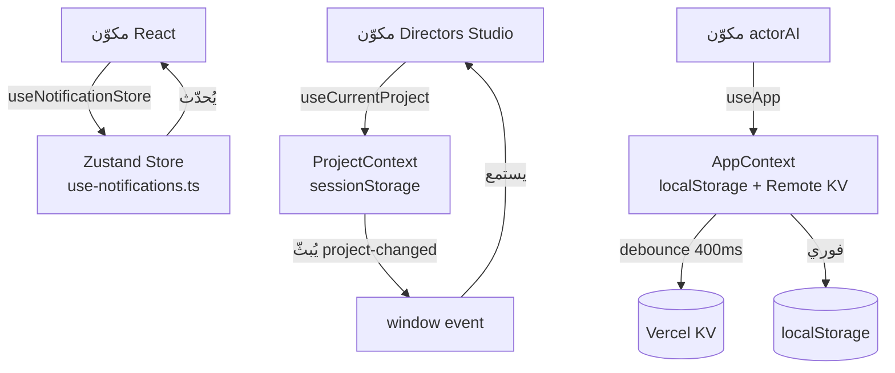
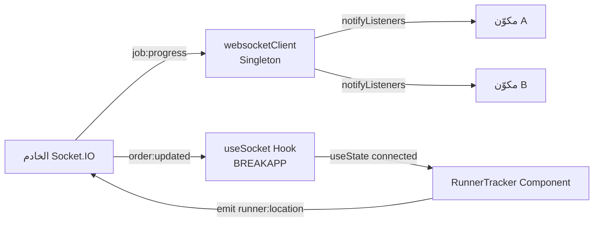
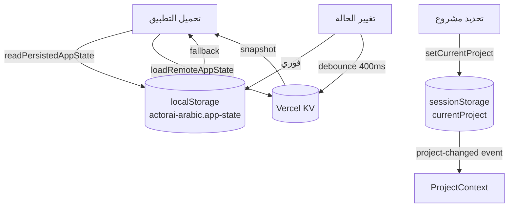
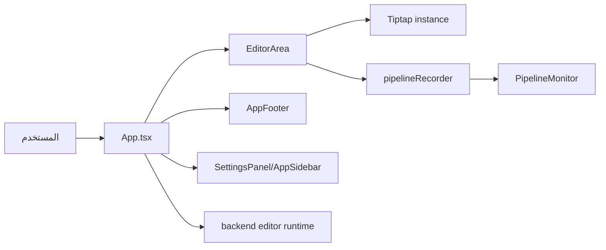

# دليل إدارة الحالة وتدفق البيانات

> **النطاق:** `apps/web/src`
> **آخر تحديث:** مارس 2026
> **الإصدار:** Next.js 15 · React 19 · TanStack Query v5 · Zustand v4 · Socket.IO v4

---

## جدول المحتويات

1. [الاستراتيجية العامة](#1-الاستراتيجية-العامة)
2. [جدول أنواع الحالة](#2-جدول-أنواع-الحالة)
3. [مخازن Zustand](#3-مخازن-zustand)
4. [React Query — الحالة الخادمية](#4-react-query--الحالة-الخادمية)
5. [Context Providers](#5-context-providers)
6. [حالة URL وحالة الجلسة](#6-حالة-url-وحالة-الجلسة)
7. [الاتصال اللحظي — WebSocket / Socket.IO](#7-الاتصال-اللحظي--websocket--socketio)
8. [التخزين المحلي والمتصفح](#8-التخزين-المحلي-والمتصفح)
9. [التخزين المؤقت — Redis والخادم](#9-التخزين-المؤقت--redis-والخادم)
10. [أنماط Server Components مقابل Client Components](#10-أنماط-server-components-مقابل-client-components)
11. [تدفق البيانات — مخططات Mermaid](#11-تدفق-البيانات--مخططات-mermaid)
12. [حالة editor](#12-حالة-editor)
13. [أنماط التخزين المؤقت](#13-أنماط-التخزين-المؤقت)
14. [قرارات التصميم الرئيسية](#14-قرارات-التصميم-الرئيسية)
15. [المصطلحات](#15-المصطلحات)

---

## 1. الاستراتيجية العامة

يتبع التطبيق مبدأ **"الحالة في أقرب مكان من مكان الاستخدام"** مع فصل صريح بين:

- **الحالة الخادمية** (Server State): بيانات تأتي من API ويديرها TanStack Query مع التخزين المؤقت التلقائي.
- **الحالة العميلية العالمية** (Global Client State): مُدارة بمخزن Zustand للإشعارات، ومخزن مخصص خفيف الوزن للمشاريع.
- **الحالة المحلية للميزة** (Feature-Scoped State): React Context مخصص لكل تطبيق فرعي (actorAI، Directors Studio، StyleIST).
- **الحالة المستمرة** (Persistent State): localStorage للجلسات وإعدادات المستخدم، sessionStorage للمشروع النشط.
- **الحالة اللحظية** (Realtime State): Socket.IO لتحديثات تقدم المهام وإشعارات Runner.

لا يوجد مخزن Zustand عالمي واحد — كل تطبيق فرعي له سياقه الخاص، وتتشارك الوظائف الأفقية (الإشعارات، المشروع النشط) عبر مخازن مشتركة.

إدارة الحالة ليست موحدة تحت مكتبة واحدة في جميع الأجزاء. الواجهة العامة تستخدم `React Query` للحالة البعيدة المشتركة، بينما محرر `editor` يعتمد أساساً على state محلية داخل `App.tsx` وعلى كائن تحكم غير Reactي هو `EditorArea`.

---

## 2. جدول أنواع الحالة

| النوع | الآلية | مكان التعريف | دورة الحياة | أمثلة |
|---|---|---|---|---|
| **خادمية** (Server) | TanStack Query `useQuery` / `useMutation` | `src/hooks/useProject.ts`، `src/hooks/useMetrics.ts` | تلقائي — staleTime 1 دقيقة | قائمة المشاريع، المشاهد، اللقطات، المقاييس |
| **عميلية عالمية** (Global Client) | Zustand `create()` | `src/hooks/use-notifications.ts` | حياة التطبيق | قائمة الإشعارات |
| **عميلية ميزة** (Feature Client) | React Context | `context/AppContext.tsx`، `lib/ProjectContext.tsx` | حياة الـ Layout | المستخدم، العرض الحالي، المشروع المحدد |
| **URL** | `usePathname` / `useSearchParams` / `window.history` | `app/(main)/layout.tsx`، `lib/storage.ts` | ناتج التنقل | المسار، المعامل `?view=` |
| **جلسة** (Session) | `sessionStorage` | `src/lib/projectStore.ts` | تبويب المتصفح | المشروع النشط الحالي |
| **محلية مستمرة** (LocalStorage) | `localStorage` | `lib/storage.ts`، `useSessionPersistence.ts` | المتصفح | حالة actorAI، جلسات Breakdown (حد 15)، الحفظ التلقائي |
| **آنية** (Realtime) | Socket.IO Client | `lib/services/websocket-client.ts`، `BREAKAPP/hooks/useSocket.ts` | الاتصال النشط | تقدم الوظائف، إشعارات Runner |
| **نماذج** (Forms) | React local state / `useState` | مكونات الفرونت اند | مدة النموذج | حقول تسجيل الدخول، تعديل السيناريو |
| **تخزين مؤقت خادمي** | Redis عبر `withCache` | `lib/cache-middleware.ts` | TTL قابل للضبط (افتراضي 1 ساعة) | ردود API للـ GET |
| **حالة UI** (UI State) | `useState` محلي | المكونات | عمر المكوّن | مؤشرات التحميل، الأخطاء، الحوارات |
| **حالة دائمة محلية** | JSON files | `apps/web/src/lib/db-json.ts`, `.data/app-state` | دائمة محلياً | ملفات JSON على القرص |

---

## 3. مخازن Zustand

### 3.1 مخزن الإشعارات — `useNotificationStore`

**الملف:** `apps/web/src/hooks/use-notifications.ts`

**الغرض:** إدارة الإشعارات العالمية التي تظهر لكل مكوّن في التطبيق، بدءاً من الإشعارات البسيطة وحتى إشعارات الذكاء الاصطناعي ذات المدة اللانهائية.

**الواجهة:**

```typescript
interface NotificationStore {
  notifications: Notification[];
  addNotification: (notification: Omit<Notification, "id">) => string;
  dismissNotification: (id: string) => void;
  clearAll: () => void;
}

// أنواع الإشعارات المدعومة
type NotificationType = "success" | "error" | "warning" | "info" | "ai";
```

**الهيكل الداخلي:**

```typescript
export const useNotificationStore = create<NotificationStore>((set) => ({
  notifications: [],

  addNotification: (notification) => {
    const id = Math.random().toString(36).substring(7); // معرّف عشوائي
    set((state) => ({
      notifications: [...state.notifications, { ...notification, id }],
    }));
    return id;
  },

  dismissNotification: (id) =>
    set((state) => ({
      notifications: state.notifications.filter((n) => n.id !== id),
    })),

  clearAll: () => set({ notifications: [] }),
}));
```

**مثال استخدام — طريقة الاختصار:**

```tsx
import { useNotifications } from "@/hooks/use-notifications";

function MyComponent() {
  const { success, error, ai } = useNotifications();

  const handleSave = async () => {
    try {
      await saveData();
      success("تم الحفظ", "حُفظ المستند بنجاح");
    } catch {
      error("فشل الحفظ", "يرجى المحاولة مرة أخرى");
    }
  };

  const handleAITask = () => {
    // إشعار الذكاء الاصطناعي يبقى حتى يُرفض يدوياً (duration: Infinity)
    ai("جارٍ التحليل", "يعمل الذكاء الاصطناعي على تحليل السيناريو...");
  };
}
```

**ملاحظة:** إشعارات النوع `"ai"` تُضبط بـ `duration: Infinity` — لا تختفي تلقائياً وتتطلب رفضاً صريحاً.

---

### 3.2 مخزن المشروع المخصص — `useProjectStore`

**الملف:** `apps/web/src/lib/stores/projectStore.ts`

**الغرض:** إدارة حالة المشاريع والمشاهد والشخصيات واللقطات في الذاكرة، بمخزن خفيف الوزن يحاكي واجهة Zustand بدون استيراد المكتبة.

**ملاحظة:** الملف يصف نفسه بأنه "Simple state management without zustand" رغم وجود `zustand` ضمن التبعيات. لذلك المكتبة الفعلية هنا ليست Zustand في هذا الجزء.

**الواجهة:**

```typescript
interface ProjectStore {
  // الحالة
  projects: Project[];
  currentProject: Project | null;
  scenes: Scene[];
  characters: Character[];
  shots: Shot[];
  loading: boolean;
  error: string | null;

  // أفعال المشاريع
  setProjects: (projects: Project[]) => void;
  setCurrentProject: (project: Project | null) => void;
  addProject: (project: Project) => void;
  updateProject: (id: string, updates: Partial<Project>) => void;
  deleteProject: (id: string) => void;

  // أفعال المشاهد
  setScenes: (scenes: Scene[]) => void;
  addScene: (scene: Scene) => void;
  updateScene: (id: string, updates: Partial<Scene>) => void;
  deleteScene: (id: string) => void;

  // أفعال الشخصيات
  setCharacters: (characters: Character[]) => void;
  addCharacter: (character: Character) => void;
  updateCharacter: (id: string, updates: Partial<Character>) => void;
  deleteCharacter: (id: string) => void;

  // أفعال اللقطات
  setShots: (shots: Shot[]) => void;
  addShot: (shot: Shot) => void;
  updateShot: (id: string, updates: Partial<Shot>) => void;
  deleteShot: (id: string) => void;

  // حالة واجهة المستخدم
  setLoading: (loading: boolean) => void;
  setError: (error: string | null) => void;
  clearError: () => void;
  reset: () => void;
}
```

**مثال استخدام — مع المحددات:**

```tsx
import { useProjectStore, selectProjects, selectCurrentProject } from "@/lib/stores/projectStore";

function ProjectList() {
  // قراءة جزء محدد من الحالة لتجنب إعادة الرسم غير الضرورية
  const projects = useProjectStore(selectProjects);
  const currentProject = useProjectStore(selectCurrentProject);

  const handleSelect = () => {
    useProjectStore().setCurrentProject(projects[0]);
  };
}
```

**المحددات المتاحة:**

```typescript
export const selectProjects      = (state: ProjectStore) => state.projects;
export const selectCurrentProject = (state: ProjectStore) => state.currentProject;
export const selectScenes        = (state: ProjectStore) => state.scenes;
export const selectCharacters    = (state: ProjectStore) => state.characters;
export const selectShots         = (state: ProjectStore) => state.shots;
export const selectLoading       = (state: ProjectStore) => state.loading;
export const selectError         = (state: ProjectStore) => state.error;
```

**دوال المساعدة المباشرة:**

```typescript
// الوصول المباشر للحالة خارج مكونات React
import { getProjectById, getSceneById, getCharacterById, getShotById } from "@/lib/stores/projectStore";

const project = getProjectById("proj-123");
const scene   = getSceneById("scene-456");
```

**ملاحظة معمارية:** هذا المخزن يُنفّذ نمط publisher/subscriber يدوياً باستخدام `Set<() => void>` للمستمعين، ويُحدّث المكوّنات عبر `useState({})` مع `forceUpdate`. وهو يعمل ذاكرة فقط — لا يستمر عبر جلسات المتصفح.

---

### 3.3 مخزن السيناريو — `useScreenplayStore`

**الملف:** `apps/web/src/lib/stores/screenplayStore.ts`

**الغرض:** إدارة حالة محرر السيناريو (المحتوى، المؤشر، الاختيار، الإحصائيات، الإعدادات).

**الحالة:**

```typescript
interface ScreenplayState {
  content: string;
  formattedLines: FormattedLine[];
  cursorPosition: number;
  selection: SelectionRange | null;
  isDirty: boolean;
  stats: { totalLines: number; wordCount: number };
  settings: { autoSaveInterval: number; fontSize?: number; fontFamily?: string; theme?: "light" | "dark" };
  isSaving: boolean;
  isLoading: boolean;
  currentFormat: string; // "action" | "dialogue" | "scene-header" ...
}
```

**ملاحظة:** هذا المخزن حالياً في حالة **stub** — الأفعال تعيد دوالاً فارغة. تتولى المكونات الفعلية للمحرر (مبنية على Tiptap) إدارة حالتها داخلياً.

---

## 4. React Query — الحالة الخادمية

### 4.1 إعداد العميل العالمي

**الملف:** `apps/web/src/lib/queryClient.ts`

```typescript
import { QueryClient } from "@tanstack/react-query";

export const queryClient = new QueryClient({
  defaultOptions: {
    queries: {
      staleTime: 60 * 1000,        // البيانات صالحة لمدة دقيقة
      refetchOnWindowFocus: false,  // لا إعادة جلب عند التركيز
    },
  },
});
```

**الاستخدام:**

```tsx
<QueryClientProvider client={queryClient}>{children}</QueryClientProvider>
```

المثال أعلاه موجود فعلياً في `apps/web/src/app/providers.tsx`.

### 4.2 مفاتيح الاستعلام المعيارية

جميع مفاتيح الاستعلام تتبع نمط المسار:

```
["/api/projects"]                          → قائمة كل المشاريع
["/api/projects", id]                      → مشروع واحد
["/api/projects", projectId, "scenes"]     → مشاهد مشروع
["/api/projects", projectId, "characters"] → شخصيات مشروع
["/api/scenes", sceneId, "shots"]          → لقطات مشهد
["metrics", "dashboard"]                   → لوحة المقاييس
["metrics", "health"]                      → حالة الصحة (كل 15 ثانية)
["metrics", "resources"]                   → الموارد (كل 10 ثواني)
["metrics", "range", startTime, endTime]   → نطاق زمني
```

### 4.3 خطافات المشاريع — `useProject.ts`

**الملف:** `apps/web/src/hooks/useProject.ts`

| الخطاف | النوع | الوصف | يُبطل |
|---|---|---|---|
| `useProjects()` | `useQuery` | كل المشاريع | — |
| `useProject(id)` | `useQuery` | مشروع واحد (معطَّل إذا `id` فارغ) | — |
| `useProjectScenes(projectId)` | `useQuery` | مشاهد المشروع | — |
| `useProjectCharacters(projectId)` | `useQuery` | شخصيات المشروع | — |
| `useCreateProject()` | `useMutation` | إنشاء مشروع | `["/api/projects"]` |
| `useUpdateProject()` | `useMutation` | تحديث مشروع | `["/api/projects"]` + `["/api/projects", id]` |
| `useDeleteProject()` | `useMutation` | حذف مشروع | `["/api/projects"]` |
| `useCreateCharacter()` | `useMutation` | إنشاء شخصية | شخصيات المشروع |
| `useUpdateCharacter()` | `useMutation` | تحديث شخصية | كل مشاريع لها شخصيات |
| `useDeleteCharacter()` | `useMutation` | حذف شخصية | كل مشاريع لها شخصيات |
| `useCreateScene()` | `useMutation` | إنشاء مشهد | مشاهد المشروع |
| `useUpdateScene()` | `useMutation` | تحديث مشهد | كل المشاريع لها مشاهد |
| `useDeleteScene()` | `useMutation` | حذف مشهد | كل المشاريع لها مشاهد |
| `useCreateShot()` | `useMutation` | إنشاء لقطة | لقطات المشهد + قائمة المشاريع |
| `useUpdateShot()` | `useMutation` | تحديث لقطة | لقطات المشهد + مشاهد المشاريع |
| `useDeleteShot()` | `useMutation` | حذف لقطة | لقطات المشهد + مشاهد المشاريع |
| `useSceneShots(sceneId)` | `useQuery` | لقطات مشهد | — |
| `useAnalyzeScript()` | `useMutation` | تحليل سيناريو بالذكاء الاصطناعي | المشاهد + الشخصيات + المشروع |

**مثال استخدام:**

```tsx
import { useProjects, useCreateProject, useDeleteProject } from "@/hooks/useProject";

function ProjectManager() {
  const { data: projects, isLoading, error } = useProjects();
  const createProject = useCreateProject();
  const deleteProject = useDeleteProject();

  if (isLoading) return <Spinner />;
  if (error) return <ErrorMessage message={error.message} />;

  return (
    <>
      {projects?.map((p) => (
        <ProjectCard
          key={p.id}
          project={p}
          onDelete={() => deleteProject.mutate(p.id)}
        />
      ))}
      <button
        onClick={() => createProject.mutate({ name: "مشروع جديد", description: "" })}
        disabled={createProject.isPending}
      >
        إنشاء مشروع
      </button>
    </>
  );
}
```

### 4.4 خطافات المقاييس — `useMetrics.ts`

**الملف:** `apps/web/src/hooks/useMetrics.ts`

جميع الخطافات تدعم تحديثاً دورياً تلقائياً عبر `refetchInterval`:

| الخطاف | المفتاح | فترة التحديث | staleTime |
|---|---|---|---|
| `useDashboardSummary(ms?)` | `["metrics","dashboard"]` | 30 ثانية | 20 ثانية |
| `useLatestMetrics(ms?)` | `["metrics","latest"]` | 30 ثانية | 20 ثانية |
| `useHealthStatus(ms?)` | `["metrics","health"]` | 15 ثانية | 10 ثواني |
| `useDatabaseMetrics(ms?)` | `["metrics","database"]` | 30 ثانية | 20 ثانية |
| `useRedisMetrics(ms?)` | `["metrics","redis"]` | 30 ثانية | 20 ثانية |
| `useQueueMetrics(ms?)` | `["metrics","queue"]` | 15 ثانية | 10 ثواني |
| `useApiMetrics(ms?)` | `["metrics","api"]` | 30 ثانية | 20 ثانية |
| `useResourceMetrics(ms?)` | `["metrics","resources"]` | 10 ثواني | 5 ثواني |
| `useGeminiMetrics(ms?)` | `["metrics","gemini"]` | 30 ثانية | 20 ثانية |
| `usePerformanceReport(start?, end?, enabled?)` | `["metrics","report",...]` | يدوي | 60 ثانية |
| `useMetricsRange(start, end, enabled?)` | `["metrics","range",...]` | يدوي | 60 ثانية |

**مثال استخدام مع تحديث مخصص:**

```tsx
import { useHealthStatus, useResourceMetrics } from "@/hooks/useMetrics";

function SystemMonitor() {
  // تحديث كل 5 ثواني بدلاً من الافتراضي
  const { data: health } = useHealthStatus(5000);
  const { data: resources } = useResourceMetrics(5000);

  return (
    <div>
      <span>{health?.status}</span>
      <span>{resources?.cpu}%</span>
    </div>
  );
}
```

### 4.5 خطافات الذكاء الاصطناعي — `useAI.ts`

**الملف:** `apps/web/src/hooks/useAI.ts`

```typescript
// محادثة مع الذكاء الاصطناعي
export function useChatWithAI(): UseMutationResult<..., {
  message: string;
  history: Array<{ role: string; content: string }>;
}>

// اقتراح لقطة
export function useGetShotSuggestion(): UseMutationResult<..., {
  projectId: string;
  sceneId: string;
  shotType: string;
}>
```

---

## 5. Context Providers

### 5.1 AppContext — تطبيق ActorAI العربي

**الملف:** `apps/web/src/app/(main)/actorai-arabic/context/AppContext.tsx`

**النطاق:** مُغلّف فقط داخل تطبيق `actorai-arabic`، لا يُستخدم خارجه.

**القيمة المُقدَّمة:**

```typescript
interface AppContextValue {
  currentView: ViewType;   // العرض النشط داخل التطبيق
  user: User | null;       // المستخدم المسجل الدخول
  theme: "light" | "dark"; // سمة الواجهة
  notification: { type: "success" | "error" | "info"; message: string } | null;
  scripts: Script[];       // السيناريوهات المحفوظة
  recordings: Recording[]; // التسجيلات

  // الأفعال
  navigate: (view: ViewType) => void;
  toggleTheme: () => void;
  showNotification: (type, message) => void;
  handleLogin: (email, password) => void;
  handleRegister: (name, email, password) => void;
  handleLogout: () => void;
  addScript: (script) => void;
  addRecording: (recording) => void;
}
```

**استراتيجية الاستمرارية:**

```
قراءة localStorage (actorai-arabic.app-state)
    ↓
تحميل حالة بعيدة من KV (loadRemoteAppState)
    ↓
تشغيل التطبيق
    ↓ (عند كل تغيير)
كتابة localStorage فورياً
    ↓ (تأخير 400ms — debounce)
كتابة KV البعيد (persistRemoteAppState)
```

**الاستخدام:**

```tsx
import { useApp } from "../context/AppContext";

function VocalCoach() {
  const { user, navigate, showNotification } = useApp();

  if (!user) {
    navigate("login");
    return null;
  }
  // ...
}
```

---

### 5.2 ProjectContext — Directors Studio

**الملف:** `apps/web/src/app/(main)/directors-studio/lib/ProjectContext.tsx`

**النطاق:** مُغلّف داخل layout الـ Directors Studio فقط.

**القيمة المُقدَّمة:**

```typescript
interface ProjectContextValue {
  project: StoredProject | null; // المشروع الكامل مع scriptContent
  projectId: string;             // معرّف المشروع (سلسلة فارغة إذا لا يوجد)
  setProject: (project: Project) => void;
  clearProject: () => void;
}
```

**آلية المزامنة:**

يُبثّ هذا السياق حدث `directors-studio:project-changed` على `window` في كل تغيير، مما يُمكّن أي مكوّن آخر في نفس الصفحة من الاستجابة دون الحاجة للاشتراك في React Context مباشرة.

```typescript
// الاستماع لتغييرات المشروع من أي مكوّن
useEffect(() => {
  const handler = () => { /* إعادة قراءة من sessionStorage */ };
  window.addEventListener("directors-studio:project-changed", handler);
  window.addEventListener("storage", handler); // للتبويبات الأخرى
  return () => { /* إلغاء الاشتراك */ };
}, []);
```

**الاستخدام:**

```tsx
import { useCurrentProject } from "../lib/ProjectContext";

function ScenesPage() {
  const { projectId, setProject, clearProject } = useCurrentProject();
  const { data: scenes } = useProjectScenes(projectId || undefined);
  // ...
}
```

---

### 5.3 ProjectContext — StyleIST

**الملف:** `apps/web/src/app/(main)/styleIST/contexts/ProjectContext.tsx`

**النطاق:** خاص بتطبيق StyleIST (مصمم الأزياء).

**القيمة المُقدَّمة:**

```typescript
interface ProjectState {
  projectName: string;
  currentRole: "Director" | "Costume Designer" | "Producer";
  activeScene: string;
  notifications: string[];
}
```

---

## 6. حالة URL وحالة الجلسة

### 6.1 حالة URL

يستخدم layout الرئيسي `usePathname` لتحديد ما إذا كان المحرر نشطاً:

```tsx
// apps/web/src/app/(main)/layout.tsx
const pathname = usePathname();
if (pathname.startsWith("/editor")) {
  return <>{children}</>; // تخطّي السايدبار
}
```

داخل تطبيق `actorai-arabic`، يُزامن `syncViewToUrl` العرض الحالي مع `?view=` في URL:

```typescript
// القراءة: URL → State
const viewFromUrl = searchParams.get("view"); // أولوية القراءة

// الكتابة: State → URL
window.history.replaceState({}, "", url.toString());
```

### 6.2 حالة sessionStorage — المشروع النشط

**الملف:** `apps/web/src/lib/projectStore.ts`

المشروع النشط يُخزَّن في `sessionStorage` (لا يُشارك بين التبويبات):

```typescript
// قراءة
export function getCurrentProject(): Project | null {
  const stored = sessionStorage.getItem("currentProject");
  return stored ? JSON.parse(stored) : null;
}

// كتابة
export function setCurrentProject(project: Project): void {
  sessionStorage.setItem("currentProject", JSON.stringify(project));
}

// مسح
export function clearCurrentProject(): void {
  sessionStorage.removeItem("currentProject");
}
```

---

## 7. الاتصال اللحظي — WebSocket / Socket.IO

### 7.1 Singleton عالمي — `websocketClient`

**الملف:** `apps/web/src/lib/services/websocket-client.ts`

عميل Singleton يتصل تلقائياً بعد 1 ثانية من تحميل الصفحة:

```typescript
// الاتصال التلقائي (جانب العميل فقط)
if (typeof window !== "undefined") {
  setTimeout(() => websocketClient.connect(), 1000);
}
```

**أنواع الأحداث:**

```typescript
enum RealtimeEventType {
  AGENT_STARTED    = "agent:started",
  AGENT_PROGRESS   = "agent:progress",
  AGENT_COMPLETED  = "agent:completed",
  AGENT_FAILED     = "agent:failed",

  JOB_STARTED      = "job:started",
  JOB_PROGRESS     = "job:progress",
  JOB_COMPLETED    = "job:completed",
  JOB_FAILED       = "job:failed",

  STEP_PROGRESS    = "step:progress",

  CONNECTED        = "connect",
  DISCONNECTED     = "disconnect",
  UNAUTHORIZED     = "unauthorized",
  ERROR            = "error",
}
```

**استخدام متقدم — الانضمام لغرفة وظيفة:**

```typescript
import { websocketClient } from "@/lib/services/websocket-client";

// الاشتراك في تحديثات وظيفة معينة
const unsubscribeProgress = websocketClient.onJobProgress((data) => {
  console.log(`تقدم الوظيفة ${data.jobId}: ${data.progress}%`);
});

const unsubscribeComplete = websocketClient.onJobCompleted((data) => {
  console.log("اكتملت الوظيفة:", data);
  unsubscribeProgress(); // إلغاء الاشتراك
  unsubscribeComplete();
});

// الانضمام لغرفة الوظيفة لتلقي تحديثاتها فقط
websocketClient.joinRoom(`job:${jobId}`);
```

### 7.2 خطاف `useSocket` — BREAKAPP

**الملف:** `apps/web/src/app/(main)/BREAKAPP/hooks/useSocket.ts`

خطاف React مخصص يُدير دورة حياة اتصال Socket.IO بالكامل، مُصمَّم لتطبيق BREAKAPP (تطبيق Runner):

```typescript
interface UseSocketReturn {
  socket: Socket | null;
  connected: boolean;
  error: string | null;
  emit: (event: string, data: unknown) => void;
  on: (event: string, handler: (...args: unknown[]) => void) => void;
  off: (event: string, handler?: (...args: unknown[]) => void) => void;
  connect: () => void;
  disconnect: () => void;
}
```

**مثال استخدام:**

```tsx
import { useSocket } from "../hooks/useSocket";

function RunnerTracker() {
  const { connected, emit, on, off } = useSocket({
    url: process.env.NEXT_PUBLIC_SOCKET_URL,
    autoConnect: true,
    auth: true, // يُضيف JWT تلقائياً (httpOnly cookies)
  });

  useEffect(() => {
    const handleOrderUpdate = (data: unknown) => {
      // معالجة تحديث الطلب
    };

    on("order:updated", handleOrderUpdate);
    return () => off("order:updated", handleOrderUpdate);
  }, [on, off]);

  const sendLocation = (lat: number, lng: number) => {
    if (!connected) return;
    emit("runner:location", { lat, lng });
  };
}
```

**إعداد المصادقة:** الرمز (JWT) يُخزَّن في `httpOnly cookie` ويُرسل تلقائياً عبر `withCredentials: true`. دوال `getToken()` و `storeToken()` مُهملة ودائماً تُعيد `null`.

---

## 8. التخزين المحلي والمتصفح

### 8.1 حالة actorAI — `localStorage`

**الملف:** `apps/web/src/app/(main)/actorai-arabic/lib/storage.ts`

**المفتاح:** `actorai-arabic.app-state`

```typescript
interface PersistedAppState {
  currentView?: ViewType;
  theme?: "light" | "dark";
  user?: User | null;
  scripts?: Script[];
  recordings?: Recording[];
}
```

البيانات تمر بالتحقق (Zod) عند القراءة — أي بيانات تالفة أو غير متوافقة تُتجاهل.

### 8.2 جلسات Breakdown — `localStorage`

**الملف:** `apps/web/src/app/(main)/breakdown/application/workspace/useSessionPersistence.ts`

**المفتاح:** `breakdown_sessions`

- الحد الأقصى: **15 جلسة** (الأقدم تُحذف تلقائياً)
- الحفظ التلقائي: `breakdown_autosave` كل **30 ثانية**
- يُدار بالكامل عبر خطاف `useBreakdownSessionPersistence`

```typescript
const {
  savedSessions,   // قائمة الجلسات المحفوظة
  saveSession,     // حفظ/تحديث جلسة
  loadSession,     // تحميل جلسة بالمعرّف
  deleteSession,   // حذف جلسة
  clearAll,        // مسح كل الجلسات
  autoSave,        // حفظ تلقائي مؤقت
  loadAutoSave,    // استرجاع الحفظ التلقائي
  clearAutoSave,   // مسح الحفظ التلقائي
  AUTO_SAVE_INTERVAL, // 30000ms
} = useBreakdownSessionPersistence();
```

---

## 9. التخزين المؤقت — Redis والخادم

### 9.1 Middleware التخزين المؤقت

**الملف:** `apps/web/src/lib/cache-middleware.ts`

```typescript
function withCache<T>(
  handler: (request: NextRequest) => Promise<NextResponse<T>>,
  options?: CacheOptions
): (request: NextRequest) => Promise<NextResponse<T>>

interface CacheOptions {
  keyPrefix?: string;      // افتراضي: "api"
  ttl?: number;            // افتراضي: 3600 ثانية (1 ساعة)
  shouldCache?: (req) => boolean;   // افتراضي: GET فقط
  keyGenerator?: (req) => string;   // افتراضي: method + path + query
}
```

**قيم TTL المعيارية:**

```typescript
export const CACHE_TTL = {
  MINUTE:          60,
  FIVE_MINUTES:    300,
  FIFTEEN_MINUTES: 900,
  HOUR:            3600,
  DAY:             86400,
  WEEK:            604800,
};
```

**مثال تطبيق في Route Handler:**

```typescript
// apps/web/src/app/api/projects/route.ts
import { withCache, CACHE_TTL } from "@/lib/cache-middleware";

export const GET = withCache(
  async (request) => {
    const projects = await db.query.projects.findMany();
    return NextResponse.json({ data: projects });
  },
  { keyPrefix: "projects", ttl: CACHE_TTL.FIVE_MINUTES }
);
```

**رأسا الاستجابة:**

- `X-Cache: HIT` — تم تقديم الاستجابة من Redis
- `X-Cache: MISS` — تم جلب البيانات من قاعدة البيانات وتخزينها
- `Cache-Control: public, s-maxage={ttl}, stale-while-revalidate={ttl*2}`

### 9.2 التخزين المؤقت على مستوى React Query

كل خطافات `useQuery` تستفيد من التخزين المؤقت في الذاكرة التلقائي لـ TanStack Query بالإعدادات الموضحة في القسم 4.1.

---

## 10. أنماط Server Components مقابل Client Components

### 10.1 متى تُستخدم `'use client'`

يُضاف التوجيه فقط عند الحاجة الفعلية:

| السبب | مثال |
|---|---|
| الوصول لخطافات React (`useState`, `useEffect`) | `AppContext.tsx`, `ProjectContext.tsx` |
| معالجات الأحداث (`onClick`, `onChange`) | نماذج تسجيل الدخول، أزرار الإجراءات |
| الوصول لـ Web APIs (`localStorage`, `window`, `socket`) | `useSocket.ts`, `websocket-client.ts` |
| مزودو الحالة (QueryClientProvider, Context.Provider) | `directors-studio/layout.tsx`, `providers.tsx` |
| خطافات التنقل (`usePathname`, `useSearchParams`) | `app/(main)/layout.tsx` |

### 10.2 النمط الموصى به

```tsx
// page.tsx — Server Component (افتراضي)
// يجلب البيانات مباشرة من قاعدة البيانات
export default async function ProjectPage({ params }: { params: { id: string } }) {
  const project = await db.query.projects.findFirst({
    where: eq(projects.id, params.id),
  });

  return <ProjectClient initialData={project} />;
}

// project-client.tsx — 'use client'
// يتلقى البيانات الأولية ويُدير التفاعل
"use client";
import { useProject, useUpdateProject } from "@/hooks/useProject";

export function ProjectClient({ initialData }: { initialData: Project }) {
  // React Query يستخدم البيانات الأولية كـ initialData
  const { data: project } = useProject(initialData.id);
  const updateProject = useUpdateProject();
  // ...
}
```

### 10.3 هرمية مزودي الحالة

```
app/
└── layout.tsx (Server)
    └── providers.tsx ('use client')
        ├── QueryClientProvider
        └── app/(main)/
            └── layout.tsx ('use client') — SidebarProvider + usePathname
                └── directors-studio/
                    └── layout.tsx ('use client')
                        ├── QueryClientProvider (نسخة محلية)
                        └── ProjectProvider (sessionStorage)
                └── actorai-arabic/
                    └── AppProvider ('use client')
                        └── (localStorage + Remote KV)
```

**ملاحظة:** Directors Studio تُنشئ `QueryClientProvider` خاصاً بها بدلاً من استخدام المزود العالمي — وهذا يعني أن ذاكرة cache الاستعلامات منفصلة عن باقي التطبيق.

---

## 11. تدفق البيانات — مخططات Mermaid

### 11.1 تدفق الحالة الخادمية (React Query)

```mermaid
flowchart TD
    UC[مكوّن 'use client'] -->|useProjects()| RQ[TanStack Query Cache]
    RQ -->|cache hit - stale < 1min| UC
    RQ -->|cache miss أو stale| API[/api/projects]
    API -->|Redis Hit| REDIS[(Redis Cache)]
    API -->|Redis Miss| DB[(قاعدة البيانات PostgreSQL)]
    DB --> REDIS
    REDIS --> API
    API --> RQ
    RQ -->|تحديث الذاكرة| UC

    MUT[useMutation] -->|POST/PUT/DELETE| API
    MUT -->|onSuccess → invalidateQueries| RQ
    RQ -->|إعادة الجلب| API
```

### 11.2 تدفق الحالة العميلية (Zustand + Context)



### 11.3 تدفق الحالة اللحظية (Socket.IO)



### 11.4 تدفق التخزين المستمر



### 11.5 تدفق بيانات محرر السيناريو



---

## 12. حالة editor

المحرر لا يستخدم store خارجي موحداً. الحالة موزعة بين:

- `apps/web/src/app/(main)/editor/src/App.tsx`
- `apps/web/src/app/(main)/editor/src/components/editor/EditorArea.ts`
- `pipelineRecorder` في `extensions/pipeline-recorder`

أهم أنواع الحالة:

| الحالة | المصدر |
|---|---|
| إحصائيات المستند | `EditorArea` ثم `AppFooter` |
| القوائم المفتوحة/اللوحات | React state في `App.tsx` |
| إعدادات نظام الكتابة | React state و`SettingsPanel` |
| مراقبة المراحل | `PipelineMonitor` المشترك مع `pipelineRecorder` |
| المحتوى الفعلي للمحرر | مثيل Tiptap داخل `EditorArea` |

**مثال فعلي: دورة تحديث إحصاءات المحرر**

1. `EditorArea` يحسب `DocumentStats`.
2. `App.tsx` يستقبل stats عبر callback.
3. `AppFooter` يعرض `pages`, `words`, `characters`, `scenes`.

هذا التدفق يفسر لماذا لا توجد طبقة store خارجية لهذا الجزء: التفاعل قصير ومحصور داخل shell نفسه.

---

## 13. أنماط التخزين المؤقت

| البيانات | الاستراتيجية | المدة | إعادة التحقق |
|---|---|---|---|
| React Query العامة | default `QueryClient` | حسب الإعدادات الافتراضية في `queryClient.ts` | عبر invalidation المعتاد |
| محتوى المحرر | داخل الذاكرة أثناء الجلسة | حتى refresh | لا يوجد revalidate شبكي مباشر |
| حالة التطبيقات المحلية | ملفات JSON | دائمة محلياً | قراءة/كتابة مباشرة |
| أصول Next/static | headers cache في `next.config.ts` | حسب المسار | عبر النشر أو hash |

---

## 14. قرارات التصميم الرئيسية

### مخزن مشروع مخصص بدلاً من Zustand عالمي

`lib/stores/projectStore.ts` يُنفّذ نمط publisher/subscriber يدوياً لأسباب متعمدة:

- **لا استيراد إضافي** لـ Zustand في هذه الوحدة — يُقلّل حجم الحزمة.
- يُقدّم نفس واجهة Zustand (`getState`, `setState`, `subscribe`) لسهولة الانتقال مستقبلاً.
- **تحذير:** لا يدعم SSR — يُستخدم فقط في مكوّنات `'use client'`.

### استخدام Zustand فقط للإشعارات

Zustand الحقيقي (`create()`) محجوز للإشعارات العالمية لأنها:

- تحتاج للوصول من أي مكوّن في أي مكان بدون مزود.
- تتطلب تحديثات متكررة قد تسبب مشاكل أداء مع Context API.

### فصل ذاكرة Cache بين التطبيقات الفرعية

Directors Studio لها `QueryClientProvider` منفصل لمنع تلوث cache المشاريع بين سياقات مختلفة.

### استراتيجية httpOnly Cookies للمصادقة

رموز JWT لا تُخزَّن في `localStorage` أو `sessionStorage` — تُرسَل فقط عبر `httpOnly cookies` لمنع هجمات XSS. دوال `getToken()` و `storeToken()` مُهملة (`@deprecated`) وتُعيد `null` دائماً.

### مزامنة ثنائية للحالة (localStorage + Remote KV)

تطبيق actorAI يُزامن حالته مع `localStorage` فورياً و Vercel KV بعد تأخير 400ms. هذا يضمن:

- **استجابة فورية** للمستخدم دون انتظار الشبكة.
- **مزامنة عبر الأجهزة** عند تسجيل الدخول من متصفح مختلف.

---

## 15. المصطلحات

| المصطلح | المعنى في سياق هذا المشروع |
|---|---|
| server state | بيانات تأتي من API أو backend |
| client state | حالة واجهة محلية لا تحتاج API مباشر |
| persistent local state | حالة مخزنة كملف JSON على القرص |
| stub | مخزن معرَّف لكن أفعاله فارغة حتى الآن |
| invalidation | إلغاء صلاحية cache React Query لإعادة الجلب |
