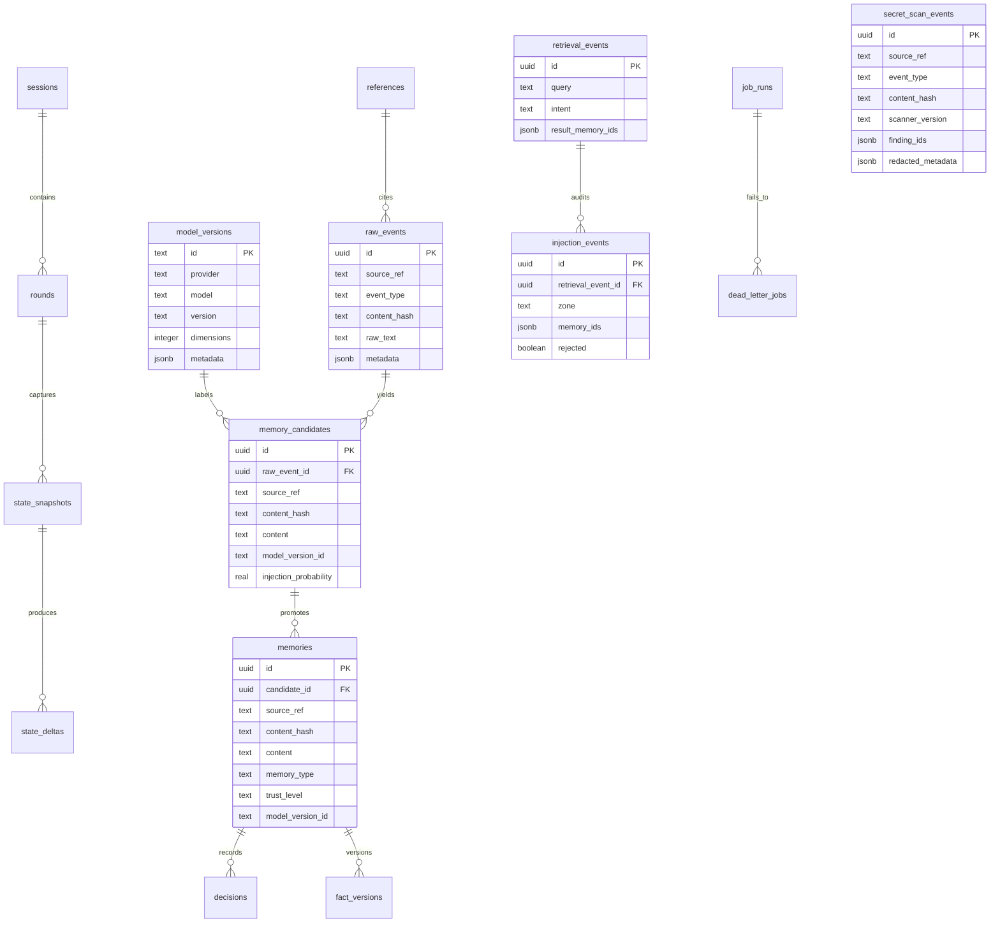

# Persistent Agent Memory ERD

This document is operational documentation for implementation review.

The source of truth remains:

```text
output/session-state.md
```



Pre-storage rule:

```text
raw_events.raw_text is written only after memory secret scanning returns clean.
```

Rejected input rule:

```text
secret_scan_events stores only content hash, finding ids, and redacted metadata.
```

