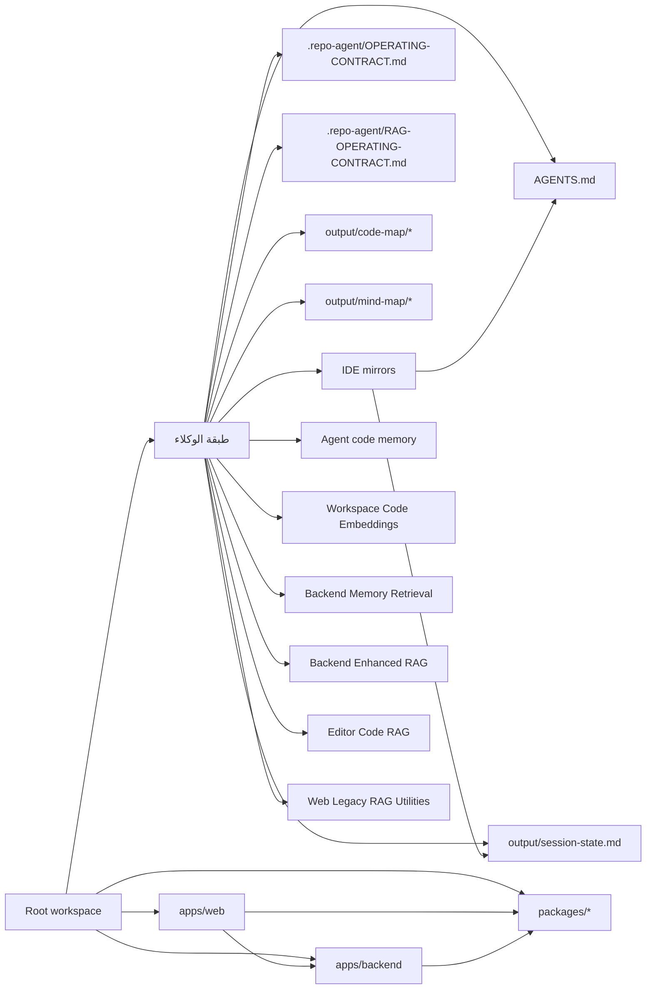

# الرسم الاعتمادي العالي

```mermaid
flowchart LR
    Root["Root workspace"] --> Agents["طبقة الوكلاء"]
    Root --> Web["apps/web"]
    Root --> Backend["apps/backend"]
    Root --> Packages["packages/*"]

    Agents --> Contract["AGENTS.md"]
    Agents --> Operating[".repo-agent/OPERATING-CONTRACT.md"]
    Agents --> RAGContract[".repo-agent/RAG-OPERATING-CONTRACT.md"]
    Agents --> Session["output/session-state.md"]
    Agents --> CodeMap["output/code-map/*"]
    Agents --> MindMap["output/mind-map/*"]
    Agents --> IDE["IDE mirrors"]
    Agents --> CodeMemory["Agent code memory"]
    Agents --> workspace-embeddings["Workspace Code Embeddings"]
    Agents --> backend-memory["Backend Memory Retrieval"]
    Agents --> backend-enhanced-rag["Backend Enhanced RAG"]
    Agents --> editor-code-rag["Editor Code RAG"]
    Agents --> web-legacy-rag["Web Legacy RAG Utilities"]
    Web --> Backend
    Web --> Packages
    Backend --> Packages
    IDE --> Contract
    IDE --> Session
```
