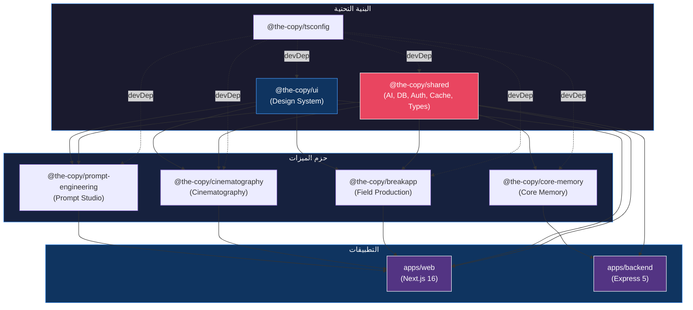

# فهرس الحزم — The Copy Monorepo

> آخر تحديث: 2026-03-30
> المستودع: `the-copy-monorepo` | مدير الحزم: `pnpm@10.32.1` | بناء: `Turborepo`

---

## نظرة عامة

يحتوي المستودع على **7 حزم** موزعة في مجلد `packages/`. تنقسم إلى فئتين رئيسيتين:

| الفئة | الحزم | الوصف |
|---|---|---|
| **البنية التحتية** | `shared`، `ui`، `tsconfig`، `core-memory` | اللبنات الأساسية المشتركة بين كل التطبيقات والحزم |
| **ميزات الإنتاج السينمائي** | `breakapp`، `cinematography`، `prompt-engineering` | أدوات متخصصة لمراحل الإنتاج السينمائي |

جميع حزم الميزات:
- تعتمد على `@the-copy/shared` (البنية التحتية)
- تعتمد على `@the-copy/ui` (نظام التصميم)
- تستخدم TypeScript 5.9 وتُختبر بـ Vitest
- خاصة (`private: true`) وغير مُنشأة على npm

---

## جدول الملخص السريع

| الحزمة | الاسم الكامل | الوصف | يستخدمها | الحالة |
|---|---|---|---|---|
| `shared` | `@the-copy/shared` | البنية التحتية المشتركة (AI، DB، Auth، Cache، Types) | `web`، `backend`، كل الحزم | مستقر |
| `ui` | `@the-copy/ui` | نظام التصميم (shadcn/ui + مكونات مخصصة) | `web`، معظم الحزم | مستقر |
| `tsconfig` | `@the-copy/tsconfig` | إعدادات TypeScript المشتركة | كل الحزم | مستقر |
| `breakapp` | `@the-copy/breakapp` | إدارة الإنتاج الميداني وقراءة QR | `web` | مستقر |
| `cinematography` | `@the-copy/cinematography` | استوديو التصوير السينمائي (ما قبل/أثناء/بعد الإنتاج) | `web` | مستقر |
| `core-memory` | `@the-copy/core-memory` | ذاكرة النظام الأساسية | `backend` | مستقر |
| `prompt-engineering` | `@the-copy/prompt-engineering` | استوديو هندسة الـ Prompts وتحليلها | `web` | مستقر |

---

## الأقسام التفصيلية

---

### 1. `@the-copy/shared`

**المسار:** `packages/shared/`
**الوصف:** حزمة البنية التحتية المركزية. تُوفر كل الخدمات الأساسية المشتركة بين التطبيقات والحزم الأخرى: خدمة Gemini AI، مخطط قاعدة البيانات، مصادقة JWT، ذاكرة تخزين Redis، أنواع TypeScript، ومخططات Zod.

**التطبيقات التي تستخدمها:** `apps/web`، `apps/backend`، جميع حزم الميزات.

#### نقاط التصدير (exports)

```typescript
// الاستيراد الرئيسي — يُصدّر types و utils فقط
import { cn } from '@the-copy/shared';

// خدمة Gemini AI
import { GeminiService, geminiService, GeminiModel, GEMINI_MODELS, GEMINI_CONFIGS } from '@the-copy/shared/ai';

// مخطط قاعدة البيانات (Drizzle ORM)
import { users, projects, scenes, characters, shots, sessions, refreshTokens } from '@the-copy/shared/db';
import type { User, NewUser, Project, Scene, Character, Shot } from '@the-copy/shared/db';

// مصادقة — مخططات Zod وأنواع TypeScript
import { LoginRequestSchema, SignupRequestSchema, AuthUserSchema, AuthTokensSchema } from '@the-copy/shared/auth';
import type { LoginRequest, SignupRequest, AuthUser, AuthTokens, AuthSession } from '@the-copy/shared/auth';

// ذاكرة التخزين المؤقت Redis
import { getCached, setCached, invalidateCache, cachedGeminiCall, generateGeminiCacheKey } from '@the-copy/shared/cache';

// مخططات API المشتركة
import { IdSchema, PaginationSchema, SortOrderSchema, ApiResponseSchema } from '@the-copy/shared/schemas';

// أنواع TypeScript الشاملة
import type { AnalysisTypes, CoreTypes, Enums, ApiTypes, MetricTypes } from '@the-copy/shared/types';

// أدوات مساعدة
import { cn } from '@the-copy/shared/utils';
```

#### الواجهة العامة الرئيسية

```typescript
// خدمة Gemini AI
class GeminiService {
  constructor(apiKey?: string)
  getModel(modelName?: string, configName?: string): GenerativeModel
  isAvailable(): boolean
  getAvailableModels(): string[]
  async testConnection(): Promise<{ success: boolean; error?: string }>
  async analyzeText(text: string): Promise<{ success: boolean; data?: any; error?: string }>
  async enhancePrompt(prompt: string, genre: string, technique: string): Promise<...>
  async generateContent(prompt: string, options?: { temperature?: number; maxTokens?: number; model?: string }): Promise<string>
}

// Redis Cache
async function getCached<T>(key: string): Promise<T | null>
async function setCached<T>(key: string, value: T, options?: { ttl?: number }): Promise<void>
async function invalidateCache(pattern: string): Promise<void>
async function cachedGeminiCall<T>(key: string, callFn: () => Promise<T>, options?: { ttl?: number }): Promise<T>

// Auth Schemas
const LoginRequestSchema: ZodObject<{ email: ZodString; password: ZodString }>
const SignupRequestSchema: ZodObject<{ email; password; firstName?; lastName? }>
```

#### التبعيات الرئيسية

| الحزمة | الإصدار | الغرض |
|---|---|---|
| `@google/generative-ai` | ^0.24.1 | خدمة Gemini AI |
| `@neondatabase/serverless` | ^1.0.2 | قاعدة بيانات Neon Postgres |
| `drizzle-orm` | ^0.44.7 | ORM لقاعدة البيانات |
| `zod` | 3.25.76 | التحقق من البيانات |
| `redis` | ^5.10.0 | التخزين المؤقت |
| `jsonwebtoken` | ^9.0.2 | JWT المصادقة |

#### مثال استخدام

```typescript
import { GeminiService, cachedGeminiCall, generateGeminiCacheKey } from '@the-copy/shared/ai';
import { getCached, setCached } from '@the-copy/shared/cache';

const ai = new GeminiService(process.env.GEMINI_API_KEY);

// استدعاء مع تخزين مؤقت تلقائي
const result = await cachedGeminiCall(
  generateGeminiCacheKey('analyze script', 'gemini-1.5-flash'),
  () => ai.analyzeText(scriptContent),
  { ttl: 3600 }
);
```

---

### 2. `@the-copy/ui`

**المسار:** `packages/ui/`
**الوصف:** نظام التصميم الموحد للمشروع. يجمع مكونات shadcn/ui الأساسية (Primitives) مع مكونات مخصصة متعلقة بالإنتاج السينمائي.

**التطبيقات التي تستخدمها:** `apps/web`، جميع حزم الميزات تقريبًا.

#### نقاط التصدير

```typescript
// الاستيراد الرئيسي لجميع المكونات
import { Button, Dialog, Card, Badge, ... } from '@the-copy/ui';

// استيراد مكون محدد
import { Button } from '@the-copy/ui/components/button';
```

#### المكونات الأساسية (shadcn/ui Primitives)

`Accordion`، `Alert`، `AlertDialog`، `Avatar`، `Badge`، `Button`، `Calendar`، `Card`، `Carousel`، `Chart`، `Checkbox`، `Collapsible`، `Dialog`، `DropdownMenu`، `Form`، `Input`، `Label`، `Menubar`، `Popover`، `Progress`، `RadioGroup`، `ScrollArea`، `Select`، `Separator`، `Sheet`، `Skeleton`، `Slider`، `Switch`، `Table`، `Tabs`، `Textarea`، `Toast`، `Toaster`، `Tooltip`

#### المكونات المخصصة للإنتاج السينمائي

| المكون | الوصف |
|---|---|
| `AiShotLibrary` | مكتبة اللقطات السينمائية المدعومة بالذكاء الاصطناعي |
| `AnalyticsDashboard` | لوحة تحليلات الإنتاج |
| `ArabicRhymeFinder` | أداة إيجاد القوافي العربية |
| `CameraMovement` | تصور حركات الكاميرا |
| `ColorGradingPreview` | معاينة تدرج الألوان |
| `CommandPalette` | لوحة الأوامر السريعة |
| `DofCalculator` | حاسبة عمق الحقل |
| `InfiniteCanvas` | لوحة رسم لا نهائية |
| `LensSimulator` | محاكي العدسات |
| `Lighting` | مكونات الإضاءة |
| `MetricsCard` | بطاقات مقاييس الأداء |
| `NotificationCenter` | مركز الإشعارات |
| `ShotList` | قائمة اللقطات |
| `SpatialScenePlanner` | مخطط المشاهد المكاني |
| `Storyboard` | لوحة القصة المصورة |
| `SwotAnalysis` | تحليل SWOT |
| `SystemMetricsDashboard` | لوحة مقاييس النظام |
| `UniversalSearch` | البحث الشامل |
| `VirtualizedGrid` | شبكة مُحسّنة للأداء |

#### التبعيات الرئيسية

`@radix-ui/*`، `class-variance-authority`، `lucide-react`، `recharts`، `tailwind-merge`، `cmdk`، `embla-carousel-react`

#### مثال استخدام

```typescript
import { Button, Dialog, DialogContent, DialogHeader, DialogTitle } from '@the-copy/ui';

export function MyComponent() {
  return (
    <Dialog>
      <DialogContent>
        <DialogHeader>
          <DialogTitle>عنوان النافذة</DialogTitle>
        </DialogHeader>
        <Button variant="default">تأكيد</Button>
      </DialogContent>
    </Dialog>
  );
}
```

---

### 3. `@the-copy/tsconfig`

**المسار:** `packages/tsconfig/`
**الوصف:** إعدادات TypeScript المشتركة للمستودع. توفر ثلاثة ملفات إعداد لبيئات مختلفة.

**التطبيقات التي تستخدمها:** جميع الحزم والتطبيقات كـ `devDependency`.

#### الملفات المتاحة

| الملف | الاستخدام |
|---|---|
| `base.json` | الإعداد الأساسي لجميع الحزم (strict، ESNext، bundler resolution) |
| `nextjs.json` | يمتد من base — مع JSX preserve وDOM libs لتطبيقات Next.js |
| `node.json` | يمتد من base — للحزم الخلفية Node.js |

#### مثال استخدام

```json
// packages/my-package/tsconfig.json
{
  "extends": "@the-copy/tsconfig/base.json",
  "include": ["src"],
  "exclude": ["node_modules", "dist"]
}
```

---

### 4. `@the-copy/breakapp`

**المسار:** `packages/breakapp/`
**الوصف:** حزمة إدارة الإنتاج الميداني. تُوفر أدوات للمسح الضوئي لـ QR والمصادقة الميدانية وتتبع الموقع الجغرافي للطاقم والتواصل عبر Socket.IO.

**التطبيقات التي تستخدمها:** `apps/web`

#### الواجهة العامة

```typescript
// المكونات
export { default as QRScanner } from './components/scanner/QRScanner';
export { default as MapComponent } from './components/maps/MapComponent';
export { default as ConnectionTest } from './components/ConnectionTest';

// Hooks
export function useGeolocation(options?: GeolocationOptions): LocationState
export function useSocket(options?: SocketConnectionOptions): SocketState

// Auth & API utilities
export function storeToken(token: string): void
export function getToken(): string | null
export function removeToken(): void
export function isAuthenticated(): boolean
export function getCurrentUser(): CurrentUser | null
export async function scanQRAndLogin(qrData: string): Promise<AuthResponse>
export function verifyToken(token: string): JWTPayload | null
export function generateDeviceHash(): string
export const api: AxiosInstance  // محور API مُعدّ مسبقاً مع interceptors

// الأنواع الرئيسية
interface AuthResponse { token: string; user: CurrentUser; expiresIn: number }
interface Order { id: string; items: OrderItem[]; status: string; deliveryTask?: DeliveryTask }
interface Vendor { id: string; name: string; location: LocationPosition; menu: MenuItem[] }
```

#### التبعيات

`@the-copy/shared`، `@the-copy/ui`

#### مثال استخدام

```tsx
import { QRScanner, useSocket, scanQRAndLogin } from '@the-copy/breakapp';

export function FieldLogin() {
  const { isConnected } = useSocket({ url: process.env.NEXT_PUBLIC_API_URL });

  async function handleScan(qrData: string) {
    const auth = await scanQRAndLogin(qrData);
    storeToken(auth.token);
  }

  return <QRScanner onScan={handleScan} />;
}
```

---

### 5. `@the-copy/cinematography`

**المسار:** `packages/cinematography/`
**الوصف:** استوديو التصوير السينمائي. يغطي الدورة الإنتاجية الكاملة في ثلاث مراحل: ما قبل الإنتاج (تخطيط المشاهد)، أثناء التصوير (تحليل اللقطات)، وما بعد الإنتاج (تدرج الألوان والتصدير).

**التطبيقات التي تستخدمها:** `apps/web`

#### الواجهة العامة

```typescript
// المكونات
export { CineAIStudio } from './components/CineAIStudio';
export { CinematographyStudio } from './components/CinematographyStudio';
export { default as PreProductionTools } from './components/tools/PreProductionTools';
export { default as ProductionTools } from './components/tools/ProductionTools';
export { default as PostProductionTools } from './components/tools/PostProductionTools';

// Hooks
export function useCinematographyStudio(): CineStudioState
export function usePreProduction(mood?: VisualMood): PreProductionState
export function useProduction(mood?: VisualMood): ProductionState
export function usePostProduction(mood?: VisualMood): PostProductionState

// الأنواع الجوهرية
type Phase = 'pre' | 'production' | 'post'
type VisualMood = 'noir' | 'realistic' | 'surreal' | 'vintage'

interface CineStudioState {
  currentPhase: Phase;
  visualMood: VisualMood;
  activeTool: string | null;
  activeView: 'dashboard' | 'phases';
}

interface ShotAnalysis {
  score: number;           // 0-100
  dynamicRange: string;
  grainLevel: string;
  issues: string[];
  exposure: number;        // 0-100
}

interface ExportSettings {
  platform: 'cinema-dcp' | 'broadcast-hd' | 'web-social' | 'bluray';
  resolution?: string;
  frameRate?: number;
  codec?: string;
}

// دوال التحقق
function validateScenePrompt(data: unknown): ZodSafeParseResult
function validateColorTemperature(temperature: number): ZodSafeParseResult
function isValidVisualMood(value: string): value is VisualMood
```

#### التبعيات

`@the-copy/shared`، `@the-copy/ui`

---

### 6. `@the-copy/prompt-engineering`

**المسار:** `packages/prompt-engineering/`
**الوصف:** استوديو هندسة الـ Prompts. يُوفر أدوات لتحليل جودة الـ Prompts وتحسينها وإدارة مكتبة قوالب جاهزة، مع تقدير التكلفة وعدد الـ tokens.

**التطبيقات التي تستخدمها:** `apps/web`

#### الواجهة العامة

```typescript
// المحللات والخدمات
export function analyzePrompt(prompt: string): PromptAnalysis
export function comparePrompts(prompts: string[]): PromptComparison
export function generateEnhancementSuggestions(analysis: PromptAnalysis): string[]

// مكتبة القوالب
export const defaultPromptTemplates: PromptTemplate[]
export function getTemplateById(id: string): PromptTemplate | undefined
export function getTemplatesByCategory(category: PromptCategory): PromptTemplate[]
export function renderTemplate(template: PromptTemplate, variables: Record<string, string>): string
export function validateTemplateVariables(template: PromptTemplate, vars: Record<string, string>): boolean

// خدمة Gemini
export function createPromptStudioGeminiService(config: PromptStudioGeminiConfig): GeminiService
export function estimateTokenCount(text: string): number
export function estimatePromptCost(tokens: number, model: string): number
export function validatePrompt(prompt: string): { valid: boolean; issues: string[] }
export function generatePromptAnalysis(prompt: string, apiKey: string): Promise<PromptAnalysis>

// إدارة البيانات
export { DataManager } from './lib/data-manager';

// المكونات
export { CreativeWritingStudio, PromptLibrary, WritingEditor, SettingsPanel } from './components/*';

// الأنواع
interface PromptMetrics {
  clarity: number;       // 0-100
  specificity: number;   // 0-100
  completeness: number;  // 0-100
  effectiveness: number; // 0-100
  tokenEfficiency: number; // 0-100
  overallScore: number;  // 0-100
}

interface PromptAnalysis {
  prompt: string; metrics: PromptMetrics; strengths: string[];
  weaknesses: string[]; suggestions: string[];
  estimatedTokens: number;
  complexity: 'low' | 'medium' | 'high';
  category: PromptCategory;
  language: 'ar' | 'en' | 'mixed';
}

type PromptCategory = 'creative_writing' | 'analysis' | 'translation' | 'summarization' | 'question_answering' | 'code_generation' | 'data_extraction' | 'conversation' | 'other'
```

#### التبعيات

`@the-copy/shared`، `@the-copy/ui`

---

## مخطط العلاقات بين الحزم



---

## كيفية إنشاء حزمة جديدة

### الخطوة 1: إنشاء هيكل المجلد

```bash
# من جذر المستودع
mkdir -p packages/my-package/src
```

### الخطوة 2: إنشاء `package.json`

```json
{
  "name": "@the-copy/my-package",
  "version": "1.0.0",
  "private": true,
  "main": "./src/index.ts",
  "types": "./src/index.ts",
  "exports": {
    ".": "./src/index.ts",
    "./*": "./src/*/index.ts"
  },
  "scripts": {
    "test": "vitest run",
    "test:watch": "vitest",
    "type-check": "tsc --noEmit",
    "clean": "rm -rf dist node_modules .turbo",
    "build": "tsc"
  },
  "dependencies": {
    "@the-copy/shared": "workspace:*",
    "@the-copy/ui": "workspace:*"
  },
  "devDependencies": {
    "@the-copy/tsconfig": "workspace:*",
    "vitest": "^4.0.6",
    "typescript": "^5.9.3"
  }
}
```

### الخطوة 3: إنشاء `tsconfig.json`

```json
{
  "extends": "@the-copy/tsconfig/base.json",
  "compilerOptions": {
    "outDir": "./dist",
    "rootDir": "./src"
  },
  "include": ["src"],
  "exclude": ["node_modules", "dist"]
}
```

### الخطوة 4: إنشاء `src/index.ts`

```typescript
// @the-copy/my-package
// نقطة الدخول الرئيسية — أعد تصدير كل المكونات العامة هنا

// Components
export { MyMainComponent } from './components/MyMainComponent';

// Hooks
export { useMyHook } from './hooks/useMyHook';

// Types
export * from './types';
```

### الخطوة 5: إنشاء `vitest.config.ts`

```typescript
import { defineConfig } from 'vitest/config';

export default defineConfig({
  test: {
    environment: 'node',
    globals: true,
  },
});
```

### الخطوة 6: تسجيل الحزمة في التطبيق المستهدف

```bash
# إضافة الحزمة إلى apps/web/package.json مثلاً
pnpm --filter @the-copy/web add @the-copy/my-package@workspace:*
```

### الخطوة 7: تثبيت التبعيات

```bash
# من جذر المستودع
pnpm install
```

### قواعد التسمية والاتفاقيات

| القاعدة | التفصيل |
|---|---|
| اسم الحزمة | دائمًا بصيغة `@the-copy/<kebab-case>` |
| ملف الدخول | يجب أن يكون `src/index.ts` |
| التصدير | استخدم `export *` للأنواع والأدوات، وتصديرًا صريحًا للمكونات |
| التعليقات | اكتب تعليقات بالعربية للملفات، بالإنجليزية للـ JSDoc |
| الأنواع | عرّف أنواع TypeScript في `src/types/index.ts` |
| مخططات Zod | ضع مخططات التحقق في نفس ملف الأنواع أو `src/schemas.ts` |
| الاختبارات | ضع ملفات الاختبار بجانب الملف المُختبَر بلاحقة `.test.ts` |
| التنظيف | لا تُحلل `node_modules` أو `dist` في tsconfig |

---

*هذا الملف مُولَّد تلقائيًا من تحليل الكود المصدري للمستودع.*

---

## ملحق — حزم جاهزية الإنتاج المضافة في جولة P0 (2026-05-03)

أُنشئت سبع حزم جديدة استجابةً لتقرير E2E الميداني، تخدم المرحلة 0 من خطة جاهزية الإنتاج P0. كلها تستخدم `@the-copy/tsconfig` ولا تكرّر الكود.

### 1. `@the-copy/api-client`

عميل HTTP موحد + ApiResponse + ApiError مُصنَّف. يفرض عقد البيانات `{ ok, data, meta } | { ok, error: { code, message, requestId } }` ويمنع الفشل الصامت.

نقاط دخول رئيسية:

```typescript
import { api, apiFetch, ApiError, isApiError } from "@the-copy/api-client";
import { apiSuccess, apiFailure, errorToFailure, statusForCode, generateRequestId } from "@the-copy/api-client";
```

### 2. `@the-copy/security-middleware`

فحص التوكنات في التخزين المحلي + rate limiting + actor scoping للمصادق والمجهول.

```typescript
import { auditClientTokenStorage, assertNoClientTokenStorage, bootstrapClientStorageGuard } from "@the-copy/security-middleware";
import { enforceRateLimit, readActorIdentity, requireUser, actorScopeFilter, rateLimitKeyFor } from "@the-copy/security-middleware";
```

### 3. `@the-copy/error-boundary`

`useAsyncOperation` يدير حالة async مع منع double-submit وحالة error مصنفة دائماً.

```typescript
import { useAsyncOperation, normalizeError, formatErrorForUser } from "@the-copy/error-boundary";
```

### 4. `@the-copy/persistence`

autosave + snapshot + preferences بـ namespace ثابت `the-copy.{appId}.v{schema}.{projectId}.{kind}`.

```typescript
import { createAppStorage, bootstrapPersistenceLayer } from "@the-copy/persistence";
```

### 5. `@the-copy/validation`

Zod schemas + sanitizers لـ Excel/HTML + parseOrThrow.

```typescript
import { z, NonEmptyString, ProjectTitle, ScriptText, parseOrThrow, sanitizeForExcel, escapeHtml } from "@the-copy/validation";
```

### 6. `@the-copy/export`

prepare-export-dom (يحلّ مشكلة `oklch` في PDF) + downloadBlob + exportJson/Markdown/Text.

```typescript
import { prepareExportDom, toExportSafeColor, exportJson, exportMarkdown, downloadBlob } from "@the-copy/export";
```

### 7. `@the-copy/ai-orchestration`

assertModelTextNotEmpty + assertToolResultNotEmpty + assertActorAnalysisNotEmpty — يمنع empty response من المرور كنجاح.

```typescript
import { assertModelTextNotEmpty, assertToolResultNotEmpty, assertActorAnalysisNotEmpty } from "@the-copy/ai-orchestration";
```

### مخطط الاعتماد بين الحزم الجديدة

```
api-client                      ←  base (لا اعتمادات داخلية)
security-middleware             ←  api-client
error-boundary                  ←  api-client
persistence                     ←  security-middleware
validation                      ←  api-client + zod
export                          ←  validation
ai-orchestration                ←  api-client
```

### اختبارات الصرامة الإلزامية

| الملف | يضمن |
|---|---|
| `packages/api-client/src/__tests__/errors.test.ts` | تصنيف status → code صحيح، رسائل عربية |
| `packages/security-middleware/src/__tests__/client.test.ts` | كشف JWT/access/refresh في localStorage و sessionStorage |
| `packages/ai-orchestration/src/__tests__/empty-response.test.ts` | empty response لا يمر كنجاح |
| `packages/export/src/__tests__/color.test.ts` | تحويل oklch/oklab/color-mix إلى rgb آمن |

أمر التحقق:

```text
pnpm -r --filter "@the-copy/api-client" --filter "@the-copy/security-middleware" --filter "@the-copy/ai-orchestration" --filter "@the-copy/export" test
pnpm -r --filter "@the-copy/api-client" --filter "@the-copy/security-middleware" --filter "@the-copy/error-boundary" --filter "@the-copy/persistence" --filter "@the-copy/validation" --filter "@the-copy/export" --filter "@the-copy/ai-orchestration" type-check
```

